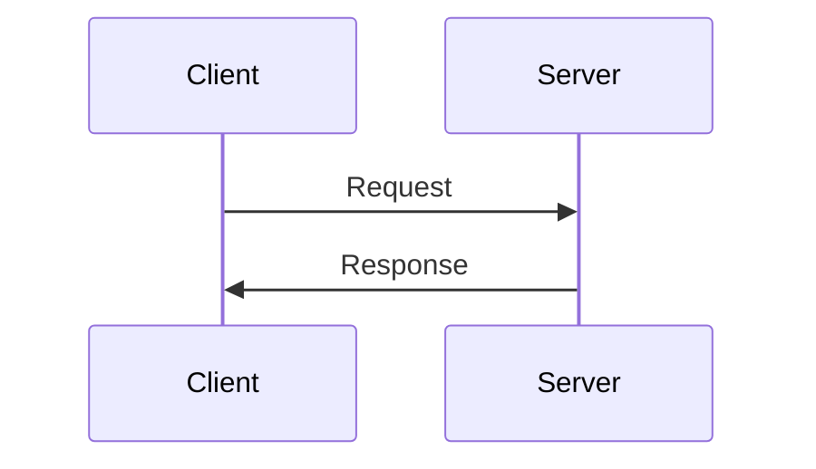

# Contributing to Link2Pay Documentation

Thank you for your interest in contributing to Link2Pay documentation! This guide will help you get started.

## How Can I Contribute?

### Reporting Issues

Found a problem with the documentation?

1. Check [existing issues](https://github.com/Link2Pay/docs-link2pay/issues) first
2. If it's new, [open an issue](https://github.com/Link2Pay/docs-link2pay/issues/new) with:
   - Clear title describing the problem
   - Page URL where the issue occurs
   - Description of what's wrong
   - Expected vs actual behavior
   - Screenshots if applicable

### Suggesting Improvements

Have an idea for better documentation?

1. [Open a discussion](https://github.com/Link2Pay/docs-link2pay/discussions/new)
2. Explain your suggestion
3. Provide examples if possible
4. We'll discuss and potentially create an issue to track implementation

### Fixing Typos & Small Edits

For quick fixes:

1. Click "Edit this page on GitHub" at the bottom of any page
2. Make your changes in the GitHub web editor
3. Propose changes via Pull Request
4. We'll review and merge quickly!

### Adding New Documentation

For larger contributions:

1. Fork the repository
2. Create a new branch (`git checkout -b docs/new-feature-guide`)
3. Add your documentation (see [Writing Guidelines](#writing-guidelines))
4. Test locally (`npm run docs:dev`)
5. Commit with clear message
6. Push and create Pull Request

## Development Setup

### Prerequisites

- Node.js 18+
- npm 9+
- Git

### Local Development

```bash
# Clone your fork
git clone https://github.com/YOUR_USERNAME/docs-link2pay.git
cd docs-link2pay

# Install dependencies
npm install

# Start development server
npm run docs:dev

# Open http://localhost:5173
```

### Build & Preview

```bash
# Build for production
npm run docs:build

# Preview production build
npm run docs:preview
```

## Writing Guidelines

### File Organization

- Use kebab-case for filenames (`quick-start.md`, not `QuickStart.md`)
- Place files in appropriate directories:
  - `/docs/guide/` - User guides and tutorials
  - `/docs/api/` - API reference documentation
  - `/docs/sdk/` - SDK documentation
- Create subdirectories for related content

### Markdown Style

**Headers:**
- Use sentence case ("Quick start guide", not "Quick Start Guide")
- Only one H1 per page (the title)
- Use H2 for main sections, H3 for subsections

**Code blocks:**
- Always specify language for syntax highlighting
- Use TypeScript for JavaScript examples
- Show both request and response for API examples

````markdown
```typescript
const invoice = await api.createInvoice({
  amount: 100,
  currency: "USDC"
});
```
````

**Links:**
- Use relative paths for internal links (`/guide/concepts`)
- Use descriptive link text (not "click here")
- Verify all links work

**Admonitions:**
Use containers for important information:

```markdown
::: tip
Helpful tip for users
:::

::: warning
Important warning
:::

::: danger
Critical information
:::
```

### Content Guidelines

**Clarity:**
- Write for beginners (explain jargon)
- Use active voice
- Keep sentences concise
- Use examples liberally

**Accuracy:**
- Test all code examples
- Verify API responses match current implementation
- Update version numbers when applicable

**Completeness:**
- Cover edge cases
- Mention error scenarios
- Link to related documentation
- Provide "Next Steps" section

**Consistency:**
- Follow existing patterns and terminology
- Use "Link2Pay" (not "link2pay" or "LinkToPay")
- Use "Stellar" (not "stellar network" in prose)
- Use "invoice" consistently (not mixing with "bill")

### Code Examples

**Good example:**
```typescript
// Create an invoice with line items
const invoice = await link2pay.invoices.create({
  clientName: "Acme Corp",
  clientEmail: "billing@acme.com",
  amount: 1000,
  currency: "USDC",
  items: [
    {
      description: "Web Development",
      quantity: 40,
      rate: 25
    }
  ]
});

console.log(`Payment link: ${invoice.paymentLink}`);
```

**Bad example:**
```typescript
// bad code with no context
var x = await api.create({n: "test", e: "test@test.com", a: 100});
```

### API Documentation

Follow this structure for endpoint documentation:

1. **Endpoint title & HTTP method**
2. **Description** (1-2 sentences)
3. **Authentication** requirement
4. **Rate limits** if applicable
5. **Request parameters** (path, query, body)
6. **Example request** (curl + language SDKs)
7. **Example response** (success case)
8. **Error responses** (common errors)
9. **Related endpoints**

### Diagrams

Use Mermaid for diagrams:

````markdown

````

## Pull Request Process

### Before Submitting

- [ ] Test all code examples
- [ ] Run `npm run docs:build` successfully
- [ ] Check for broken links
- [ ] Verify formatting looks good locally
- [ ] Update table of contents if needed
- [ ] Add yourself to contributors list (optional)

### PR Description Template

```markdown
## Description
Brief description of changes

## Type of Change
- [ ] Fix typo/error
- [ ] Improve existing docs
- [ ] Add new documentation
- [ ] Update code examples
- [ ] Other (describe)

## Related Issue
Closes #123

## Checklist
- [ ] Tested locally
- [ ] Followed style guidelines
- [ ] Updated navigation if needed
- [ ] Added examples where helpful
```

### Review Process

1. Maintainers will review within 3-5 business days
2. Address any requested changes
3. Once approved, we'll merge and deploy
4. Docs will be live within minutes (Vercel auto-deploy)

## Style Guide Summary

### Formatting

```markdown
# Page Title

Brief introduction paragraph.

## Main Section

Content with **bold** and *italic* emphasis.

### Subsection

- Bullet points
- Use dashes for lists
- Keep items parallel

1. Numbered lists
2. For sequential steps
3. Or ordered information

**Important term**: Definition of the term.

`inline code` for short code references.

[Link text](/path/to/page) for internal links.

[External link](https://example.com) for external references.
```

### Terminology

| Use | Don't Use |
|-----|-----------|
| Link2Pay | link2pay, LinkToPay, L2P |
| Stellar | stellar network, Stellar Network |
| Freighter | freighter, Freighter Wallet |
| testnet | Testnet, test net |
| mainnet | Mainnet, main net |
| invoice | bill, receipt |
| payment link | checkout link, pay link |
| wallet address | public key (in user-facing docs) |

### Voice & Tone

**Do:**
- Use "you" and "your" (second person)
- Be encouraging and supportive
- Explain the "why" behind recommendations
- Acknowledge complexity when it exists

**Don't:**
- Use "we" or "I" (except in tutorials)
- Assume advanced knowledge
- Use condescending language
- Leave users without next steps

## Questions?

- 💬 [Discord Community](#) - Ask questions
- 📧 [Email](mailto:docs@link2pay.dev) - Contact maintainers
- 📚 [Discussions](https://github.com/Link2Pay/docs-link2pay/discussions) - Start a conversation

Thank you for contributing! 🎉
