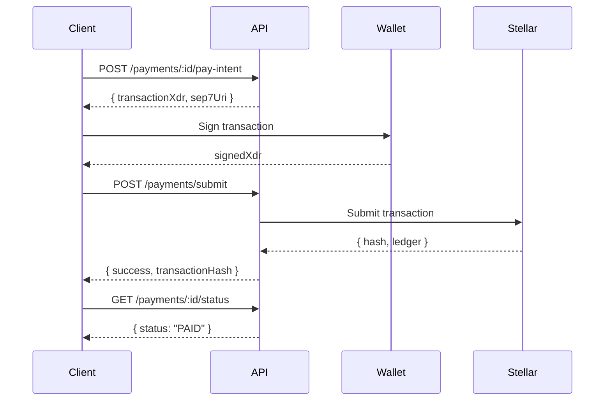

# Payments Endpoints

Payment endpoints handle the creation, submission, and confirmation of Stellar blockchain payments.

## Payment Flow



## Create Payment Intent

Generate an unsigned payment transaction for the client to sign.

**Endpoint:** `POST /api/payments/:invoiceId/pay-intent`

**Authentication:** Not required (public endpoint)

**Parameters:**

| Parameter | Type | Location | Required | Description |
|-----------|------|----------|----------|-------------|
| `invoiceId` | string | Path | Yes | Invoice ID to pay |
| `senderPublicKey` | string | Body | No | Sender's Stellar address (desktop flow) |
| `networkPassphrase` | string | Body | Yes | Stellar network passphrase |

**Request Body:**

```json
{
  "senderPublicKey": "GDPYEQVXKP7VVXV6XJZXJQVXQVXQVXQVXQVXQVXQVXQVXQVXQVXQVXQV",
  "networkPassphrase": "Test SDF Network ; September 2015"
}
```

**Success Response (200):**

```json
{
  "invoiceId": "cm123abc456def",
  "transactionXdr": "AAAAAgAAAABk7F...",
  "sep7Uri": "web+stellar:pay?destination=GABC...&amount=100&asset_code=USDC&memo=INV-0001",
  "amount": "100.00",
  "asset": {
    "code": "USDC",
    "issuer": "GBBD47IF6LWK7P7MDEVSCWR7DPUWV3NY3DTQEVFL4NAT4AQH3ZLLFLA5"
  },
  "memo": "INV-0001",
  "networkPassphrase": "Test SDF Network ; September 2015",
  "timeout": 300
}
```

**Response Fields:**

| Field | Type | Description |
|-------|------|-------------|
| `invoiceId` | string | Invoice being paid |
| `transactionXdr` | string \| null | Unsigned transaction XDR (desktop flow) |
| `sep7Uri` | string | SEP-7 payment URI (mobile flow) |
| `amount` | string | Payment amount |
| `asset.code` | string | Asset code (XLM, USDC, EURC) |
| `asset.issuer` | string \| null | Asset issuer address (null for XLM) |
| `memo` | string | Invoice number used as memo |
| `networkPassphrase` | string | Network the payment must use |
| `timeout` | number | Seconds until transaction expires (300s) |

**Error Responses:**

| Status | Error | Description |
|--------|-------|-------------|
| 400 | Cannot pay your own invoice | Sender matches invoice owner |
| 400 | Invoice cannot be paid | Invoice not in payable status |
| 400 | Selected wallet network does not match | Network mismatch |
| 404 | Invoice not found | Invalid invoice ID |

**Example:**

```bash
curl -X POST https://api.link2pay.dev/api/payments/cm123abc456def/pay-intent \
  -H "Content-Type: application/json" \
  -d '{
    "senderPublicKey": "GDPYEQVXKP7V...",
    "networkPassphrase": "Test SDF Network ; September 2015"
  }'
```

**Usage Notes:**

- Invoice status changes to `PROCESSING` after successful pay-intent creation
- `transactionXdr` is only returned if `senderPublicKey` is provided
- `sep7Uri` is always returned for mobile wallet compatibility
- Desktop flow: sign `transactionXdr` with Freighter → submit to `/payments/submit`
- Mobile flow: open `sep7Uri` in wallet app (auto-signs and submits)

---

## Submit Payment

Submit a signed payment transaction to the Stellar network.

**Endpoint:** `POST /api/payments/submit`

**Authentication:** Not required (public endpoint)

**Request Body:**

```json
{
  "invoiceId": "cm123abc456def",
  "signedTransactionXdr": "AAAAAgAAAABk7F..."
}
```

**Request Schema:**

| Field | Type | Required | Description |
|-------|------|----------|-------------|
| `invoiceId` | string | Yes | Invoice being paid |
| `signedTransactionXdr` | string | Yes | Signed transaction XDR from wallet |

**Success Response (200):**

```json
{
  "success": true,
  "transactionHash": "7a8b9c0d1e2f3a4b5c6d7e8f9a0b1c2d3e4f5a6b7c8d9e0f1a2b3c4d5e6f7a8b",
  "ledger": 123456
}
```

**Already Paid Response (200):**

```json
{
  "success": true,
  "alreadyPaid": true
}
```

**Error Responses:**

| Status | Error | Description |
|--------|-------|-------------|
| 400 | Network mismatch | Transaction network doesn't match invoice |
| 400 | Insufficient balance | Wallet doesn't have enough funds |
| 400 | Your wallet does not have a trustline | Missing trustline for asset |
| 400 | Recipient wallet is not activated | Recipient needs funding |
| 404 | Invoice not found | Invalid invoice ID |
| 429 | Network is busy | Horizon rate limit hit |
| 500 | Payment processing failed | Generic submission error |
| 503 | Stellar network is temporarily unavailable | Horizon down |

**Example:**

```bash
curl -X POST https://api.link2pay.dev/api/payments/submit \
  -H "Content-Type: application/json" \
  -d '{
    "invoiceId": "cm123abc456def",
    "signedTransactionXdr": "AAAAAgAAAABk7F..."
  }'
```

**Usage Notes:**

- Transaction is validated against invoice network passphrase
- If successful, invoice status becomes `PAID`
- Idempotent: submitting an already-paid invoice returns `success: true, alreadyPaid: true`
- Transaction hash can be viewed on Stellar Expert or StellarChain

---

## Confirm Payment

Manually confirm a payment by providing a transaction hash.

**Endpoint:** `POST /api/payments/confirm`

**Authentication:** Not required (public endpoint)

**Use Cases:**

- Mobile wallet flow (wallet submits directly to Stellar)
- Retry after timeout
- Manual verification

**Request Body:**

```json
{
  "invoiceId": "cm123abc456def",
  "transactionHash": "7a8b9c0d1e2f3a4b5c6d7e8f9a0b1c2d3e4f5a6b7c8d9e0f1a2b3c4d5e6f7a8b"
}
```

**Request Schema:**

| Field | Type | Required | Description |
|-------|------|----------|-------------|
| `invoiceId` | string | Yes | Invoice being confirmed |
| `transactionHash` | string | Yes | Stellar transaction hash |

**Success Response (200):**

```json
{
  "status": "confirmed",
  "transactionHash": "7a8b9c0d1e2f3a4b5c6d7e8f9a0b1c2d3e4f5a6b7c8d9e0f1a2b3c4d5e6f7a8b",
  "ledger": 123456,
  "paidAt": "2024-03-07T12:00:00.000Z"
}
```

**Already Paid Response (200):**

```json
{
  "status": "already_paid",
  "transactionHash": "7a8b9c0d...",
  "paidAt": "2024-03-07T12:00:00.000Z"
}
```

**Error Responses:**

| Status | Error | Description |
|--------|-------|-------------|
| 400 | Transaction was not successful | Transaction failed on-chain |
| 400 | Transaction does not match invoice | Payment details mismatch |
| 400 | Underpayment: paid X, expected Y | Amount too low |
| 404 | Invoice not found | Invalid invoice ID |
| 404 | Transaction not found on network | Invalid hash or wrong network |

**Example:**

```bash
curl -X POST https://api.link2pay.dev/api/payments/confirm \
  -H "Content-Type: application/json" \
  -d '{
    "invoiceId": "cm123abc456def",
    "transactionHash": "7a8b9c0d..."
  }'
```

**Verification Steps:**

1. Fetches transaction from Stellar Horizon
2. Verifies transaction succeeded
3. Validates payment recipient matches invoice
4. Validates payment asset matches invoice currency
5. Validates payment amount ≥ invoice total
6. Marks invoice as `PAID` if all checks pass

---

## Get Payment Status

Check the payment status of an invoice.

**Endpoint:** `GET /api/payments/:invoiceId/status`

**Authentication:** Not required (public endpoint)

**Parameters:**

| Parameter | Type | Location | Required | Description |
|-----------|------|----------|----------|-------------|
| `invoiceId` | string | Path | Yes | Invoice ID |

**Success Response (200):**

```json
{
  "invoiceId": "cm123abc456def",
  "status": "PAID",
  "transactionHash": "7a8b9c0d1e2f3a4b5c6d7e8f9a0b1c2d3e4f5a6b7c8d9e0f1a2b3c4d5e6f7a8b",
  "ledgerNumber": 123456,
  "paidAt": "2024-03-07T12:00:00.000Z",
  "payerWallet": "GDPYEQVXKP7V..."
}
```

**Response Fields:**

| Field | Type | Description |
|-------|------|-------------|
| `invoiceId` | string | Invoice ID |
| `status` | string | Invoice status (DRAFT, PENDING, PROCESSING, PAID, etc.) |
| `transactionHash` | string \| null | Stellar transaction hash (if paid) |
| `ledgerNumber` | number \| null | Ledger number (if paid) |
| `paidAt` | string \| null | ISO timestamp of payment |
| `payerWallet` | string \| null | Payer's wallet address |

**Error Responses:**

| Status | Error | Description |
|--------|-------|-------------|
| 404 | Invoice not found | Invalid invoice ID |
| 500 | Failed to fetch payment status | Server error |

**Example:**

```bash
curl https://api.link2pay.dev/api/payments/cm123abc456def/status
```

**Usage Notes:**

- Use for polling payment status
- Recommended polling interval: 5 seconds
- Status transitions: `PENDING` → `PROCESSING` → `PAID`
- Alternative: Use webhooks (coming soon) instead of polling

---

## Verify Transaction

Verify a Stellar transaction hash and get payment details.

**Endpoint:** `POST /api/payments/verify-tx`

**Authentication:** Not required (public endpoint)

**Request Body:**

```json
{
  "transactionHash": "7a8b9c0d1e2f3a4b5c6d7e8f9a0b1c2d3e4f5a6b7c8d9e0f1a2b3c4d5e6f7a8b"
}
```

**Success Response (200):**

```json
{
  "successful": true,
  "hash": "7a8b9c0d1e2f3a4b5c6d7e8f9a0b1c2d3e4f5a6b7c8d9e0f1a2b3c4d5e6f7a8b",
  "ledger": 123456,
  "createdAt": "2024-03-07T12:00:00.000Z",
  "payments": [
    {
      "from": "GDPYEQVXKP7V...",
      "to": "GABC123...",
      "amount": "100.00",
      "assetCode": "USDC",
      "assetIssuer": "GBBD47IF6LWK7P7MDEVSCWR7DPUWV3NY3DTQEVFL4NAT4AQH3ZLLFLA5"
    }
  ]
}
```

**Response Fields:**

| Field | Type | Description |
|-------|------|-------------|
| `successful` | boolean | Whether transaction succeeded |
| `hash` | string | Transaction hash |
| `ledger` | number | Ledger number |
| `createdAt` | string | ISO timestamp |
| `payments` | array | List of payment operations |
| `payments[].from` | string | Sender wallet |
| `payments[].to` | string | Recipient wallet |
| `payments[].amount` | string | Payment amount |
| `payments[].assetCode` | string | Asset code |
| `payments[].assetIssuer` | string \| undefined | Asset issuer |

**Error Responses:**

| Status | Error | Description |
|--------|-------|-------------|
| 400 | transactionHash required | Missing hash in request body |
| 404 | Transaction not found | Invalid or non-existent hash |
| 500 | Failed to verify transaction | Server error |

**Example:**

```bash
curl -X POST https://api.link2pay.dev/api/payments/verify-tx \
  -H "Content-Type: application/json" \
  -d '{
    "transactionHash": "7a8b9c0d..."
  }'
```

**Usage Notes:**

- Independent verification endpoint
- Not tied to invoices
- Useful for debugging and reconciliation
- Returns all payment operations in the transaction

---

## Payment Lifecycle

### Status Flow

```
DRAFT → PENDING → PROCESSING → PAID
  ↓        ↓           ↓
CANCELLED  EXPIRED    FAILED
```

**Status Definitions:**

| Status | Description | Can Pay? |
|--------|-------------|----------|
| `DRAFT` | Invoice created, not sent | Yes |
| `PENDING` | Invoice sent to client | Yes |
| `PROCESSING` | Payment intent created, awaiting signature | Yes (retry) |
| `PAID` | Payment confirmed on-chain | No |
| `EXPIRED` | Passed due date without payment | No |
| `FAILED` | Payment failed | No |
| `CANCELLED` | Invoice cancelled by owner | No |

### Complete Payment Flow

```typescript
// 1. Create payment intent
const intent = await fetch('/api/payments/invoice123/pay-intent', {
  method: 'POST',
  headers: { 'Content-Type': 'application/json' },
  body: JSON.stringify({
    senderPublicKey: walletAddress,
    networkPassphrase: 'Test SDF Network ; September 2015'
  })
}).then(r => r.json());

// 2. Sign with Freighter
const signedXdr = await signTransaction(intent.transactionXdr, {
  networkPassphrase: intent.networkPassphrase
});

// 3. Submit payment
const result = await fetch('/api/payments/submit', {
  method: 'POST',
  headers: { 'Content-Type': 'application/json' },
  body: JSON.stringify({
    invoiceId: 'invoice123',
    signedTransactionXdr: signedXdr
  })
}).then(r => r.json());

// 4. Poll for confirmation (or use watcher)
let status;
do {
  await new Promise(resolve => setTimeout(resolve, 5000));
  status = await fetch(`/api/payments/invoice123/status`).then(r => r.json());
} while (status.status === 'PROCESSING');

console.log('Payment complete:', status.transactionHash);
```

---

## Error Handling

See [API Errors](/api/errors) for detailed error codes and handling strategies.

**Common Payment Errors:**

- **Network mismatch**: Switch wallet to correct network
- **Insufficient balance**: Add funds to wallet
- **No trustline**: Add trustline for asset in wallet
- **Account not activated**: Recipient needs 1 XLM to activate
- **Transaction timeout**: Create new payment intent

---

## Next Steps

- Learn about [Payment Links](/api/endpoints/links)
- Understand [Invoice Endpoints](/api/endpoints/invoices)
- Read [Integration Guide](/guide/integration/frontend)
