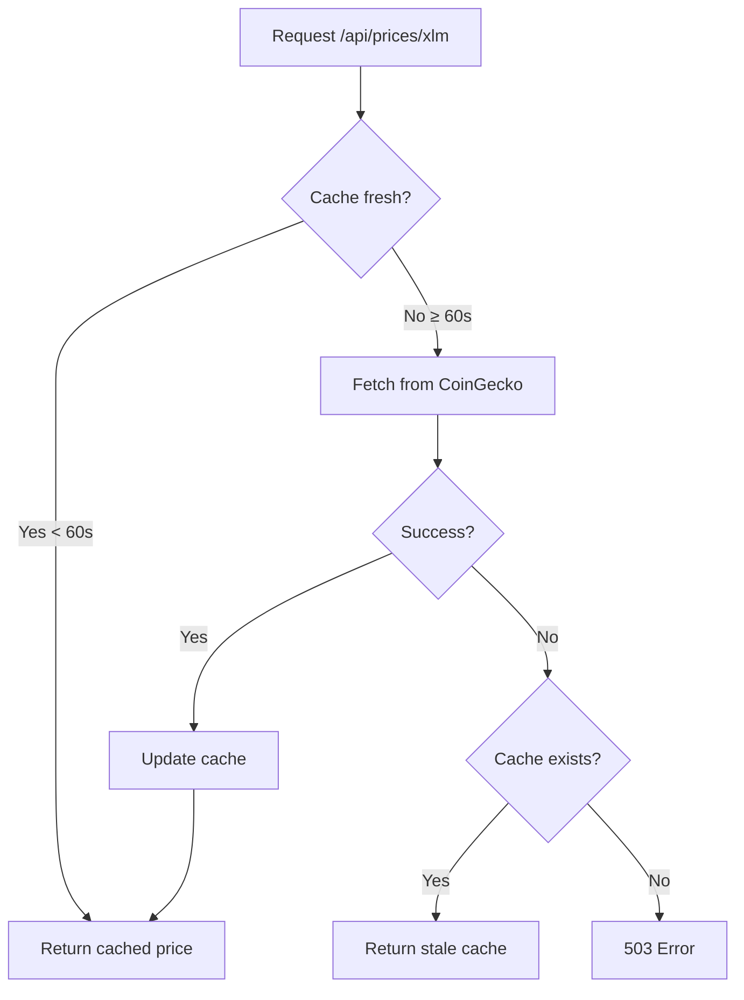

# Prices Endpoints

Price feed endpoints provide real-time cryptocurrency pricing data from external sources.

## Overview

The Prices API provides:
- Current XLM price in USD
- Cached pricing data (60-second TTL)
- Fallback to stale data on external API failures
- Rate limiting to protect quota

**Data Source:** CoinGecko API (free tier, no API key required)

---

## Get XLM Price

Retrieve current XLM price in USD.

**Endpoint:** `GET /api/prices/xlm`

**Authentication:** Not required (public endpoint)

**Rate Limit:** 30 requests per minute (per IP address)

**Success Response (200):**

```json
{
  "usd": 0.1234,
  "cached": false
}
```

**Cached Response (200):**

```json
{
  "usd": 0.1234,
  "cached": true
}
```

**Stale Cached Response (200):**

```json
{
  "usd": 0.1234,
  "cached": true,
  "stale": true
}
```

**Response Fields:**

| Field | Type | Description |
|-------|------|-------------|
| `usd` | number | XLM price in USD |
| `cached` | boolean | Whether price is from cache |
| `stale` | boolean | Whether cached price is stale (only appears if true) |

**Error Response (503):**

```json
{
  "error": "Price feed temporarily unavailable"
}
```

**Example:**

```bash
curl https://api.link2pay.dev/api/prices/xlm
```

---

## Caching Behavior

The API implements server-side caching to minimize external API calls:

**Cache TTL:** 60 seconds

```typescript
// Fresh data (< 60s old)
{
  "usd": 0.1234,
  "cached": false  // Fetched from CoinGecko
}

// Cached data (< 60s old)
{
  "usd": 0.1234,
  "cached": true  // Served from memory
}

// Stale data (CoinGecko unavailable)
{
  "usd": 0.1234,
  "cached": true,
  "stale": true  // Last known price
}
```

**Cache Flow:**



---

## Rate Limiting

**Limit:** 30 requests per minute per IP address

**Headers:**

```http
HTTP/1.1 200 OK
RateLimit-Limit: 30
RateLimit-Remaining: 25
RateLimit-Reset: 1709816460
```

**Rate Limit Exceeded (429):**

```json
{
  "error": "Too many price requests"
}
```

**Recommended Client Behavior:**

```typescript
// ❌ Bad: Request on every render
useEffect(() => {
  fetch('/api/prices/xlm');
}, []); // Missing dependency

// ✅ Good: Cache client-side for 60 seconds
const priceCache = {
  value: null,
  expiresAt: 0
};

async function getXLMPrice() {
  if (Date.now() < priceCache.expiresAt) {
    return priceCache.value;
  }

  const res = await fetch('/api/prices/xlm');
  const data = await res.json();

  priceCache.value = data.usd;
  priceCache.expiresAt = Date.now() + 60_000; // 60s

  return data.usd;
}
```

---

## Use Cases

### 1. XLM ↔ USD Conversion

```typescript
async function convertXLMToUSD(xlmAmount: number): Promise<number> {
  const price = await fetch('/api/prices/xlm').then(r => r.json());
  return xlmAmount * price.usd;
}

async function convertUSDToXLM(usdAmount: number): Promise<number> {
  const price = await fetch('/api/prices/xlm').then(r => r.json());
  return usdAmount / price.usd;
}

// Example
const xlmPrice = await getXLMPrice(); // 0.12 USD
const xlmAmount = 100;
const usdValue = xlmAmount * xlmPrice; // $12.00
```

### 2. Invoice Preview

```typescript
function InvoicePreview({ amount, currency }: { amount: number, currency: string }) {
  const [usdValue, setUsdValue] = useState<number | null>(null);

  useEffect(() => {
    if (currency === 'XLM') {
      convertXLMToUSD(amount).then(setUsdValue);
    }
  }, [amount, currency]);

  return (
    <div>
      <div>{amount} {currency}</div>
      {usdValue && <div className="text-gray-500">≈ ${usdValue.toFixed(2)} USD</div>}
    </div>
  );
}
```

### 3. Real-Time Price Display

```typescript
function XLMPriceWidget() {
  const [price, setPrice] = useState<number | null>(null);
  const [isStale, setIsStale] = useState(false);

  useEffect(() => {
    async function updatePrice() {
      const res = await fetch('/api/prices/xlm');
      const data = await res.json();
      setPrice(data.usd);
      setIsStale(data.stale || false);
    }

    updatePrice();
    const interval = setInterval(updatePrice, 60_000); // Update every 60s
    return () => clearInterval(interval);
  }, []);

  if (!price) return <div>Loading...</div>;

  return (
    <div className="price-widget">
      <span>XLM: ${price.toFixed(4)}</span>
      {isStale && <span className="warning">⚠ Stale Data</span>}
    </div>
  );
}
```

---

## Error Handling

### Strategy 1: Fallback Price

```typescript
async function getXLMPriceWithFallback(fallbackPrice = 0.12): Promise<number> {
  try {
    const res = await fetch('/api/prices/xlm');
    if (!res.ok) throw new Error('Price fetch failed');
    const { usd } = await res.json();
    return usd;
  } catch (error) {
    console.warn('Using fallback price:', fallbackPrice);
    return fallbackPrice;
  }
}
```

### Strategy 2: Display Warning

```typescript
async function fetchPriceWithStatus() {
  try {
    const res = await fetch('/api/prices/xlm');
    const data = await res.json();

    if (data.stale) {
      showWarning('Price data may be outdated');
    }

    return data.usd;
  } catch (error) {
    showError('Unable to fetch current price');
    return null;
  }
}
```

### Strategy 3: Retry Logic

```typescript
async function fetchPriceWithRetry(maxRetries = 3): Promise<number> {
  for (let i = 0; i < maxRetries; i++) {
    try {
      const res = await fetch('/api/prices/xlm');
      if (res.status === 429) {
        // Rate limited, wait 60 seconds
        await new Promise(resolve => setTimeout(resolve, 60_000));
        continue;
      }
      if (res.status === 503) {
        // Service unavailable, exponential backoff
        await new Promise(resolve => setTimeout(resolve, Math.pow(2, i) * 1000));
        continue;
      }
      const { usd } = await res.json();
      return usd;
    } catch (error) {
      if (i === maxRetries - 1) throw error;
    }
  }
  throw new Error('Max retries exceeded');
}
```

---

## Implementation Details

### Server-Side Code

```typescript
let priceCache: { usd: number; updatedAt: number } | null = null;
const CACHE_TTL_MS = 60_000;

async function getXLMPrice(): Promise<PriceResponse> {
  // Return cached price if fresh
  if (priceCache && Date.now() - priceCache.updatedAt < CACHE_TTL_MS) {
    return { usd: priceCache.usd, cached: true };
  }

  try {
    // Fetch from CoinGecko
    const response = await fetch(
      'https://api.coingecko.com/api/v3/simple/price?ids=stellar&vs_currencies=usd',
      { signal: AbortSignal.timeout(5000) }
    );

    if (!response.ok) {
      throw new Error(`CoinGecko returned ${response.status}`);
    }

    const data = await response.json();
    const usd = data?.stellar?.usd;

    if (typeof usd !== 'number') {
      throw new Error('Unexpected price response format');
    }

    // Update cache
    priceCache = { usd, updatedAt: Date.now() };
    return { usd, cached: false };

  } catch (error) {
    // Return stale cache if available
    if (priceCache) {
      return { usd: priceCache.usd, cached: true, stale: true };
    }
    throw error;
  }
}
```

---

## Future Enhancements

### Additional Assets (Coming Soon)

```typescript
// Planned endpoints
GET /api/prices/usdc  // USDC price in USD
GET /api/prices/eurc  // EURC price in EUR
GET /api/prices/all   // All asset prices

// Response format
{
  "xlm": { "usd": 0.1234 },
  "usdc": { "usd": 1.0001 },
  "eurc": { "eur": 1.0000, "usd": 1.0850 }
}
```

### Historical Data (Planned)

```typescript
// 24-hour price history
GET /api/prices/xlm/history?interval=1h&range=24h

// Response
{
  "currency": "XLM",
  "prices": [
    { "timestamp": "2024-03-07T00:00:00Z", "usd": 0.1230 },
    { "timestamp": "2024-03-07T01:00:00Z", "usd": 0.1235 },
    // ...
  ]
}
```

---

## Best Practices

### 1. Implement Client-Side Caching

```typescript
class PriceCache {
  private cache = new Map<string, { value: number; expiresAt: number }>();
  private ttl = 60_000; // 60 seconds

  async get(asset: string): Promise<number> {
    const cached = this.cache.get(asset);
    if (cached && cached.expiresAt > Date.now()) {
      return cached.value;
    }

    const price = await this.fetch(asset);
    this.cache.set(asset, {
      value: price,
      expiresAt: Date.now() + this.ttl
    });

    return price;
  }

  private async fetch(asset: string): Promise<number> {
    const res = await fetch(`/api/prices/${asset}`);
    const { usd } = await res.json();
    return usd;
  }
}

const priceCache = new PriceCache();
const xlmPrice = await priceCache.get('xlm');
```

### 2. Handle Stale Data

```typescript
async function getPriceWithFreshness() {
  const res = await fetch('/api/prices/xlm');
  const data = await res.json();

  if (data.stale) {
    // Use cached price but warn user
    console.warn('Price may be outdated');
    showNotification('warning', 'Price data may not be current');
  }

  return data.usd;
}
```

### 3. Respect Rate Limits

```typescript
class RateLimitedPriceFetcher {
  private lastFetch = 0;
  private minInterval = 2000; // 2 seconds between requests

  async fetch(): Promise<number> {
    const now = Date.now();
    const timeSinceLastFetch = now - this.lastFetch;

    if (timeSinceLastFetch < this.minInterval) {
      await new Promise(resolve =>
        setTimeout(resolve, this.minInterval - timeSinceLastFetch)
      );
    }

    const res = await fetch('/api/prices/xlm');
    const { usd } = await res.json();
    this.lastFetch = Date.now();

    return usd;
  }
}
```

---

## Next Steps

- Learn about [Payment Endpoints](/api/endpoints/payments)
- Understand [Invoice Creation](/api/endpoints/invoices)
- Explore [Frontend Integration](/guide/integration/frontend)
