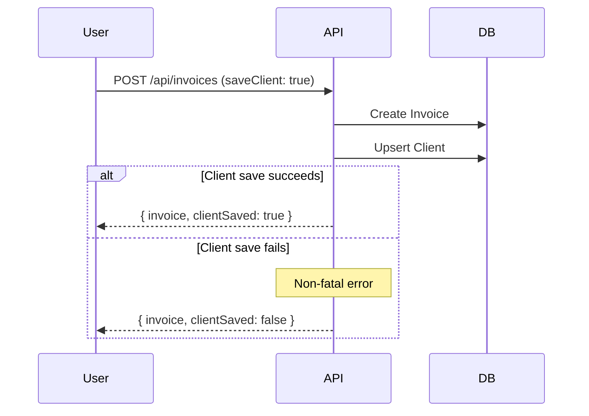

# Client Object

The Client object represents a saved customer/payer for quick invoice creation.

## Object Structure

```typescript
interface Client {
  // Identifiers
  id: string;
  freelancerWallet: string;

  // Client information
  name: string;
  email: string;
  company?: string;
  address?: string;

  // Settings
  isFavorite: boolean;

  // Timestamps
  createdAt: string;
  updatedAt: string;
}
```

---

## Field Reference

### Identifiers

| Field | Type | Description |
|-------|------|-------------|
| `id` | string | Unique client ID (CUID format) |
| `freelancerWallet` | string | Wallet address of the client's owner (freelancer) |

**Example:**
```json
{
  "id": "client_abc123def456",
  "freelancerWallet": "GAIXVVI3IHXPCFVD4NF6NFMYNHF7ZO5J5KN3AEVD67X3ZGXNCRQQ2AIC"
}
```

---

### Client Information

| Field | Type | Required | Max Length | Description |
|-------|------|----------|------------|-------------|
| `name` | string | Yes | 200 chars | Client's full name |
| `email` | string | Yes | 200 chars | Client's email address (must be valid) |
| `company` | string | No | 200 chars | Client's company name |
| `address` | string | No | 500 chars | Client's billing address |

**Validation Rules:**

```typescript
const clientSchema = z.object({
  name: z.string().min(1).max(200),
  email: z.string().email().max(200),
  company: z.string().max(200).optional(),
  address: z.string().max(500).optional()
});
```

**Example:**
```json
{
  "name": "John Doe",
  "email": "john.doe@acme.com",
  "company": "Acme Corporation",
  "address": "123 Main Street, San Francisco, CA 94105, USA"
}
```

---

### Settings

| Field | Type | Description |
|-------|------|-------------|
| `isFavorite` | boolean | Whether client is marked as favorite |

**Usage:**
- Favorite clients appear first in client lists
- Useful for frequently invoiced clients
- Can be toggled via `PATCH /api/clients/:id/favorite`

**Example:**
```json
{
  "isFavorite": true
}
```

---

### Timestamps

| Field | Type | Description |
|-------|------|-------------|
| `createdAt` | string | ISO 8601 timestamp when client was first saved |
| `updatedAt` | string | ISO 8601 timestamp of last modification |

**Example:**
```json
{
  "createdAt": "2024-01-15T10:00:00.000Z",
  "updatedAt": "2024-03-07T14:30:00.000Z"
}
```

**Update Triggers:**
- Client information changed (name, email, company, address)
- Favorite status toggled
- `createdAt` never changes after creation

---

## Complete Example

```json
{
  "id": "client_abc123def456",
  "freelancerWallet": "GAIXVVI3IHXPCFVD4NF6NFMYNHF7ZO5J5KN3AEVD67X3ZGXNCRQQ2AIC",
  "name": "John Doe",
  "email": "john.doe@acme.com",
  "company": "Acme Corporation",
  "address": "123 Main Street, San Francisco, CA 94105, USA",
  "isFavorite": true,
  "createdAt": "2024-01-15T10:00:00.000Z",
  "updatedAt": "2024-03-07T14:30:00.000Z"
}
```

---

## Unique Constraints

Clients have a **composite unique constraint** on `(freelancerWallet, email)`:

```typescript
// ✅ Valid: Same email, different freelancers
{
  freelancerWallet: "GABC123...",
  email: "john@example.com"
}
{
  freelancerWallet: "GDEF456...",
  email: "john@example.com"
}

// ❌ Invalid: Same freelancer + email
{
  freelancerWallet: "GABC123...",
  email: "john@example.com"
}
{
  freelancerWallet: "GABC123...",
  email: "john@example.com"  // Duplicate!
}
```

**Behavior:**
- `POST /api/clients` with existing email → **Updates** the client (upsert)
- Prevents duplicate clients per freelancer
- Allows same client email across different freelancers

---

## Upsert Behavior

The `POST /api/clients` endpoint performs an **upsert** (update or insert):

```typescript
// First call - creates new client
POST /api/clients
{
  "name": "John Doe",
  "email": "john@example.com",
  "company": "Acme Corp"
}
// Response: { id: "client_abc123", ... }

// Second call - updates existing client (same email)
POST /api/clients
{
  "name": "John Doe",
  "email": "john@example.com",  // Same email
  "company": "Updated Corp",      // Different company
  "address": "456 New St"         // Added address
}
// Response: { id: "client_abc123", ... } // Same ID, updated fields
```

**Upsert Logic:**

```prisma
upsert({
  where: {
    freelancerWallet_email: {
      freelancerWallet: authenticatedWallet,
      email: requestBody.email
    }
  },
  update: {
    name: requestBody.name,
    company: requestBody.company,
    address: requestBody.address,
    isFavorite: requestBody.isFavorite
  },
  create: {
    freelancerWallet: authenticatedWallet,
    name: requestBody.name,
    email: requestBody.email,
    company: requestBody.company,
    address: requestBody.address,
    isFavorite: requestBody.isFavorite
  }
})
```

---

## Integration with Invoices

### Auto-Save During Invoice Creation

When creating an invoice, you can automatically save the client:

```typescript
POST /api/invoices
{
  "freelancerWallet": "GABC123...",
  "clientName": "John Doe",
  "clientEmail": "john@example.com",
  "clientCompany": "Acme Corp",
  "clientAddress": "123 Main St",
  "saveClient": true,         // ← Auto-save client
  "favoriteClient": true,     // ← Mark as favorite
  // ... other invoice fields
}
```

**Flow:**



**Error Handling:**
- Client save failure is **non-fatal**
- Invoice creation still succeeds
- Error logged but not returned to user

---

### Load Client for Invoice

Pre-fill invoice form with saved client data:

```typescript
// 1. Fetch saved clients
const clients = await fetch('/api/clients', {
  headers: { 'Authorization': `Bearer ${token}` }
}).then(r => r.json());

// 2. User selects a client
const selectedClient = clients.find(c => c.id === 'client_abc123');

// 3. Pre-fill invoice form
const invoiceData = {
  clientName: selectedClient.name,
  clientEmail: selectedClient.email,
  clientCompany: selectedClient.company,
  clientAddress: selectedClient.address,
  // ... other invoice fields
};

// 4. Create invoice
const invoice = await createInvoice(invoiceData);
```

---

## Database Schema

```prisma
model Client {
  id               String   @id @default(cuid())
  freelancerWallet String   @map("freelancer_wallet")
  name             String
  email            String
  company          String?
  address          String?
  isFavorite       Boolean  @default(false) @map("is_favorite")
  createdAt        DateTime @default(now()) @map("created_at")
  updatedAt        DateTime @updatedAt @map("updated_at")

  @@unique([freelancerWallet, email])
  @@index([freelancerWallet])
  @@index([isFavorite])
  @@map("clients")
}
```

**Indexes:**
- `freelancerWallet`: Fast lookups of all clients for a freelancer
- `isFavorite`: Efficient favorite client queries
- `(freelancerWallet, email)`: Unique constraint + upsert key

---

## Client Management Patterns

### Pattern 1: Favorite Clients Dropdown

```typescript
function FavoriteClientsDropdown() {
  const [clients, setClients] = useState<Client[]>([]);
  const [favorites, setFavorites] = useState<Client[]>([]);

  useEffect(() => {
    fetchClients().then(clients => {
      setClients(clients);
      setFavorites(clients.filter(c => c.isFavorite));
    });
  }, []);

  return (
    <select>
      <optgroup label="Favorites">
        {favorites.map(client => (
          <option key={client.id} value={client.id}>
            ⭐ {client.name} - {client.company}
          </option>
        ))}
      </optgroup>
      <optgroup label="All Clients">
        {clients.filter(c => !c.isFavorite).map(client => (
          <option key={client.id} value={client.id}>
            {client.name} - {client.company}
          </option>
        ))}
      </optgroup>
    </select>
  );
}
```

### Pattern 2: Email Autocomplete

```typescript
function EmailAutocomplete() {
  const [clients, setClients] = useState<Client[]>([]);
  const [email, setEmail] = useState('');

  useEffect(() => {
    fetchClients().then(setClients);
  }, []);

  const suggestions = clients.filter(c =>
    c.email.toLowerCase().includes(email.toLowerCase()) ||
    c.name.toLowerCase().includes(email.toLowerCase())
  );

  return (
    <div>
      <input
        type="email"
        value={email}
        onChange={(e) => setEmail(e.target.value)}
        placeholder="Search clients..."
      />
      {suggestions.length > 0 && (
        <ul className="autocomplete-dropdown">
          {suggestions.map(client => (
            <li key={client.id} onClick={() => selectClient(client)}>
              <strong>{client.name}</strong> ({client.email})
              <br />
              <small>{client.company}</small>
            </li>
          ))}
        </ul>
      )}
    </div>
  );
}
```

### Pattern 3: Client Analytics Dashboard

```typescript
async function getClientStats(clientEmail: string, freelancerWallet: string) {
  // Fetch all invoices for this client
  const allInvoices = await listInvoices(freelancerWallet);
  const clientInvoices = allInvoices.filter(inv =>
    inv.clientEmail === clientEmail
  );

  // Calculate stats
  const paidInvoices = clientInvoices.filter(inv => inv.status === 'PAID');
  const totalRevenue = paidInvoices.reduce(
    (sum, inv) => sum + parseFloat(inv.total),
    0
  );

  return {
    totalInvoices: clientInvoices.length,
    paidInvoices: paidInvoices.length,
    pendingInvoices: clientInvoices.filter(inv => inv.status === 'PENDING').length,
    totalRevenue,
    averageInvoice: totalRevenue / (paidInvoices.length || 1),
    firstInvoice: clientInvoices[clientInvoices.length - 1]?.createdAt,
    lastInvoice: clientInvoices[0]?.createdAt
  };
}

// Usage
const stats = await getClientStats('john@example.com', myWallet);
console.log(`Total Revenue: $${stats.totalRevenue.toFixed(2)}`);
```

---

## Best Practices

### 1. Validate Email Before Saving

```typescript
function isValidEmail(email: string): boolean {
  const emailRegex = /^[^\s@]+@[^\s@]+\.[^\s@]+$/;
  return emailRegex.test(email);
}

async function saveClient(client: ClientInput) {
  if (!isValidEmail(client.email)) {
    throw new Error('Invalid email address');
  }

  return await fetch('/api/clients', {
    method: 'POST',
    headers: {
      'Authorization': `Bearer ${token}`,
      'Content-Type': 'application/json'
    },
    body: JSON.stringify(client)
  }).then(r => r.json());
}
```

### 2. Cache Client List

```typescript
class ClientCache {
  private clients: Client[] = [];
  private lastFetch = 0;
  private ttl = 5 * 60 * 1000; // 5 minutes

  async getClients(force = false): Promise<Client[]> {
    const now = Date.now();

    if (!force && now - this.lastFetch < this.ttl) {
      return this.clients;
    }

    this.clients = await fetchClients();
    this.lastFetch = now;
    return this.clients;
  }

  invalidate() {
    this.lastFetch = 0;
  }
}

const clientCache = new ClientCache();

// Fetch (uses cache if fresh)
const clients = await clientCache.getClients();

// After saving a client, invalidate cache
await saveClient(newClient);
clientCache.invalidate();
```

### 3. Sort by Favorites and Recency

```typescript
function sortClients(clients: Client[]): Client[] {
  return clients.sort((a, b) => {
    // Favorites first
    if (a.isFavorite && !b.isFavorite) return -1;
    if (!a.isFavorite && b.isFavorite) return 1;

    // Then by most recently updated
    return new Date(b.updatedAt).getTime() - new Date(a.updatedAt).getTime();
  });
}

// Usage
const sortedClients = sortClients(await fetchClients());
```

---

## Future Enhancements

### Tags/Categories (Planned)

```typescript
interface Client {
  // ... existing fields
  tags: string[];  // e.g., ['vip', 'monthly', 'enterprise']
}

// Filter by tag
const vipClients = clients.filter(c => c.tags.includes('vip'));
```

### Payment History (Planned)

```typescript
interface Client {
  // ... existing fields
  stats: {
    totalInvoices: number;
    paidInvoices: number;
    totalRevenue: string;
    lastPayment?: string;
  };
}
```

---

## Next Steps

- Learn about [Invoice Object](/api/resources/invoice)
- Explore [Payment Object](/api/resources/payment)
- Read [Client Endpoints](/api/endpoints/clients)
- Understand [Invoice Integration](/guide/integration/frontend)
