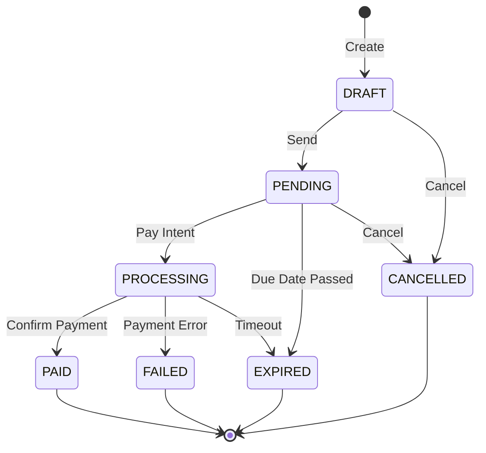

# Invoice Object

The Invoice object represents a payment request from a freelancer to a client.

## Object Structure

```typescript
interface Invoice {
  // Identifiers
  id: string;
  invoiceNumber: string;
  status: InvoiceStatus;

  // Freelancer (creator) information
  freelancerWallet: string;
  freelancerName?: string;
  freelancerEmail?: string;
  freelancerCompany?: string;

  // Client (payer) information
  clientName: string;
  clientEmail: string;
  clientCompany?: string;
  clientAddress?: string;
  clientWallet?: string;

  // Invoice details
  title: string;
  description?: string;
  notes?: string;

  // Financial details
  subtotal: string;
  taxRate?: string;
  taxAmount?: string;
  discount?: string;
  total: string;
  currency: Currency;

  // Timestamps
  createdAt: string;
  updatedAt: string;
  dueDate?: string;
  paidAt?: string;

  // Blockchain reference
  transactionHash?: string;
  ledgerNumber?: number;
  payerWallet?: string;
  networkPassphrase: string;

  // Relations
  lineItems: LineItem[];
  payments?: Payment[];
  auditLogs?: InvoiceAuditLog[];
}
```

---

## Field Reference

### Identifiers

| Field | Type | Description |
|-------|------|-------------|
| `id` | string | Unique invoice ID (CUID format: `cm123abc456def`) |
| `invoiceNumber` | string | Human-readable invoice number (`INV-0001`, `INV-0002`, etc.) |
| `status` | InvoiceStatus | Current invoice status |

**Example:**
```json
{
  "id": "cm3g4h5i6j7k8l9m0n",
  "invoiceNumber": "INV-0042",
  "status": "PAID"
}
```

---

### Invoice Status

```typescript
type InvoiceStatus =
  | "DRAFT"      // Created but not sent
  | "PENDING"    // Sent to client, awaiting payment
  | "PROCESSING" // Payment intent created, awaiting confirmation
  | "PAID"       // Payment confirmed on blockchain
  | "FAILED"     // Payment failed
  | "EXPIRED"    // Passed due date without payment
  | "CANCELLED"; // Cancelled by creator
```

**Status Flow:**



---

### Freelancer Information

Information about the invoice creator (service provider).

| Field | Type | Required | Description |
|-------|------|----------|-------------|
| `freelancerWallet` | string | Yes | Stellar wallet address (payment recipient) |
| `freelancerName` | string | No | Freelancer name |
| `freelancerEmail` | string | No | Freelancer email |
| `freelancerCompany` | string | No | Freelancer company name |

**Example:**
```json
{
  "freelancerWallet": "GAIXVVI3IHXPCFVD4NF6NFMYNHF7ZO5J5KN3AEVD67X3ZGXNCRQQ2AIC",
  "freelancerName": "John Doe",
  "freelancerEmail": "john@freelancer.com",
  "freelancerCompany": "JD Web Services"
}
```

---

### Client Information

Information about the invoice recipient (payer).

| Field | Type | Required | Description |
|-------|------|----------|-------------|
| `clientName` | string | Yes | Client name |
| `clientEmail` | string | Yes | Client email |
| `clientCompany` | string | No | Client company name |
| `clientAddress` | string | No | Client billing address |
| `clientWallet` | string | No | Client Stellar wallet (set after payment) |

**Example:**
```json
{
  "clientName": "Acme Corporation",
  "clientEmail": "billing@acme.com",
  "clientCompany": "Acme Corp",
  "clientAddress": "123 Main St, San Francisco, CA 94105",
  "clientWallet": null
}
```

**Note:** `clientWallet` is automatically populated when the invoice is paid.

---

### Invoice Details

| Field | Type | Required | Description |
|-------|------|----------|-------------|
| `title` | string | Yes | Invoice title (e.g., "Website Development - March 2024") |
| `description` | string | No | Detailed description |
| `notes` | string | No | Additional notes (terms, payment instructions) |

**Example:**
```json
{
  "title": "Web Development Services",
  "description": "Frontend development for e-commerce platform",
  "notes": "Payment due within 30 days. Thank you for your business!"
}
```

---

### Financial Details

| Field | Type | Required | Description |
|-------|------|----------|-------------|
| `subtotal` | string | Yes | Sum of all line items (before tax/discount) |
| `taxRate` | string | No | Tax percentage (e.g., "7.50" for 7.5%) |
| `taxAmount` | string | No | Calculated tax amount |
| `discount` | string | No | Discount amount |
| `total` | string | Yes | Final amount to be paid |
| `currency` | Currency | Yes | Payment currency |

**Currency Types:**
```typescript
type Currency = "XLM" | "USDC" | "EURC";
```

**Calculation:**
```
total = subtotal + taxAmount - discount
```

**Example:**
```json
{
  "subtotal": "1000.00",
  "taxRate": "7.50",
  "taxAmount": "75.00",
  "discount": "50.00",
  "total": "1025.00",
  "currency": "USDC"
}
```

**Precision:**
- All amounts stored as `Decimal(18, 7)` in database
- Supports up to 7 decimal places
- Returned as strings in API responses to prevent floating-point errors

---

### Timestamps

| Field | Type | Description |
|-------|------|-------------|
| `createdAt` | string | ISO 8601 timestamp of creation |
| `updatedAt` | string | ISO 8601 timestamp of last update |
| `dueDate` | string | ISO 8601 timestamp of payment deadline |
| `paidAt` | string | ISO 8601 timestamp of payment confirmation |

**Example:**
```json
{
  "createdAt": "2024-03-01T10:00:00.000Z",
  "updatedAt": "2024-03-07T14:30:00.000Z",
  "dueDate": "2024-03-31T23:59:59.000Z",
  "paidAt": "2024-03-07T14:25:00.000Z"
}
```

---

### Blockchain Reference

| Field | Type | Description |
|-------|------|-------------|
| `transactionHash` | string | Stellar transaction hash (64 hex chars) |
| `ledgerNumber` | number | Stellar ledger number |
| `payerWallet` | string | Wallet address that made the payment |
| `networkPassphrase` | string | Stellar network used |

**Network Passphrases:**
- **Testnet:** `Test SDF Network ; September 2015`
- **Mainnet:** `Public Global Stellar Network ; September 2015`

**Example (Paid):**
```json
{
  "transactionHash": "7a8b9c0d1e2f3a4b5c6d7e8f9a0b1c2d3e4f5a6b7c8d9e0f1a2b3c4d5e6f7a8b",
  "ledgerNumber": 123456,
  "payerWallet": "GDPYEQVXKP7VVXV6XJZXJQVXQVXQVXQVXQVXQVXQVXQVXQVXQVXQVXQV",
  "networkPassphrase": "Test SDF Network ; September 2015"
}
```

**Example (Unpaid):**
```json
{
  "transactionHash": null,
  "ledgerNumber": null,
  "payerWallet": null,
  "networkPassphrase": "Test SDF Network ; September 2015"
}
```

---

### Relations

#### Line Items

```typescript
interface LineItem {
  id: string;
  invoiceId: string;
  description: string;
  quantity: string;  // Decimal(10, 2)
  rate: string;      // Decimal(18, 7)
  amount: string;    // Decimal(18, 7) - quantity * rate
}
```

**Example:**
```json
{
  "lineItems": [
    {
      "id": "li_abc123",
      "invoiceId": "cm3g4h5i6j7k8l9m0n",
      "description": "Website Homepage Design",
      "quantity": "1.00",
      "rate": "500.00",
      "amount": "500.00"
    },
    {
      "id": "li_def456",
      "invoiceId": "cm3g4h5i6j7k8l9m0n",
      "description": "Contact Page Development",
      "quantity": "5.00",
      "rate": "100.00",
      "amount": "500.00"
    }
  ]
}
```

#### Payments

```typescript
interface Payment {
  id: string;
  invoiceId: string;
  transactionHash: string;
  ledgerNumber: number;
  fromWallet: string;
  toWallet: string;
  amount: string;
  asset: string;
  status: PaymentStatus;
  confirmedAt: string;
}

type PaymentStatus = "CONFIRMED" | "FAILED" | "REFUNDED";
```

**Example:**
```json
{
  "payments": [
    {
      "id": "pay_xyz789",
      "invoiceId": "cm3g4h5i6j7k8l9m0n",
      "transactionHash": "7a8b9c0d...",
      "ledgerNumber": 123456,
      "fromWallet": "GDPYEQVX...",
      "toWallet": "GAIXVVI3...",
      "amount": "1025.00",
      "asset": "USDC",
      "status": "CONFIRMED",
      "confirmedAt": "2024-03-07T14:25:00.000Z"
    }
  ]
}
```

#### Audit Logs

```typescript
interface InvoiceAuditLog {
  id: string;
  invoiceId: string;
  action: AuditAction;
  actorWallet: string;
  changes?: Record<string, any>;
  createdAt: string;
}

type AuditAction =
  | "CREATED"
  | "UPDATED"
  | "SENT"
  | "PAID"
  | "EXPIRED"
  | "CANCELLED"
  | "DELETED";
```

**Example:**
```json
{
  "auditLogs": [
    {
      "id": "log_aaa111",
      "invoiceId": "cm3g4h5i6j7k8l9m0n",
      "action": "CREATED",
      "actorWallet": "GAIXVVI3...",
      "changes": null,
      "createdAt": "2024-03-01T10:00:00.000Z"
    },
    {
      "id": "log_bbb222",
      "invoiceId": "cm3g4h5i6j7k8l9m0n",
      "action": "SENT",
      "actorWallet": "GAIXVVI3...",
      "changes": {
        "status": { "from": "DRAFT", "to": "PENDING" }
      },
      "createdAt": "2024-03-01T11:00:00.000Z"
    },
    {
      "id": "log_ccc333",
      "invoiceId": "cm3g4h5i6j7k8l9m0n",
      "action": "PAID",
      "actorWallet": "GDPYEQVX...",
      "changes": {
        "status": { "from": "PROCESSING", "to": "PAID" },
        "transactionHash": "7a8b9c0d..."
      },
      "createdAt": "2024-03-07T14:25:00.000Z"
    }
  ]
}
```

---

## Complete Example

```json
{
  "id": "cm3g4h5i6j7k8l9m0n",
  "invoiceNumber": "INV-0042",
  "status": "PAID",

  "freelancerWallet": "GAIXVVI3IHXPCFVD4NF6NFMYNHF7ZO5J5KN3AEVD67X3ZGXNCRQQ2AIC",
  "freelancerName": "John Doe",
  "freelancerEmail": "john@freelancer.com",
  "freelancerCompany": "JD Web Services",

  "clientName": "Acme Corporation",
  "clientEmail": "billing@acme.com",
  "clientCompany": "Acme Corp",
  "clientAddress": "123 Main St, San Francisco, CA 94105",
  "clientWallet": "GDPYEQVXKP7VVXV6XJZXJQVXQVXQVXQVXQVXQVXQVXQVXQVXQVXQVXQV",

  "title": "Web Development Services - March 2024",
  "description": "Full-stack development for e-commerce platform",
  "notes": "Payment due within 30 days. Thank you for your business!",

  "subtotal": "1000.0000000",
  "taxRate": "7.50",
  "taxAmount": "75.0000000",
  "discount": "50.0000000",
  "total": "1025.0000000",
  "currency": "USDC",

  "createdAt": "2024-03-01T10:00:00.000Z",
  "updatedAt": "2024-03-07T14:30:00.000Z",
  "dueDate": "2024-03-31T23:59:59.000Z",
  "paidAt": "2024-03-07T14:25:00.000Z",

  "transactionHash": "7a8b9c0d1e2f3a4b5c6d7e8f9a0b1c2d3e4f5a6b7c8d9e0f1a2b3c4d5e6f7a8b",
  "ledgerNumber": 123456,
  "payerWallet": "GDPYEQVXKP7VVXV6XJZXJQVXQVXQVXQVXQVXQVXQVXQVXQVXQVXQVXQV",
  "networkPassphrase": "Test SDF Network ; September 2015",

  "lineItems": [
    {
      "id": "li_abc123",
      "invoiceId": "cm3g4h5i6j7k8l9m0n",
      "description": "Website Homepage Design",
      "quantity": "1.00",
      "rate": "500.0000000",
      "amount": "500.0000000"
    },
    {
      "id": "li_def456",
      "invoiceId": "cm3g4h5i6j7k8l9m0n",
      "description": "Additional Pages (×5)",
      "quantity": "5.00",
      "rate": "100.0000000",
      "amount": "500.0000000"
    }
  ],

  "payments": [
    {
      "id": "pay_xyz789",
      "invoiceId": "cm3g4h5i6j7k8l9m0n",
      "transactionHash": "7a8b9c0d1e2f3a4b5c6d7e8f9a0b1c2d3e4f5a6b7c8d9e0f1a2b3c4d5e6f7a8b",
      "ledgerNumber": 123456,
      "fromWallet": "GDPYEQVXKP7VVXV6XJZXJQVXQVXQVXQVXQVXQVXQVXQVXQVXQVXQVXQV",
      "toWallet": "GAIXVVI3IHXPCFVD4NF6NFMYNHF7ZO5J5KN3AEVD67X3ZGXNCRQQ2AIC",
      "amount": "1025.0000000",
      "asset": "USDC",
      "status": "CONFIRMED",
      "confirmedAt": "2024-03-07T14:25:00.000Z"
    }
  ]
}
```

---

## Public vs Owner View

### Public View (`GET /api/invoices/:id`)

Returns limited fields suitable for the payment page:

```json
{
  "id": "cm3g4h5i6j7k8l9m0n",
  "invoiceNumber": "INV-0042",
  "status": "PENDING",
  "title": "Web Development Services",
  "description": "Full-stack development",
  "total": "1025.0000000",
  "currency": "USDC",
  "freelancerWallet": "GAIXVVI3...",
  "clientName": "Acme Corporation",
  "networkPassphrase": "Test SDF Network ; September 2015",
  "lineItems": [...]
}
```

**Hidden fields:**
- `freelancerEmail`
- `clientEmail`
- `clientAddress`
- `notes` (may contain sensitive info)
- `auditLogs`

### Owner View (`GET /api/invoices/:id/owner`)

Returns all fields including sensitive data:

```json
{
  "id": "cm3g4h5i6j7k8l9m0n",
  "invoiceNumber": "INV-0042",
  // ... all fields including emails, addresses, etc.
  "auditLogs": [...]
}
```

**Requires:** Authentication + ownership verification

---

## Database Schema

```prisma
model Invoice {
  id                String        @id @default(cuid())
  invoiceNumber     String        @unique @map("invoice_number")
  status            InvoiceStatus @default(DRAFT)

  freelancerWallet  String        @map("freelancer_wallet")
  freelancerName    String?       @map("freelancer_name")
  freelancerEmail   String?       @map("freelancer_email")
  freelancerCompany String?       @map("freelancer_company")

  clientName        String        @map("client_name")
  clientEmail       String        @map("client_email")
  clientCompany     String?       @map("client_company")
  clientAddress     String?       @map("client_address")
  clientWallet      String?       @map("client_wallet")

  title             String
  description       String?
  notes             String?

  subtotal          Decimal       @db.Decimal(18, 7)
  taxRate           Decimal?      @map("tax_rate") @db.Decimal(5, 2)
  taxAmount         Decimal?      @map("tax_amount") @db.Decimal(18, 7)
  discount          Decimal?      @db.Decimal(18, 7)
  total             Decimal       @db.Decimal(18, 7)
  currency          Currency      @default(XLM)

  createdAt         DateTime      @default(now()) @map("created_at")
  updatedAt         DateTime      @updatedAt @map("updated_at")
  dueDate           DateTime?     @map("due_date")
  paidAt            DateTime?     @map("paid_at")

  transactionHash   String?       @map("transaction_hash")
  ledgerNumber      Int?          @map("ledger_number")
  payerWallet       String?       @map("payer_wallet")
  networkPassphrase String        @default("Test SDF Network ; September 2015")

  deletedAt         DateTime?     @map("deleted_at")

  lineItems         LineItem[]
  payments          Payment[]
  auditLogs         InvoiceAuditLog[]

  @@index([freelancerWallet])
  @@index([status])
  @@index([freelancerWallet, status])
  @@map("invoices")
}
```

---

## Next Steps

- Learn about [Payment Object](/api/resources/payment)
- Explore [Invoice Endpoints](/api/endpoints/invoices)
- Read [Integration Guide](/guide/integration/backend)
