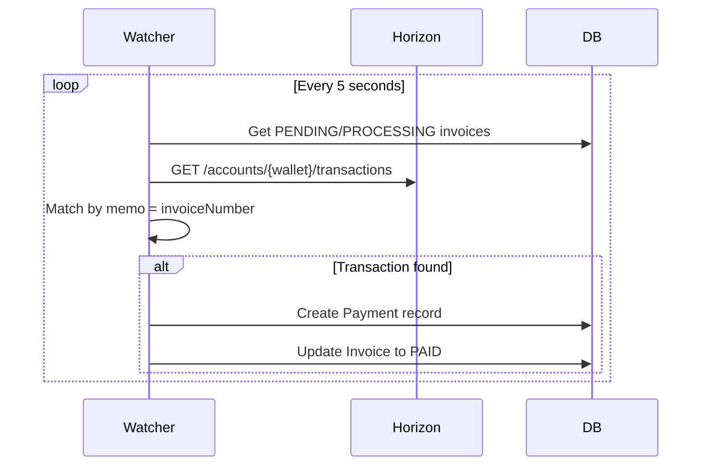

# Payment Object

The Payment object represents a confirmed cryptocurrency payment on the Stellar blockchain.

## Object Structure

```typescript
interface Payment {
  // Identifiers
  id: string;
  invoiceId: string;
  transactionHash: string;
  ledgerNumber: number;

  // Payment details
  fromWallet: string;
  toWallet: string;
  amount: string;
  asset: string;
  status: PaymentStatus;

  // Timestamp
  confirmedAt: string;
}
```

---

## Field Reference

### Identifiers

| Field | Type | Description |
|-------|------|-------------|
| `id` | string | Unique payment ID (CUID format) |
| `invoiceId` | string | Associated invoice ID |
| `transactionHash` | string | Stellar blockchain transaction hash (64 hex characters) |
| `ledgerNumber` | number | Stellar ledger number where transaction was confirmed |

**Example:**
```json
{
  "id": "pay_xyz123abc456",
  "invoiceId": "cm3g4h5i6j7k8l9m0n",
  "transactionHash": "7a8b9c0d1e2f3a4b5c6d7e8f9a0b1c2d3e4f5a6b7c8d9e0f1a2b3c4d5e6f7a8b",
  "ledgerNumber": 123456
}
```

---

### Payment Details

| Field | Type | Description |
|-------|------|-------------|
| `fromWallet` | string | Sender's Stellar wallet address |
| `toWallet` | string | Recipient's Stellar wallet address (freelancer) |
| `amount` | string | Payment amount (Decimal 18,7 precision) |
| `asset` | string | Asset code (`XLM`, `USDC`, `EURC`) |
| `status` | PaymentStatus | Payment status |

**Example:**
```json
{
  "fromWallet": "GDPYEQVXKP7VVXV6XJZXJQVXQVXQVXQVXQVXQVXQVXQVXQVXQVXQVXQV",
  "toWallet": "GAIXVVI3IHXPCFVD4NF6NFMYNHF7ZO5J5KN3AEVD67X3ZGXNCRQQ2AIC",
  "amount": "1025.0000000",
  "asset": "USDC",
  "status": "CONFIRMED"
}
```

---

### Payment Status

```typescript
type PaymentStatus =
  | "CONFIRMED"  // Payment confirmed on blockchain
  | "FAILED"     // Payment failed
  | "REFUNDED";  // Payment refunded (future feature)
```

**Status Descriptions:**

| Status | Description | Final? |
|--------|-------------|--------|
| `CONFIRMED` | Payment successfully recorded on Stellar blockchain | Yes |
| `FAILED` | Payment transaction failed | Yes |
| `REFUNDED` | Payment has been refunded (not yet implemented) | Yes |

---

### Timestamp

| Field | Type | Description |
|-------|------|-------------|
| `confirmedAt` | string | ISO 8601 timestamp when payment was confirmed on-chain |

**Example:**
```json
{
  "confirmedAt": "2024-03-07T14:25:30.000Z"
}
```

---

## Complete Example

```json
{
  "id": "pay_xyz123abc456",
  "invoiceId": "cm3g4h5i6j7k8l9m0n",
  "transactionHash": "7a8b9c0d1e2f3a4b5c6d7e8f9a0b1c2d3e4f5a6b7c8d9e0f1a2b3c4d5e6f7a8b",
  "ledgerNumber": 123456,
  "fromWallet": "GDPYEQVXKP7VVXV6XJZXJQVXQVXQVXQVXQVXQVXQVXQVXQVXQVXQVXQV",
  "toWallet": "GAIXVVI3IHXPCFVD4NF6NFMYNHF7ZO5J5KN3AEVD67X3ZGXNCRQQ2AIC",
  "amount": "1025.0000000",
  "asset": "USDC",
  "status": "CONFIRMED",
  "confirmedAt": "2024-03-07T14:25:30.000Z"
}
```

---

## Relationship to Invoice

Each Payment is linked to an Invoice:

```typescript
interface Invoice {
  id: string;
  status: InvoiceStatus;
  total: string;
  transactionHash?: string;
  ledgerNumber?: number;
  payerWallet?: string;
  payments: Payment[];  // All associated payments
}
```

**Typical Flow:**

1. Invoice created with status `DRAFT`
2. Invoice sent to client → status becomes `PENDING`
3. Client initiates payment → status becomes `PROCESSING`
4. Payment confirmed on blockchain → Payment record created
5. Invoice status updated to `PAID`
6. Invoice fields updated with payment details:
   - `transactionHash` = Payment.transactionHash
   - `ledgerNumber` = Payment.ledgerNumber
   - `payerWallet` = Payment.fromWallet
   - `paidAt` = Payment.confirmedAt

---

## Payment Creation

Payment objects are **automatically created** by the system when:

1. **Watcher Service** detects a matching transaction
2. **Manual Confirmation** via `POST /api/payments/confirm`
3. **Direct Submission** via `POST /api/payments/submit`

**Watcher Service Flow:**



**Manual Confirmation Flow:**

```typescript
// Client submits transaction hash
POST /api/payments/confirm
{
  "invoiceId": "cm123...",
  "transactionHash": "7a8b9c0d..."
}

// Backend:
// 1. Fetch transaction from Horizon
// 2. Verify transaction details
// 3. Create Payment record
// 4. Update Invoice to PAID
```

---

## Viewing Payments

### Via Invoice Endpoint

```typescript
GET /api/invoices/:id/owner

{
  "id": "cm123...",
  "status": "PAID",
  "payments": [
    {
      "id": "pay_xyz123",
      "transactionHash": "7a8b9c0d...",
      "amount": "1025.0000000",
      "asset": "USDC",
      "status": "CONFIRMED",
      "confirmedAt": "2024-03-07T14:25:30.000Z"
    }
  ]
}
```

### Via Blockchain Explorer

Payment details can be verified on public blockchain explorers:

**Testnet:**
- Stellar Expert: `https://stellar.expert/explorer/testnet/tx/{transactionHash}`
- StellarChain: `https://testnet.stellarchain.io/transactions/{transactionHash}`

**Mainnet:**
- Stellar Expert: `https://stellar.expert/explorer/public/tx/{transactionHash}`
- StellarChain: `https://stellarchain.io/transactions/{transactionHash}`

**Example:**
```
https://stellar.expert/explorer/testnet/tx/7a8b9c0d1e2f3a4b5c6d7e8f9a0b1c2d3e4f5a6b7c8d9e0f1a2b3c4d5e6f7a8b
```

---

## Payment Verification

### On-Chain Verification

The Payment Watcher Service performs these checks:

1. **Transaction exists** on Stellar network
2. **Transaction succeeded** (not failed)
3. **Recipient matches** invoice.freelancerWallet
4. **Asset matches** invoice.currency
5. **Amount sufficient** (≥ invoice.total)
6. **Memo matches** invoice.invoiceNumber

**Code Example:**

```typescript
async function verifyPayment(
  transactionHash: string,
  invoice: Invoice
): Promise<boolean> {
  // 1. Fetch transaction from Horizon
  const tx = await horizon.transactions()
    .transaction(transactionHash)
    .call();

  // 2. Verify success
  if (!tx.successful) return false;

  // 3. Get payment operations
  const operations = await horizon.operations()
    .forTransaction(transactionHash)
    .call();

  // 4. Find matching payment
  const payment = operations.records.find(op =>
    op.type === 'payment' &&
    op.to === invoice.freelancerWallet &&
    op.asset_code === invoice.currency &&
    parseFloat(op.amount) >= parseFloat(invoice.total)
  );

  return !!payment;
}
```

---

## Database Schema

```prisma
enum PaymentStatus {
  CONFIRMED
  FAILED
  REFUNDED
}

model Payment {
  id              String        @id @default(cuid())
  invoiceId       String        @map("invoice_id")
  transactionHash String        @unique @map("transaction_hash")
  ledgerNumber    Int           @map("ledger_number")
  fromWallet      String        @map("from_wallet")
  toWallet        String        @map("to_wallet")
  amount          Decimal       @db.Decimal(18, 7)
  asset           String
  status          PaymentStatus @default(CONFIRMED)
  confirmedAt     DateTime      @default(now()) @map("confirmed_at")

  invoice         Invoice       @relation(fields: [invoiceId], references: [id], onDelete: Cascade)

  @@index([invoiceId])
  @@index([transactionHash])
  @@map("payments")
}
```

**Unique Constraints:**
- `transactionHash` is unique (prevents duplicate payment records)

**Indexes:**
- `invoiceId`: Fast lookups of payments for an invoice
- `transactionHash`: Fast transaction verification

**Cascade Behavior:**
- If Invoice is deleted, all associated Payments are deleted

---

## Payment Analytics

### Query Examples

**Total Revenue:**
```sql
SELECT
  asset,
  SUM(amount) as total_revenue,
  COUNT(*) as payment_count
FROM payments
WHERE status = 'CONFIRMED'
GROUP BY asset;
```

**Revenue by Time Period:**
```sql
SELECT
  DATE_TRUNC('month', confirmed_at) as month,
  asset,
  SUM(amount) as revenue
FROM payments
WHERE status = 'CONFIRMED'
  AND confirmed_at >= NOW() - INTERVAL '6 months'
GROUP BY month, asset
ORDER BY month DESC;
```

**Top Payers:**
```sql
SELECT
  from_wallet,
  COUNT(*) as payment_count,
  SUM(amount) as total_paid
FROM payments
WHERE status = 'CONFIRMED'
GROUP BY from_wallet
ORDER BY total_paid DESC
LIMIT 10;
```

---

## Future Enhancements

### Refund Support (Planned)

```typescript
// Refund endpoint (planned)
POST /api/payments/:id/refund

// Request
{
  "reason": "Customer request",
  "amount": "1025.00" // Full or partial
}

// Response
{
  "id": "pay_xyz123",
  "status": "REFUNDED",
  "refundTransactionHash": "abc123def456...",
  "refundedAt": "2024-03-08T10:00:00.000Z"
}
```

### Partial Payments (Planned)

Support for invoices paid across multiple transactions:

```typescript
{
  "invoiceId": "cm123...",
  "total": "1000.00",
  "payments": [
    {
      "amount": "500.00",
      "transactionHash": "tx1...",
      "confirmedAt": "2024-03-07T10:00:00Z"
    },
    {
      "amount": "500.00",
      "transactionHash": "tx2...",
      "confirmedAt": "2024-03-07T12:00:00Z"
    }
  ],
  "status": "PAID" // When sum(payments.amount) >= invoice.total
}
```

---

## Best Practices

### 1. Always Verify On-Chain

Don't trust Payment records blindly—verify on Stellar:

```typescript
async function verifyPaymentOnChain(payment: Payment): Promise<boolean> {
  try {
    const tx = await horizon.transactions()
      .transaction(payment.transactionHash)
      .call();

    return tx.successful && tx.ledger === payment.ledgerNumber;
  } catch (error) {
    return false;
  }
}
```

### 2. Handle Network Delays

Stellar finality is 3-5 seconds, but watcher polling is every 5 seconds:

```typescript
// Expect 5-10 second delay between on-chain confirmation and Payment record creation
const MAX_WAIT_TIME = 30_000; // 30 seconds
const POLL_INTERVAL = 5_000;  // 5 seconds

async function waitForPayment(invoiceId: string): Promise<Payment> {
  const startTime = Date.now();

  while (Date.now() - startTime < MAX_WAIT_TIME) {
    const invoice = await getInvoice(invoiceId);

    if (invoice.status === 'PAID' && invoice.payments.length > 0) {
      return invoice.payments[0];
    }

    await new Promise(resolve => setTimeout(resolve, POLL_INTERVAL));
  }

  throw new Error('Payment timeout');
}
```

### 3. Display Transaction Links

Provide users with blockchain explorer links:

```typescript
function getTransactionUrl(
  transactionHash: string,
  network: 'testnet' | 'mainnet'
): string {
  const baseUrl = network === 'testnet'
    ? 'https://stellar.expert/explorer/testnet/tx'
    : 'https://stellar.expert/explorer/public/tx';

  return `${baseUrl}/${transactionHash}`;
}

// Usage
<a href={getTransactionUrl(payment.transactionHash, 'testnet')}>
  View on Stellar Explorer
</a>
```

---

## Next Steps

- Learn about [Invoice Object](/api/resources/invoice)
- Explore [Client Object](/api/resources/client)
- Read [Payment Endpoints](/api/endpoints/payments)
- Understand [Payment Watcher](/guide/advanced/watcher)
