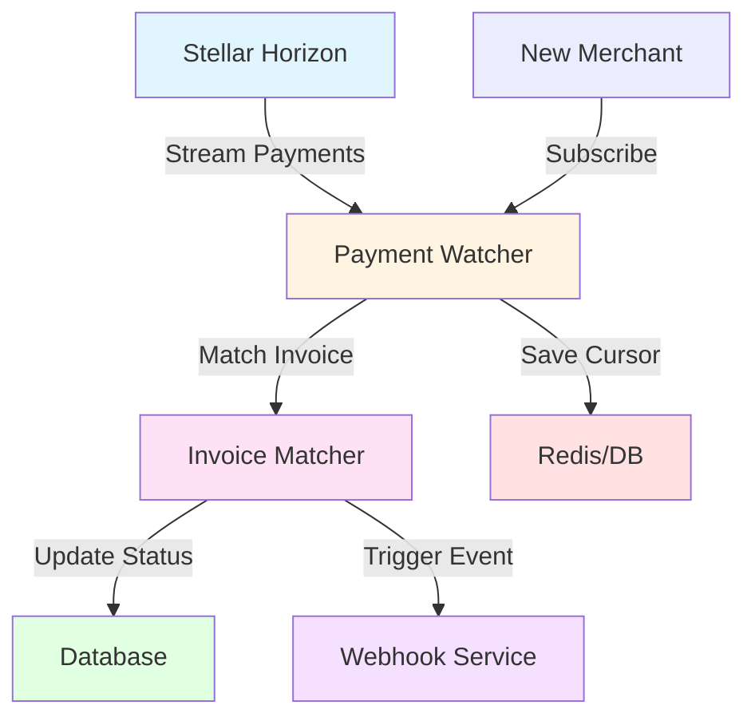

# Payment Watcher

The Payment Watcher is a critical background service that monitors the Stellar network for incoming payments and automatically updates invoice statuses. This guide covers the architecture, implementation, and operational aspects of the watcher service.

## Overview

The Payment Watcher provides real-time payment detection without requiring customers to manually submit transaction hashes. It continuously monitors merchant Stellar accounts and processes payments as they occur on the blockchain.

### Key Features

- **Real-time monitoring**: Detects payments within seconds
- **Automatic reconciliation**: Matches payments to invoices
- **Multi-asset support**: Handles XLM, USDC, EURC, and other assets
- **Fault tolerance**: Resumes from last processed ledger on restart
- **Scalability**: Handles multiple merchant accounts efficiently
- **Webhook triggering**: Fires events when payments are detected

## Architecture



### How It Works

1. **Stream Connection**: Connects to Stellar Horizon's payment stream
2. **Payment Detection**: Receives payment operations in real-time
3. **Invoice Matching**: Matches payments to pending invoices by merchant address and amount
4. **Verification**: Validates payment details (amount, asset, recipient)
5. **Status Update**: Updates invoice status to PAID
6. **Webhook Trigger**: Sends webhook event to merchant
7. **Cursor Management**: Saves last processed ledger for recovery

## Implementation

### Core Watcher Service

```typescript
// services/paymentWatcher.ts
import { Server, ServerApi } from 'stellar-sdk';
import { PrismaClient } from '@prisma/client';
import { Redis } from 'ioredis';

export class PaymentWatcher {
  private server: Server;
  private prisma: PrismaClient;
  private redis: Redis;
  private streamClosers: Map<string, () => void> = new Map();

  constructor() {
    const horizonUrl = process.env.STELLAR_NETWORK === 'testnet'
      ? 'https://horizon-testnet.stellar.org'
      : 'https://horizon.stellar.org';

    this.server = new Server(horizonUrl);
    this.prisma = new PrismaClient();
    this.redis = new Redis(process.env.REDIS_URL);
  }

  /**
   * Start watching a merchant's account for payments
   */
  async watchMerchant(merchantId: string, walletAddress: string) {
    // Check if already watching
    if (this.streamClosers.has(merchantId)) {
      console.log(`Already watching merchant ${merchantId}`);
      return;
    }

    // Get last processed cursor
    const cursor = await this.getLastCursor(merchantId);

    console.log(`Starting watcher for ${walletAddress} from cursor ${cursor}`);

    // Create payment stream
    const closer = this.server
      .payments()
      .forAccount(walletAddress)
      .cursor(cursor || 'now')
      .stream({
        onmessage: (payment) => this.handlePayment(payment, merchantId),
        onerror: (error) => this.handleError(error, merchantId)
      });

    // Store closer for cleanup
    this.streamClosers.set(merchantId, closer);
  }

  /**
   * Stop watching a merchant's account
   */
  stopWatchingMerchant(merchantId: string) {
    const closer = this.streamClosers.get(merchantId);
    if (closer) {
      closer();
      this.streamClosers.delete(merchantId);
      console.log(`Stopped watching merchant ${merchantId}`);
    }
  }

  /**
   * Handle incoming payment
   */
  private async handlePayment(
    payment: ServerApi.PaymentOperationRecord,
    merchantId: string
  ) {
    try {
      // Skip non-payment operations
      if (payment.type !== 'payment') {
        return;
      }

      // Skip outgoing payments
      if (payment.from === payment.to) {
        return;
      }

      // Extract payment details
      const amount = payment.amount;
      const asset = payment.asset_type === 'native' ? 'XLM' : payment.asset_code;
      const from = payment.from;
      const to = payment.to;

      console.log('Payment detected:', {
        amount,
        asset,
        from,
        to,
        transactionHash: payment.transaction_hash
      });

      // Find matching invoice
      const invoice = await this.findMatchingInvoice(
        merchantId,
        to,
        amount,
        asset
      );

      if (!invoice) {
        console.log('No matching invoice found for payment');
        await this.saveCursor(merchantId, payment.paging_token);
        return;
      }

      // Process payment
      await this.processPayment(invoice, payment);

      // Save cursor
      await this.saveCursor(merchantId, payment.paging_token);

    } catch (error) {
      console.error('Error handling payment:', error);
      // Don't throw - continue processing other payments
    }
  }

  /**
   * Find invoice matching payment parameters
   */
  private async findMatchingInvoice(
    merchantId: string,
    recipientAddress: string,
    amount: string,
    asset: string
  ) {
    // Get merchant's wallet address
    const merchant = await this.prisma.user.findUnique({
      where: { id: merchantId },
      select: { walletAddress: true }
    });

    // Verify payment is to merchant's address
    if (merchant?.walletAddress !== recipientAddress) {
      return null;
    }

    // Find pending invoice with matching amount and asset
    const invoice = await this.prisma.invoice.findFirst({
      where: {
        merchantId,
        status: 'PENDING',
        amount,
        asset,
        expiresAt: { gte: new Date() }
      },
      orderBy: { createdAt: 'asc' } // FIFO matching
    });

    return invoice;
  }

  /**
   * Process matched payment
   */
  private async processPayment(
    invoice: any,
    payment: ServerApi.PaymentOperationRecord
  ) {
    // Start transaction to ensure atomicity
    await this.prisma.$transaction(async (tx) => {
      // Check if payment already recorded (double-spend prevention)
      const existing = await tx.payment.findUnique({
        where: { transactionHash: payment.transaction_hash }
      });

      if (existing) {
        console.log('Payment already processed:', payment.transaction_hash);
        return;
      }

      // Create payment record
      const paymentRecord = await tx.payment.create({
        data: {
          transactionHash: payment.transaction_hash,
          invoiceId: invoice.id,
          amount: payment.amount,
          asset: payment.asset_type === 'native' ? 'XLM' : payment.asset_code,
          from: payment.from,
          to: payment.to,
          ledger: payment.ledger,
          status: 'CONFIRMED',
          createdAt: new Date(payment.created_at)
        }
      });

      // Update invoice status
      await tx.invoice.update({
        where: { id: invoice.id },
        data: {
          status: 'PAID',
          paidAt: new Date(payment.created_at)
        }
      });

      console.log('Invoice marked as paid:', {
        invoiceId: invoice.id,
        paymentId: paymentRecord.id
      });

      // Trigger webhook (async, outside transaction)
      setImmediate(() => {
        this.triggerWebhook(invoice.id, paymentRecord.id);
      });
    });
  }

  /**
   * Trigger webhook for payment event
   */
  private async triggerWebhook(invoiceId: string, paymentId: string) {
    try {
      // Get full invoice and payment data
      const invoice = await this.prisma.invoice.findUnique({
        where: { id: invoiceId },
        include: {
          merchant: true,
          client: true,
          payments: {
            where: { id: paymentId }
          }
        }
      });

      if (!invoice) return;

      // Construct webhook event
      const event = {
        id: `evt_${Date.now()}`,
        type: 'invoice.paid',
        created: new Date().toISOString(),
        data: {
          invoice: {
            id: invoice.id,
            invoiceNumber: invoice.invoiceNumber,
            amount: invoice.amount,
            asset: invoice.asset,
            status: invoice.status,
            paidAt: invoice.paidAt
          },
          payment: invoice.payments[0]
        }
      };

      // Send webhook (implement based on your webhook service)
      await this.sendWebhook(invoice.merchant.id, event);

    } catch (error) {
      console.error('Error triggering webhook:', error);
    }
  }

  /**
   * Send webhook to merchant endpoint
   */
  private async sendWebhook(merchantId: string, event: any) {
    // Get merchant's webhook URL
    const webhookUrl = await this.getWebhookUrl(merchantId);
    if (!webhookUrl) return;

    // Generate signature
    const signature = this.generateWebhookSignature(
      JSON.stringify(event),
      process.env.WEBHOOK_SECRET!
    );

    // Send HTTP POST request
    try {
      const response = await fetch(webhookUrl, {
        method: 'POST',
        headers: {
          'Content-Type': 'application/json',
          'X-Link2Pay-Signature': signature,
          'X-Link2Pay-Timestamp': Math.floor(Date.now() / 1000).toString()
        },
        body: JSON.stringify(event)
      });

      if (!response.ok) {
        console.error('Webhook delivery failed:', {
          status: response.status,
          merchantId
        });
      }
    } catch (error) {
      console.error('Webhook request failed:', error);
    }
  }

  /**
   * Get merchant's webhook URL
   */
  private async getWebhookUrl(merchantId: string): Promise<string | null> {
    // Implement based on your user settings model
    // For now, return from environment or database
    return process.env.WEBHOOK_URL || null;
  }

  /**
   * Generate HMAC signature for webhook
   */
  private generateWebhookSignature(payload: string, secret: string): string {
    const crypto = require('crypto');
    return crypto
      .createHmac('sha256', secret)
      .update(payload)
      .digest('hex');
  }

  /**
   * Handle stream errors
   */
  private async handleError(error: any, merchantId: string) {
    console.error(`Watcher error for merchant ${merchantId}:`, error);

    // Attempt to reconnect after delay
    setTimeout(() => {
      this.reconnect(merchantId);
    }, 5000);
  }

  /**
   * Reconnect to stream
   */
  private async reconnect(merchantId: string) {
    console.log(`Reconnecting watcher for merchant ${merchantId}`);

    // Stop current watcher
    this.stopWatchingMerchant(merchantId);

    // Get merchant's wallet address
    const merchant = await this.prisma.user.findUnique({
      where: { id: merchantId },
      select: { walletAddress: true }
    });

    if (merchant) {
      await this.watchMerchant(merchantId, merchant.walletAddress);
    }
  }

  /**
   * Get last processed cursor for merchant
   */
  private async getLastCursor(merchantId: string): Promise<string | null> {
    const cursor = await this.redis.get(`watcher:cursor:${merchantId}`);
    return cursor;
  }

  /**
   * Save last processed cursor
   */
  private async saveCursor(merchantId: string, cursor: string) {
    await this.redis.set(`watcher:cursor:${merchantId}`, cursor);
  }

  /**
   * Start watching all active merchants
   */
  async startAll() {
    const merchants = await this.prisma.user.findMany({
      where: {
        // Only watch merchants with active invoices
        invoices: {
          some: {
            status: 'PENDING'
          }
        }
      },
      select: {
        id: true,
        walletAddress: true
      }
    });

    console.log(`Starting watchers for ${merchants.length} merchants`);

    for (const merchant of merchants) {
      await this.watchMerchant(merchant.id, merchant.walletAddress);
    }
  }

  /**
   * Stop all watchers
   */
  stopAll() {
    console.log('Stopping all watchers');
    for (const merchantId of this.streamClosers.keys()) {
      this.stopWatchingMerchant(merchantId);
    }
  }

  /**
   * Graceful shutdown
   */
  async shutdown() {
    console.log('Shutting down payment watcher');
    this.stopAll();
    await this.prisma.$disconnect();
    await this.redis.quit();
  }
}
```

### Starting the Watcher

```typescript
// server.ts or standalone watcher service
import { PaymentWatcher } from './services/paymentWatcher';

const watcher = new PaymentWatcher();

// Start watching all merchants
await watcher.startAll();

// Graceful shutdown
process.on('SIGTERM', async () => {
  console.log('SIGTERM received, shutting down gracefully');
  await watcher.shutdown();
  process.exit(0);
});

process.on('SIGINT', async () => {
  console.log('SIGINT received, shutting down gracefully');
  await watcher.shutdown();
  process.exit(0);
});
```

## Advanced Features

### Dynamic Merchant Management

Add/remove watchers as merchants create/cancel invoices:

```typescript
// When invoice is created
router.post('/invoices', async (req, res) => {
  const invoice = await prisma.invoice.create({
    data: req.body
  });

  // Start watching merchant if not already
  const merchant = await prisma.user.findUnique({
    where: { id: req.user.id },
    select: { walletAddress: true }
  });

  if (merchant) {
    await watcher.watchMerchant(req.user.id, merchant.walletAddress);
  }

  res.json(invoice);
});
```

### Multiple Asset Handling

Handle various Stellar assets:

```typescript
private getAssetIdentifier(payment: ServerApi.PaymentOperationRecord): string {
  if (payment.asset_type === 'native') {
    return 'XLM';
  }

  // Format: CODE:ISSUER for non-native assets
  return `${payment.asset_code}:${payment.asset_issuer}`;
}

private async findMatchingInvoice(
  merchantId: string,
  recipientAddress: string,
  amount: string,
  assetIdentifier: string
) {
  const [assetCode, assetIssuer] = assetIdentifier.split(':');

  const invoice = await this.prisma.invoice.findFirst({
    where: {
      merchantId,
      status: 'PENDING',
      amount,
      asset: assetCode,
      // If storing issuer in database:
      // assetIssuer: assetIssuer || null,
      expiresAt: { gte: new Date() }
    },
    orderBy: { createdAt: 'asc' }
  });

  return invoice;
}
```

### Memo-Based Matching

Use transaction memos for precise matching:

```typescript
private async handlePayment(
  payment: ServerApi.PaymentOperationRecord,
  merchantId: string
) {
  // Get transaction to access memo
  const transaction = await this.server
    .transactions()
    .transaction(payment.transaction_hash)
    .call();

  const memo = transaction.memo || null;

  // Find invoice by memo if present
  if (memo) {
    const invoice = await this.prisma.invoice.findFirst({
      where: {
        merchantId,
        memo: memo,
        status: 'PENDING'
      }
    });

    if (invoice) {
      await this.processPayment(invoice, payment);
      return;
    }
  }

  // Fall back to amount/asset matching
  // ... existing logic
}
```

### Rate Limiting and Backoff

Implement exponential backoff for Horizon API errors:

```typescript
private async reconnect(merchantId: string, retryCount = 0) {
  const maxRetries = 5;
  const baseDelay = 1000; // 1 second

  if (retryCount >= maxRetries) {
    console.error(`Max retries reached for merchant ${merchantId}`);
    return;
  }

  // Exponential backoff: 1s, 2s, 4s, 8s, 16s
  const delay = baseDelay * Math.pow(2, retryCount);

  console.log(`Reconnecting in ${delay}ms (attempt ${retryCount + 1})`);

  setTimeout(async () => {
    try {
      this.stopWatchingMerchant(merchantId);

      const merchant = await this.prisma.user.findUnique({
        where: { id: merchantId },
        select: { walletAddress: true }
      });

      if (merchant) {
        await this.watchMerchant(merchantId, merchant.walletAddress);
      }
    } catch (error) {
      console.error('Reconnection failed:', error);
      await this.reconnect(merchantId, retryCount + 1);
    }
  }, delay);
}
```

## Deployment Strategies

### Standalone Service

Run watcher as separate process:

```typescript
// watcher.ts
import { PaymentWatcher } from './services/paymentWatcher';

async function main() {
  const watcher = new PaymentWatcher();

  console.log('Starting payment watcher service');
  await watcher.startAll();

  // Health check endpoint
  const express = require('express');
  const app = express();

  app.get('/health', (req, res) => {
    res.json({
      status: 'healthy',
      watchingCount: watcher.getActiveWatcherCount(),
      uptime: process.uptime()
    });
  });

  app.listen(3001, () => {
    console.log('Health check server running on port 3001');
  });
}

main().catch(console.error);
```

**Docker Compose:**

```yaml
# docker-compose.yml
version: '3.8'

services:
  api:
    build: .
    command: npm run start:api
    ports:
      - "3000:3000"
    environment:
      - DATABASE_URL=${DATABASE_URL}
      - REDIS_URL=${REDIS_URL}

  watcher:
    build: .
    command: npm run start:watcher
    environment:
      - DATABASE_URL=${DATABASE_URL}
      - REDIS_URL=${REDIS_URL}
      - STELLAR_NETWORK=${STELLAR_NETWORK}
    restart: unless-stopped

  redis:
    image: redis:7-alpine
    ports:
      - "6379:6379"

  postgres:
    image: postgres:15-alpine
    ports:
      - "5432:5432"
    environment:
      - POSTGRES_DB=link2pay
      - POSTGRES_PASSWORD=${DB_PASSWORD}
```

### Kubernetes Deployment

```yaml
# k8s/watcher-deployment.yaml
apiVersion: apps/v1
kind: Deployment
metadata:
  name: payment-watcher
spec:
  replicas: 1  # Single instance to avoid duplicate processing
  selector:
    matchLabels:
      app: payment-watcher
  template:
    metadata:
      labels:
        app: payment-watcher
    spec:
      containers:
      - name: watcher
        image: link2pay/watcher:latest
        command: ["npm", "run", "start:watcher"]
        env:
        - name: DATABASE_URL
          valueFrom:
            secretKeyRef:
              name: link2pay-secrets
              key: database-url
        - name: REDIS_URL
          valueFrom:
            secretKeyRef:
              name: link2pay-secrets
              key: redis-url
        resources:
          requests:
            memory: "256Mi"
            cpu: "250m"
          limits:
            memory: "512Mi"
            cpu: "500m"
        livenessProbe:
          httpGet:
            path: /health
            port: 3001
          initialDelaySeconds: 30
          periodSeconds: 10
        readinessProbe:
          httpGet:
            path: /health
            port: 3001
          initialDelaySeconds: 5
          periodSeconds: 5
```

### Process Manager (PM2)

```javascript
// ecosystem.config.js
module.exports = {
  apps: [
    {
      name: 'link2pay-api',
      script: 'dist/server.js',
      instances: 4,
      exec_mode: 'cluster',
      env: {
        NODE_ENV: 'production'
      }
    },
    {
      name: 'link2pay-watcher',
      script: 'dist/watcher.js',
      instances: 1,  // Single instance only
      exec_mode: 'fork',
      autorestart: true,
      max_restarts: 10,
      env: {
        NODE_ENV: 'production'
      }
    }
  ]
};

// Start with: pm2 start ecosystem.config.js
```

## Monitoring and Observability

### Metrics Collection

```typescript
import { Counter, Gauge, Histogram } from 'prom-client';

class PaymentWatcherMetrics {
  private paymentsProcessed = new Counter({
    name: 'watcher_payments_processed_total',
    help: 'Total number of payments processed'
  });

  private paymentsMatched = new Counter({
    name: 'watcher_payments_matched_total',
    help: 'Total number of payments matched to invoices'
  });

  private activeWatchers = new Gauge({
    name: 'watcher_active_watchers',
    help: 'Number of active merchant watchers'
  });

  private processingDuration = new Histogram({
    name: 'watcher_processing_duration_seconds',
    help: 'Payment processing duration',
    buckets: [0.1, 0.5, 1, 2, 5]
  });

  recordPaymentProcessed() {
    this.paymentsProcessed.inc();
  }

  recordPaymentMatched() {
    this.paymentsMatched.inc();
  }

  setActiveWatchers(count: number) {
    this.activeWatchers.set(count);
  }

  recordProcessingDuration(durationSeconds: number) {
    this.processingDuration.observe(durationSeconds);
  }
}
```

### Logging Best Practices

```typescript
import winston from 'winston';

const logger = winston.createLogger({
  level: 'info',
  format: winston.format.combine(
    winston.format.timestamp(),
    winston.format.errors({ stack: true }),
    winston.format.json()
  ),
  defaultMeta: { service: 'payment-watcher' },
  transports: [
    new winston.transports.File({ filename: 'error.log', level: 'error' }),
    new winston.transports.File({ filename: 'watcher.log' })
  ]
});

// Structured logging
logger.info('Payment detected', {
  transactionHash: payment.transaction_hash,
  amount: payment.amount,
  asset: payment.asset_code || 'XLM',
  from: payment.from,
  ledger: payment.ledger,
  merchantId
});

logger.warn('No matching invoice found', {
  amount: payment.amount,
  asset: payment.asset_code || 'XLM',
  merchantId
});

logger.error('Payment processing failed', {
  error: error.message,
  stack: error.stack,
  transactionHash: payment.transaction_hash
});
```

## Performance Optimization

### Cursor Management

Store cursors efficiently:

```typescript
// Use Redis for fast cursor storage
private async saveCursor(merchantId: string, cursor: string) {
  await this.redis.set(
    `watcher:cursor:${merchantId}`,
    cursor,
    'EX',
    86400 * 7  // 7 day expiry
  );
}

// Batch cursor updates
private pendingCursors = new Map<string, string>();

private async saveCursor(merchantId: string, cursor: string) {
  this.pendingCursors.set(merchantId, cursor);

  // Flush every 10 seconds
  if (!this.cursorFlushTimer) {
    this.cursorFlushTimer = setInterval(() => {
      this.flushCursors();
    }, 10000);
  }
}

private async flushCursors() {
  const pipeline = this.redis.pipeline();

  for (const [merchantId, cursor] of this.pendingCursors) {
    pipeline.set(`watcher:cursor:${merchantId}`, cursor, 'EX', 86400 * 7);
  }

  await pipeline.exec();
  this.pendingCursors.clear();
}
```

### Database Query Optimization

```typescript
// Cache merchant wallet addresses
private merchantAddresses = new Map<string, string>();

private async getMerchantAddress(merchantId: string): Promise<string | null> {
  // Check cache
  if (this.merchantAddresses.has(merchantId)) {
    return this.merchantAddresses.get(merchantId)!;
  }

  // Fetch from database
  const merchant = await this.prisma.user.findUnique({
    where: { id: merchantId },
    select: { walletAddress: true }
  });

  if (merchant) {
    this.merchantAddresses.set(merchantId, merchant.walletAddress);
    return merchant.walletAddress;
  }

  return null;
}

// Refresh cache periodically
setInterval(() => {
  this.merchantAddresses.clear();
}, 3600000); // 1 hour
```

## Troubleshooting

### Common Issues

**Watcher stops receiving events:**
- Check Horizon API status
- Verify network connectivity
- Check cursor validity
- Review error logs

**Duplicate payment processing:**
- Ensure single watcher instance
- Verify transaction hash uniqueness in database
- Check for race conditions

**Missed payments:**
- Check cursor management
- Verify watcher uptime
- Review error logs for stream disconnections

### Debugging Tools

```typescript
// Enable debug logging
const DEBUG = process.env.DEBUG === 'true';

private debug(message: string, data?: any) {
  if (DEBUG) {
    console.log(`[DEBUG] ${message}`, data || '');
  }
}

// Watcher status endpoint
app.get('/watcher/status', (req, res) => {
  res.json({
    activeWatchers: Array.from(watcher.streamClosers.keys()),
    uptime: process.uptime(),
    memory: process.memoryUsage(),
    cursors: await getAllCursors()
  });
});
```

## Best Practices

1. **Single Instance**: Run only one watcher instance to avoid duplicate processing
2. **Graceful Shutdown**: Always close streams properly
3. **Cursor Persistence**: Save cursors frequently to prevent missed payments
4. **Error Handling**: Implement retry logic with exponential backoff
5. **Monitoring**: Track metrics and set up alerts for failures
6. **Resource Management**: Monitor memory usage, especially with many merchants
7. **Testing**: Test with Stellar testnet before production deployment

## Additional Resources

- [Stellar SDK Documentation](https://stellar.github.io/js-stellar-sdk/)
- [Horizon API Reference](https://developers.stellar.org/api)
- [Streaming Best Practices](https://developers.stellar.org/docs/data/horizon/api-reference/structure/streaming)
