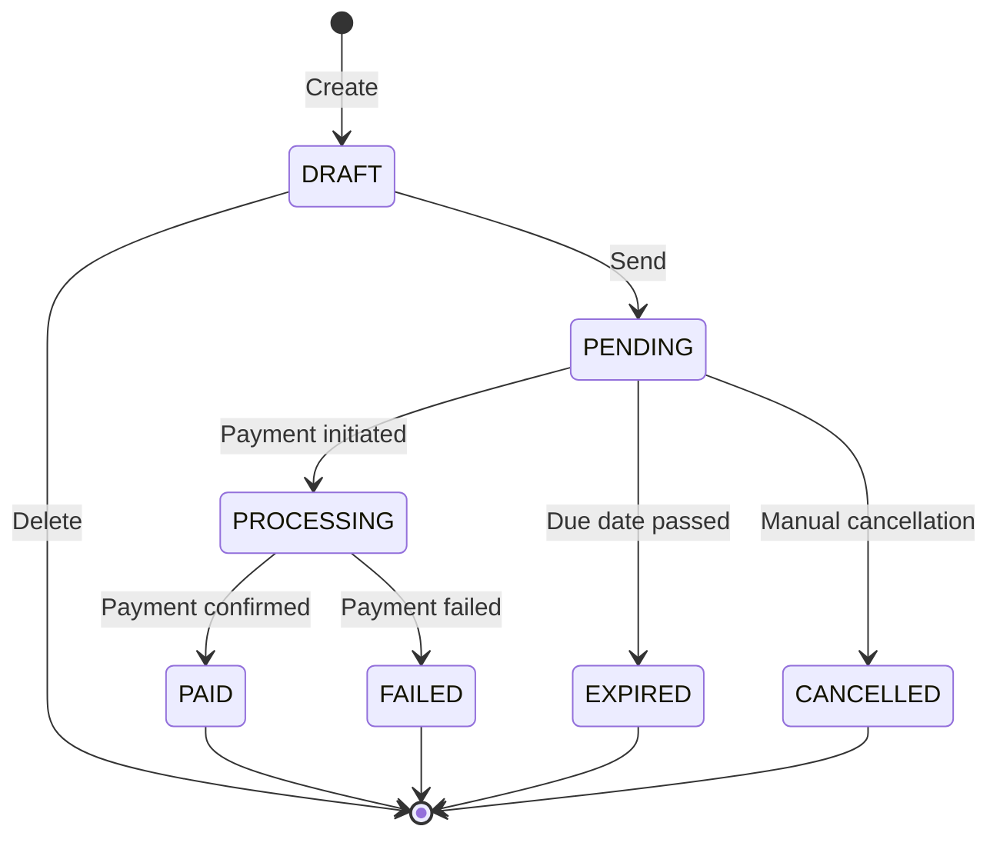
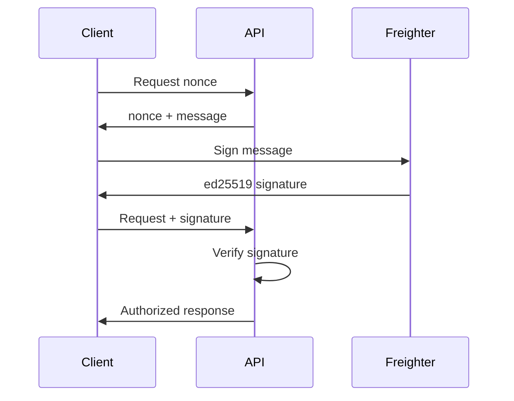

# Core Concepts

Understanding these core concepts will help you build better integrations with Link2Pay.

## Invoice Lifecycle

An invoice progresses through several states during its lifetime:



### States Explained

#### DRAFT
Initial state after invoice creation. Invoice is editable and not visible to clients.

**Actions available:**
- Edit invoice details
- Add/remove line items
- Delete invoice
- Send to client

**Not allowed:**
- Payment processing
- Status changes

#### PENDING
Invoice sent to client and awaiting payment. Payment link is active.

**Actions available:**
- Process payment
- Cancel invoice
- View audit log

**Not allowed:**
- Editing invoice details (would change payment amount)
- Deletion (use cancellation instead)

#### PROCESSING
Payment transaction submitted to Stellar network but not yet confirmed.

**System behavior:**
- Transaction pending on blockchain
- Watcher service monitoring
- Brief state (3-5 seconds typically)

**Actions available:**
- View transaction hash
- Poll status

#### PAID
Payment confirmed on Stellar blockchain. Final state.

**System behavior:**
- Payment record created
- Audit log updated
- Funds in freelancer wallet
- Immutable - cannot be changed

**Actions available:**
- Download invoice PDF
- View transaction proof
- Export for accounting

#### FAILED
Payment transaction failed (insufficient funds, network error, etc.)

**Common causes:**
- Insufficient account balance
- Invalid asset (untrusted line)
- Network timeout
- Transaction malformed

**Actions available:**
- Retry payment (new transaction)
- View failure reason
- Cancel invoice

#### EXPIRED
Due date passed without payment.

**System behavior:**
- Automatic status change at midnight UTC on due date
- Payment link remains accessible
- Can still be paid (manual override)

**Actions available:**
- Extend due date (create new invoice)
- Cancel invoice

#### CANCELLED
Manually cancelled by freelancer.

**Use cases:**
- Client no longer needs service
- Duplicate invoice created
- Terms changed (create new invoice)

**System behavior:**
- Payment link disabled
- Cannot be resumed
- Audit trail preserved

## Payment Matching

Link2Pay matches payments to invoices using Stellar's **memo field**.

### How It Works

1. **Invoice Creation**: System generates unique invoice number (e.g., `INV-001`)
2. **Transaction Building**: Memo field set to invoice number
3. **Payment Submission**: Client signs transaction with memo
4. **Watcher Detection**: Background service polls Horizon API
5. **Memo Matching**: Watcher finds payment with matching memo
6. **Invoice Update**: Status changed to PAID

### Memo Format

```typescript
{
  type: MEMO_TEXT,
  value: "INV-001" // Invoice number
}
```

### Why Memos?

Stellar transactions don't have a "purpose" field. Memos solve this:

- **Uniqueness**: Each invoice has unique number
- **On-Chain**: Memo stored on blockchain permanently
- **Verifiable**: Anyone can verify payment matches invoice
- **Automatic**: No manual confirmation needed

### Edge Cases

**Duplicate Memo:**
If two invoices somehow have the same number (shouldn't happen with CUID-based generation), the watcher matches to the oldest pending invoice.

**Missing Memo:**
Payment without memo cannot be matched automatically. Must be manually confirmed by freelancer.

**Wrong Memo:**
Payment with incorrect memo won't match any invoice. Funds still reach destination wallet, but invoice remains unpaid.

## Multi-Asset Support

Link2Pay supports three Stellar assets:

### XLM (Stellar Lumens)

**Native asset** - built into Stellar protocol.

**Characteristics:**
- No trustline required
- Required for account activation (1 XLM minimum)
- Used for transaction fees
- Price volatility (cryptocurrency)

**Use cases:**
- Quick payments between Stellar users
- Leveraging XLM price appreciation
- Lower complexity (no trustlines)

**Example:**
```typescript
{
  currency: "XLM",
  amount: 100.5
}
```

### USDC (USD Coin)

**Stablecoin** pegged to US Dollar (1 USDC = $1 USD).

**Characteristics:**
- Requires trustline to Circle issuer
- Price stability (~$1.00)
- Circle reserves backing
- Most popular stablecoin on Stellar

**Issuer:**
- Mainnet: `GA5ZSEJYB37JRC5AVCIA5MOP4RHTM335X2KGX3IHOJAPP5RE34K4KZVN`
- Testnet: `GBBD47IF6LWK7P7MDEVSCWR7DPUWV3NY3DTQEVFL4NAT4AQH3ZLLFLA5`

**Use cases:**
- Avoiding crypto volatility
- International payments (dollar-denominated)
- Accounting (stable dollar value)

**Example:**
```typescript
{
  currency: "USDC",
  amount: 1000.00
}
```

### EURC (Euro Coin)

**Stablecoin** pegged to Euro (1 EURC = €1 EUR).

**Characteristics:**
- Requires trustline to Circle issuer
- Price stability (~€1.00)
- Circle reserves backing
- Euro-denominated pricing

**Issuer:**
- Mainnet: `GDHU6WRG4IEQXM5NZ4BMPKOXHW76MZM4Y2IEMFDVXBSDP6SJY4ITNPP2`
- Testnet: (custom testnet issuer)

**Use cases:**
- European clients/freelancers
- Euro-denominated contracts
- EU regulatory compliance

**Example:**
```typescript
{
  currency: "EURC",
  amount: 850.00
}
```

### Trustlines

**What is a trustline?**
Permission to hold a specific asset. Required for all non-native assets (USDC, EURC).

**Creating a trustline:**
```typescript
// Freighter handles this automatically
// Or manually via Stellar Laboratory
const asset = new Asset('USDC', 'GA5ZSE...');
const changeTrust = Operation.changeTrust({ asset });
```

**Important:**
- One-time setup per asset
- Costs 0.5 XLM base reserve (refundable when removed)
- Client must have trustline to receive USDC/EURC
- Link2Pay validates trustlines before payment

## Network Detection

Link2Pay operates on both Stellar networks simultaneously.

### Testnet vs Mainnet

| Feature | Testnet | Mainnet |
|---------|---------|---------|
| **Purpose** | Development, testing | Production |
| **Value** | No real value | Real money |
| **Tokens** | Free from Friendbot | Buy from exchange |
| **Passphrase** | `Test SDF Network ; September 2015` | `Public Global Stellar Network ; September 2015` |
| **Horizon** | horizon-testnet.stellar.org | horizon.stellar.org |
| **Explorer** | stellar.expert/explorer/testnet | stellar.expert/explorer/public |

### How Detection Works

**Invoice Creation:**
```typescript
// Frontend checks Freighter network
const network = await freighter.getNetwork();

// Sends to backend
POST /invoices
{
  ...invoiceData,
  networkPassphrase: network.networkPassphrase
}

// Backend stores network with invoice
await prisma.invoice.create({
  data: {
    ...
    networkPassphrase: 'Test SDF Network ; September 2015'
  }
});
```

**Payment Processing:**
```typescript
// Backend reads invoice network
const invoice = await getInvoice(id);

// Builds transaction for correct network
const server = new Horizon.Server(
  invoice.networkPassphrase === Networks.PUBLIC
    ? 'https://horizon.stellar.org'
    : 'https://horizon-testnet.stellar.org'
);
```

**Network Mismatch Prevention:**
```typescript
// Frontend validates before payment
const freighterNetwork = await getFreighterNetwork();
const invoiceNetwork = invoice.networkPassphrase;

if (freighterNetwork !== invoiceNetwork) {
  throw new Error(
    `Network mismatch! Invoice is on ${invoiceNetwork}, ` +
    `but Freighter is on ${freighterNetwork}. ` +
    `Please switch Freighter to ${invoiceNetwork.includes('Test') ? 'Testnet' : 'Mainnet'}`
  );
}
```

### Best Practices

1. **Start on Testnet**: Always test integration on testnet first
2. **Label Clearly**: Show network badge in UI (testnet invoices)
3. **Separate Wallets**: Use different wallets for testnet/mainnet
4. **Validate Before Signing**: Always check network matches
5. **Explorer Links**: Point to correct Stellar Expert network

## Authentication Model

Link2Pay uses **passwordless authentication** via cryptographic signatures.

### How It Works



### Components

**Nonce:**
- Single-use random string
- 5-minute time-to-live (TTL)
- Prevents replay attacks
- Stored in-memory (backend)

**Message:**
```
Link2Pay Authentication

Wallet: GXXXXXX...
Nonce: abc123...
Time: 2024-01-15T10:30:00Z

This signature proves you own this wallet.
It will not trigger any blockchain transaction.
```

**Signature:**
- ed25519 signature of message
- Signed with wallet's private key (in Freighter)
- Proves ownership without revealing private key
- Verified using public key (wallet address)

### Why No Passwords?

**Traditional auth problems:**
- Password breaches
- Password reuse
- Forgot password flows
- Centralized user databases
- GDPR compliance complexity

**Cryptographic auth benefits:**
- No credentials to steal
- No password reset flows
- Decentralized (wallet-based)
- Minimal server state
- Stellar wallet already provides key management

### Security Properties

1. **Non-Repudiation**: Signature proves you initiated request
2. **Integrity**: Message cannot be tampered with
3. **Freshness**: Nonce ensures signature is recent
4. **No Replay**: Single-use nonce prevents reuse
5. **No Secrets**: Server doesn't store private keys

## Audit Trail

Every invoice state change is recorded in the `InvoiceAuditLog` table.

### What's Logged

```typescript
{
  id: "log-123",
  invoiceId: "inv-456",
  action: "PAID",
  actorWallet: "GXXXXXX...",
  timestamp: "2024-01-15T10:30:00Z",
  metadata: {
    transactionHash: "abc123...",
    amount: 100,
    currency: "USDC"
  }
}
```

### Action Types

- `CREATED`: Invoice created
- `UPDATED`: Invoice details edited (DRAFT only)
- `SENT`: Invoice marked as PENDING
- `PAID`: Payment confirmed
- `FAILED`: Payment failed
- `EXPIRED`: Due date passed
- `CANCELLED`: Manual cancellation
- `DELETED`: Soft delete (DRAFT only)

### Use Cases

**Dispute Resolution:**
```sql
SELECT * FROM invoice_audit_log
WHERE invoice_id = 'disputed-invoice'
ORDER BY timestamp ASC;
```

**Accounting:**
```sql
SELECT * FROM invoice_audit_log
WHERE action = 'PAID'
  AND timestamp >= '2024-01-01'
  AND timestamp < '2024-02-01';
```

**Security Audit:**
```sql
SELECT actor_wallet, COUNT(*) as invoice_count
FROM invoice_audit_log
WHERE action = 'CREATED'
GROUP BY actor_wallet;
```

## Payment Watcher

Background service that monitors Stellar blockchain for payments.

### How It Works

```typescript
async function watchPayments() {
  while (true) {
    // Get all PENDING invoices
    const pending = await getPendingInvoices();

    for (const invoice of pending) {
      // Check for payments to this invoice's wallet
      const payments = await server
        .payments()
        .forAccount(invoice.freelancerWallet)
        .cursor('now')
        .limit(100)
        .call();

      for (const payment of payments.records) {
        // Match by memo (invoice number)
        if (payment.memo === invoice.invoiceNumber) {
          // Validate amount and asset
          if (isValidPayment(payment, invoice)) {
            // Mark as paid (SERIALIZABLE transaction)
            await markInvoiceAsPaid(invoice, payment);
          }
        }
      }
    }

    // Poll every 5 seconds
    await sleep(5000);
  }
}
```

### Features

- **Real-Time**: 5-second polling interval
- **Multi-Network**: Watches both testnet and mainnet
- **Automatic Recovery**: Exponential backoff on errors
- **Race Condition Prevention**: SERIALIZABLE DB transactions
- **Efficient**: Only queries accounts with pending invoices

### Why Not Webhooks?

Stellar Horizon doesn't provide webhooks. Polling is the standard approach:

- SSE (Server-Sent Events) alternative exists but more complex
- 5-second latency acceptable for payment confirmation
- Polling more reliable than maintaining SSE connections
- Simpler deployment (no connection state)

## Transaction Lifecycle

Understanding the full transaction flow:

### 1. Payment Intent

Client requests unsigned transaction:

```typescript
POST /payments/:id/pay-intent
{
  payerAddress: "GXXXXXX..."
}

// Response
{
  xdr: "AAAAAgAAAA...",
  network: "testnet",
  timeout: 300 // 5 minutes
}
```

Backend builds XDR transaction:
- Fetches payer's sequence number
- Creates payment operation
- Sets memo to invoice number
- Sets 5-minute timeout
- Returns unsigned XDR

### 2. Client-Side Signing

```typescript
// Freighter signs XDR
const signedXdr = await freighter.signTransaction(xdr, {
  network: 'TESTNET'
});
```

**Important:**
- Signing happens **client-side only**
- Private key never leaves Freighter
- User sees transaction details before approval
- Transaction cannot be modified after signing

### 3. Submission

```typescript
POST /payments/submit
{
  signedXdr: "AAAAAgAAAA...",
  invoiceId: "inv-123"
}

// Response
{
  transactionHash: "abc123...",
  status: "PROCESSING"
}
```

Backend submits to Horizon:
- Validates signature
- Submits to Stellar network
- Returns transaction hash immediately
- Updates invoice status to PROCESSING

### 4. Confirmation

Watcher detects payment:
- Polls Horizon for new payments
- Matches memo to invoice
- Validates amount and asset
- Updates invoice to PAID
- Creates Payment record

**Time to confirmation:**
- Stellar finality: 3-5 seconds
- Watcher poll interval: 5 seconds
- **Total: ~8-10 seconds max**

## Next Steps

Now that you understand the core concepts:

- [Payment Links](/guide/features/payment-links) - Learn about shareable payment URLs
- [Multi-Asset Support](/guide/features/multi-asset) - Deep dive into XLM, USDC, EURC
- [API Reference](/api/overview) - Start building integrations
- [Security Model](/guide/advanced/security) - Understand security architecture
