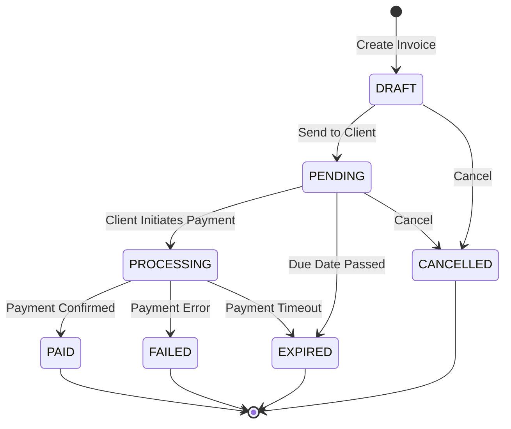

# Invoicing

Link2Pay provides a comprehensive invoicing system for freelancers and businesses to bill clients using cryptocurrency.

## Overview

The invoicing system offers:
- Professional invoice creation with line items
- Tax and discount calculations
- Multiple currency support (XLM, USDC, EURC)
- Invoice lifecycle management (Draft → Pending → Paid)
- Client management and favorites
- Payment tracking and confirmation
- Audit trail for all changes

**Perfect for:**
- Freelancers billing clients
- B2B payments
- Service-based businesses
- Project-based work
- Recurring billing

---

## Invoice Lifecycle



**Status Descriptions:**

| Status | Description | Editable? | Payable? |
|--------|-------------|-----------|----------|
| `DRAFT` | Created but not sent to client | Yes | Yes |
| `PENDING` | Sent to client, awaiting payment | No | Yes |
| `PROCESSING` | Payment transaction in progress | No | Yes (retry) |
| `PAID` | Payment confirmed on blockchain | No | No |
| `FAILED` | Payment attempt failed | No | No |
| `EXPIRED` | Passed due date without payment | No | No |
| `CANCELLED` | Cancelled by creator | No | No |

---

## Creating Invoices

### Basic Invoice

```typescript
const invoice = await createInvoice({
  freelancerWallet: "GAIXVVI3...",
  clientName: "Acme Corporation",
  clientEmail: "billing@acme.com",
  title: "Web Development Services",
  description: "Frontend development for Q1 2024",
  currency: "USDC",
  networkPassphrase: "Test SDF Network ; September 2015",
  dueDate: "2024-03-31T23:59:59.000Z",
  lineItems: [
    {
      description: "Homepage Design",
      quantity: 1,
      rate: 500
    },
    {
      description: "Contact Page Development",
      quantity: 1,
      rate: 300
    }
  ]
});
```

**Response:**
```json
{
  "id": "cm3g4h5i6j7k8l9m0n",
  "invoiceNumber": "INV-0042",
  "status": "DRAFT",
  "freelancerWallet": "GAIXVVI3...",
  "clientName": "Acme Corporation",
  "clientEmail": "billing@acme.com",
  "title": "Web Development Services",
  "description": "Frontend development for Q1 2024",
  "currency": "USDC",
  "subtotal": "800.0000000",
  "total": "800.0000000",
  "createdAt": "2024-03-07T12:00:00.000Z",
  "dueDate": "2024-03-31T23:59:59.000Z",
  "networkPassphrase": "Test SDF Network ; September 2015",
  "lineItems": [
    {
      "id": "li_abc123",
      "description": "Homepage Design",
      "quantity": "1.00",
      "rate": "500.0000000",
      "amount": "500.0000000"
    },
    {
      "id": "li_def456",
      "description": "Contact Page Development",
      "quantity": "1.00",
      "rate": "300.0000000",
      "amount": "300.0000000"
    }
  ]
}
```

---

### Invoice with Tax and Discount

```typescript
const invoice = await createInvoice({
  freelancerWallet: "GAIXVVI3...",
  clientName: "Tech Startup Inc",
  clientEmail: "payments@techstartup.io",
  title: "Monthly Consulting - March 2024",
  currency: "USDC",
  networkPassphrase: "Public Global Stellar Network ; September 2015",
  taxRate: 7.5,  // 7.5% tax
  discount: 50,  // $50 discount
  lineItems: [
    {
      description: "Consulting Hours",
      quantity: 10,
      rate: 100
    }
  ]
});

// Calculation:
// Subtotal: 10 × $100 = $1000
// Tax: $1000 × 7.5% = $75
// Discount: -$50
// Total: $1000 + $75 - $50 = $1025
```

**Response:**
```json
{
  "subtotal": "1000.0000000",
  "taxRate": "7.50",
  "taxAmount": "75.0000000",
  "discount": "50.0000000",
  "total": "1025.0000000"
}
```

---

### Full Invoice with All Fields

```typescript
const invoice = await createInvoice({
  // Freelancer info (creator)
  freelancerWallet: "GAIXVVI3...",
  freelancerName: "John Doe",
  freelancerEmail: "john@freelancer.com",
  freelancerCompany: "JD Web Services LLC",

  // Client info (payer)
  clientName: "Acme Corporation",
  clientEmail: "billing@acme.com",
  clientCompany: "Acme Corp",
  clientAddress: "123 Main St, San Francisco, CA 94105",

  // Invoice details
  title: "Q1 2024 Web Development",
  description: "Full-stack development services",
  notes: "Payment due within 30 days. Thank you for your business!",

  // Financial
  currency: "USDC",
  taxRate: 10,
  discount: 100,

  // Dates
  dueDate: "2024-03-31T23:59:59.000Z",

  // Network
  networkPassphrase: "Public Global Stellar Network ; September 2015",

  // Line items
  lineItems: [
    {
      description: "Frontend Development (80 hours)",
      quantity: 80,
      rate: 100
    },
    {
      description: "Backend API Development (40 hours)",
      quantity: 40,
      rate: 120
    },
    {
      description: "Testing & QA (20 hours)",
      quantity: 20,
      rate: 80
    }
  ],

  // Client management
  saveClient: true,     // Auto-save client for future use
  favoriteClient: true  // Mark as favorite
});

// Calculation:
// Subtotal: (80×$100) + (40×$120) + (20×$80) = $13,400
// Tax: $13,400 × 10% = $1,340
// Discount: -$100
// Total: $13,400 + $1,340 - $100 = $14,640
```

---

## Sending Invoices

### Send to Client

Change invoice status from `DRAFT` to `PENDING`:

```typescript
POST /api/invoices/:id/send

// Response
{
  "id": "cm123...",
  "status": "PENDING",  // Changed from DRAFT
  "updatedAt": "2024-03-07T12:05:00.000Z"
}
```

**What happens:**
1. Invoice status changes to `PENDING`
2. Audit log created with `SENT` action
3. Invoice becomes read-only (no more edits)
4. Client can now pay via payment link

**Payment Link:**
```
https://app.link2pay.dev/pay/{invoiceId}
```

**Sharing Options:**
- Email the checkout URL
- Generate QR code
- Embed in website
- Send via messaging apps

---

## Managing Invoices

### List Invoices

```typescript
GET /api/invoices?status=PENDING&limit=50&offset=0&networkPassphrase=Test%20SDF%20Network%20%3B%20September%202015

// Response
{
  "invoices": [
    {
      "id": "cm123...",
      "invoiceNumber": "INV-0042",
      "status": "PENDING",
      "total": "1025.00",
      "currency": "USDC",
      "createdAt": "2024-03-07T12:00:00.000Z"
    }
  ],
  "total": 1,
  "limit": 50,
  "offset": 0
}
```

**Query Parameters:**

| Parameter | Type | Description |
|-----------|------|-------------|
| `status` | InvoiceStatus | Filter by status |
| `limit` | number | Max results (default: 50, max: 100) |
| `offset` | number | Pagination offset (default: 0) |
| `excludePreview` | boolean | Exclude preview/test invoices |
| `networkPassphrase` | string | Filter by network |

---

### Update Invoice (DRAFT only)

Only invoices in `DRAFT` status can be updated:

```typescript
PATCH /api/invoices/:id

{
  "title": "Updated Title",
  "description": "Updated description",
  "lineItems": [
    {
      description: "New Item",
      quantity: 1,
      rate: 100
    }
  ]
}
```

**Error if not DRAFT:**
```json
{
  "error": "Only invoices in DRAFT status can be modified"
}
```

---

### Delete Invoice (DRAFT only)

Soft-delete invoices in `DRAFT` status:

```typescript
DELETE /api/invoices/:id

// Response
{
  "success": true
}
```

**Behavior:**
- Soft delete (sets `deletedAt` timestamp)
- Invoice hidden from lists
- Can be permanently deleted later
- Cannot delete non-DRAFT invoices

---

### Get Dashboard Statistics

```typescript
GET /api/invoices/stats?networkPassphrase=Test%20SDF%20Network%20%3B%20September%202015

// Response
{
  "totalInvoices": 42,
  "paidInvoices": 35,
  "pendingInvoices": 5,
  "totalRevenue": {
    "XLM": "15000.0000000",
    "USDC": "12500.0000000",
    "EURC": "3200.0000000"
  },
  "revenueThisMonth": {
    "XLM": "2500.0000000",
    "USDC": "1800.0000000"
  },
  "avgInvoiceValue": {
    "XLM": "428.571428571",
    "USDC": "357.142857142"
  }
}
```

---

## Client Management

### Save Clients

Store frequently used clients for quick invoice creation:

```typescript
POST /api/clients

{
  "name": "Acme Corporation",
  "email": "billing@acme.com",
  "company": "Acme Corp",
  "address": "123 Main St, San Francisco, CA 94105",
  "isFavorite": true
}

// Response
{
  "id": "client_abc123",
  "name": "Acme Corporation",
  "email": "billing@acme.com",
  "company": "Acme Corp",
  "address": "123 Main St, San Francisco, CA 94105",
  "isFavorite": true,
  "createdAt": "2024-03-07T12:00:00.000Z"
}
```

---

### Auto-Save During Invoice Creation

```typescript
const invoice = await createInvoice({
  // ... invoice fields
  clientName: "New Client",
  clientEmail: "newclient@example.com",
  saveClient: true,      // ← Auto-save to clients list
  favoriteClient: true   // ← Mark as favorite
});

// Client is now saved and appears in GET /api/clients
```

---

### List Saved Clients

```typescript
GET /api/clients

// Response (favorites first, then by creation date)
[
  {
    "id": "client_abc123",
    "name": "Acme Corporation",
    "email": "billing@acme.com",
    "company": "Acme Corp",
    "isFavorite": true,
    "createdAt": "2024-01-15T10:00:00.000Z"
  },
  {
    "id": "client_def456",
    "name": "Tech Startup Inc",
    "email": "payments@techstartup.io",
    "isFavorite": false,
    "createdAt": "2024-02-20T09:15:00.000Z"
  }
]
```

---

## Payment Process

### 1. Client Receives Invoice

Client opens checkout URL:
```
https://app.link2pay.dev/pay/cm123abc456def
```

**Checkout Page Shows:**
- Invoice details (title, description, line items)
- Total amount and currency
- Freelancer wallet address
- Due date
- Payment button

---

### 2. Connect Wallet

Client clicks "Pay with Freighter":

```typescript
// Frontend detects Freighter
const isFreighterInstalled = window.freighterApi !== undefined;

// Get wallet address
const { publicKey } = await window.freighterApi.getPublicKey();

// Get network
const { networkPassphrase } = await window.freighterApi.getNetwork();
```

---

### 3. Build Payment Transaction

```typescript
POST /api/payments/:invoiceId/pay-intent

{
  "senderPublicKey": "GDPYEQVX...",
  "networkPassphrase": "Test SDF Network ; September 2015"
}

// Response
{
  "invoiceId": "cm123...",
  "transactionXdr": "AAAAAgAAAABk7F...",  // Unsigned transaction
  "sep7Uri": "web+stellar:pay?destination=...",
  "amount": "1025.00",
  "asset": {
    "code": "USDC",
    "issuer": "GBBD47IF6LWK7P7MDEVSCWR7DPUWV3NY3DTQEVFL4NAT4AQH3ZLLFLA5"
  },
  "memo": "INV-0042",
  "networkPassphrase": "Test SDF Network ; September 2015",
  "timeout": 300  // 5 minutes
}
```

**Invoice Status:** `PENDING` → `PROCESSING`

---

### 4. Sign Transaction

```typescript
import { signTransaction } from '@stellar/freighter-api';

const signedXdr = await signTransaction(transactionXdr, {
  networkPassphrase: "Test SDF Network ; September 2015"
});
```

---

### 5. Submit to Stellar

```typescript
POST /api/payments/submit

{
  "invoiceId": "cm123...",
  "signedTransactionXdr": "AAAAAgAAAABk7F..."
}

// Success Response
{
  "success": true,
  "transactionHash": "7a8b9c0d1e2f3a4b5c6d7e8f9a0b1c2d3e4f5a6b7c8d9e0f1a2b3c4d5e6f7a8b",
  "ledger": 123456
}
```

**Invoice Status:** `PROCESSING` → `PAID`

**Invoice Updated:**
```json
{
  "status": "PAID",
  "transactionHash": "7a8b9c0d...",
  "ledgerNumber": 123456,
  "payerWallet": "GDPYEQVX...",
  "paidAt": "2024-03-07T14:25:30.000Z"
}
```

---

### 6. Payment Confirmation

```typescript
GET /api/payments/:invoiceId/status

// Response
{
  "invoiceId": "cm123...",
  "status": "PAID",
  "transactionHash": "7a8b9c0d...",
  "ledgerNumber": 123456,
  "paidAt": "2024-03-07T14:25:30.000Z",
  "payerWallet": "GDPYEQVX..."
}
```

---

## Invoice Numbering

Invoices are automatically assigned sequential numbers:

**Format:** `INV-{sequential_number}`

**Examples:**
- `INV-0001`
- `INV-0002`
- `INV-0042`
- `INV-1234`

**Properties:**
- Unique across all invoices
- Sequential (auto-incremented)
- Used as Stellar transaction memo
- Permanent (never changes)

---

## Audit Trail

Every invoice change is logged:

```typescript
GET /api/invoices/:id/owner

{
  "id": "cm123...",
  "auditLogs": [
    {
      "id": "log_aaa111",
      "action": "CREATED",
      "actorWallet": "GAIXVVI3...",
      "changes": null,
      "createdAt": "2024-03-01T10:00:00.000Z"
    },
    {
      "id": "log_bbb222",
      "action": "SENT",
      "actorWallet": "GAIXVVI3...",
      "changes": {
        "status": { "from": "DRAFT", "to": "PENDING" }
      },
      "createdAt": "2024-03-01T11:00:00.000Z"
    },
    {
      "id": "log_ccc333",
      "action": "PAID",
      "actorWallet": "GDPYEQVX...",
      "changes": {
        "status": { "from": "PROCESSING", "to": "PAID" },
        "transactionHash": "7a8b9c0d..."
      },
      "createdAt": "2024-03-07T14:25:30.000Z"
    }
  ]
}
```

**Audit Actions:**
- `CREATED`: Invoice created
- `UPDATED`: Invoice fields modified
- `SENT`: Invoice sent to client
- `PAID`: Payment confirmed
- `EXPIRED`: Invoice expired
- `CANCELLED`: Invoice cancelled
- `DELETED`: Invoice deleted

---

## Use Cases

### Freelance Billing

```typescript
async function billClient(
  clientEmail: string,
  hours: number,
  hourlyRate: number
) {
  // 1. Load saved client (if exists)
  const clients = await listClients();
  const savedClient = clients.find(c => c.email === clientEmail);

  // 2. Create invoice
  const invoice = await createInvoice({
    freelancerWallet: myWallet,
    clientName: savedClient?.name || "Client Name",
    clientEmail,
    clientCompany: savedClient?.company,
    clientAddress: savedClient?.address,
    title: `Consulting Services - ${new Date().toLocaleString('default', { month: 'long', year: 'numeric' })}`,
    currency: "USDC",
    networkPassphrase: "Public Global Stellar Network ; September 2015",
    dueDate: new Date(Date.now() + 30 * 24 * 60 * 60 * 1000).toISOString(), // 30 days
    lineItems: [
      {
        description: `Consulting Hours (${hours}h @ $${hourlyRate}/h)`,
        quantity: hours,
        rate: hourlyRate
      }
    ],
    saveClient: !savedClient, // Save if new client
    favoriteClient: true
  });

  // 3. Send invoice
  await sendInvoice(invoice.id);

  // 4. Return payment link
  return `https://app.link2pay.dev/pay/${invoice.id}`;
}
```

---

### Recurring Monthly Billing

```typescript
async function createMonthlySubscriptionInvoice(
  subscription: Subscription
) {
  const invoice = await createInvoice({
    freelancerWallet: myWallet,
    clientName: subscription.customerName,
    clientEmail: subscription.customerEmail,
    title: `${subscription.planName} - ${getCurrentMonth()}`,
    description: subscription.planDescription,
    currency: "USDC",
    networkPassphrase: "Public Global Stellar Network ; September 2015",
    dueDate: getEndOfMonth().toISOString(),
    lineItems: [
      {
        description: subscription.planName,
        quantity: 1,
        rate: subscription.monthlyPrice
      }
    ]
  });

  // Auto-send
  await sendInvoice(invoice.id);

  // Email customer
  await sendEmail(
    subscription.customerEmail,
    `Invoice for ${getCurrentMonth()}`,
    `Your monthly invoice is ready: https://app.link2pay.dev/pay/${invoice.id}`
  );

  return invoice;
}

// Schedule monthly
cron.schedule('0 0 1 * *', async () => {  // 1st of each month
  const activeSubscriptions = await getActiveSubscriptions();

  for (const subscription of activeSubscriptions) {
    await createMonthlySubscriptionInvoice(subscription);
  }
});
```

---

### Project-Based Billing

```typescript
async function createProjectInvoice(project: Project) {
  const tasks = await getCompletedTasks(project.id);

  const lineItems = tasks.map(task => ({
    description: task.name,
    quantity: task.hoursSpent,
    rate: task.hourlyRate
  }));

  const invoice = await createInvoice({
    freelancerWallet: myWallet,
    clientName: project.clientName,
    clientEmail: project.clientEmail,
    title: `${project.name} - Final Invoice`,
    description: `Completed tasks for ${project.name}`,
    notes: "Thank you for your business! Payment due within 15 days.",
    currency: "USDC",
    networkPassphrase: "Public Global Stellar Network ; September 2015",
    taxRate: 10,
    dueDate: new Date(Date.now() + 15 * 24 * 60 * 60 * 1000).toISOString(),
    lineItems
  });

  // Mark project as invoiced
  await updateProject(project.id, {
    invoiceId: invoice.id,
    status: 'INVOICED'
  });

  return invoice;
}
```

---

## Best Practices

### 1. Always Provide Due Dates

```typescript
// ❌ No due date (invoice never expires)
const invoice = await createInvoice({
  // ... fields without dueDate
});

// ✅ Reasonable due date
const invoice = await createInvoice({
  // ... other fields
  dueDate: new Date(Date.now() + 30 * 24 * 60 * 60 * 1000).toISOString() // 30 days
});
```

---

### 2. Descriptive Line Items

```typescript
// ❌ Vague
lineItems: [
  { description: "Work", quantity: 1, rate: 1000 }
]

// ✅ Detailed
lineItems: [
  {
    description: "Frontend Development (React.js) - Homepage, Dashboard, Settings",
    quantity: 40,
    rate: 100
  },
  {
    description: "Backend API Development (Node.js/Express) - Authentication, Payments",
    quantity: 20,
    rate: 120
  }
]
```

---

### 3. Save Frequent Clients

```typescript
// ✅ Auto-save for future invoices
const invoice = await createInvoice({
  // ... fields
  clientName: "Regular Client",
  clientEmail: "regular@client.com",
  saveClient: true,
  favoriteClient: true  // For very frequent clients
});
```

---

### 4. Clear Invoice Titles

```typescript
// ❌ Generic
title: "Invoice"

// ✅ Descriptive
title: "Web Development Services - March 2024"
title: "Monthly Retainer - Q1 2024"
title: "Project Alpha - Final Deliverables"
```

---

## Comparison: Invoices vs Payment Links

| Feature | Invoices | Payment Links |
|---------|----------|---------------|
| **Line Items** | ✅ Multiple items | ❌ Single amount only |
| **Tax/Discount** | ✅ Yes | ❌ No |
| **Client Details** | ✅ Full address, company | ⚠️ Limited metadata |
| **Editable** | ✅ Yes (DRAFT only) | ❌ No |
| **Audit Trail** | ✅ Full history | ❌ No |
| **Client Management** | ✅ Save for reuse | ❌ No |
| **Creation Speed** | ⚠️ Multi-step | ✅ Instant |
| **Use Case** | Professional billing | Quick payments |

---

## Next Steps

- Learn about [Payment Links](/guide/features/payment-links)
- Explore [Multi-Asset Support](/guide/features/multi-asset)
- Understand [Network Detection](/guide/features/network-detection)
- Read [Invoice API Reference](/api/endpoints/invoices)
- Check [Integration Guide](/guide/integration/frontend)
