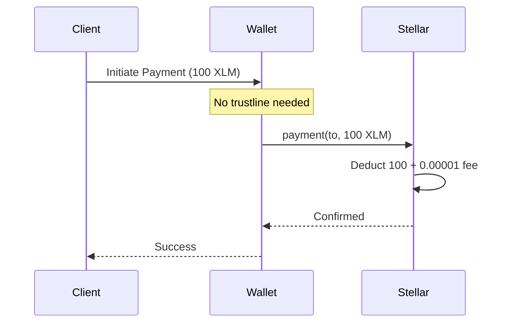
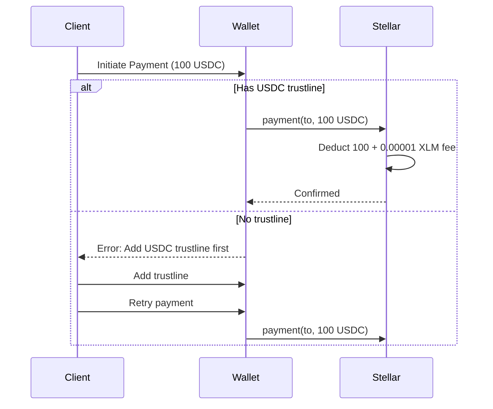

# Multi-Asset Support

Link2Pay supports multiple Stellar assets for payments, giving you flexibility in how you receive payments.

## Supported Assets

| Asset | Symbol | Type | Description |
|-------|--------|------|-------------|
| **Stellar Lumens** | XLM | Native | Stellar's native cryptocurrency |
| **USD Coin** | USDC | Token | Circle's USD stablecoin (1 USDC = $1 USD) |
| **Euro Coin** | EURC | Token | Circle's EUR stablecoin (1 EURC = €1 EUR) |

---

## Asset Details

### XLM (Stellar Lumens)

**Type:** Native Stellar asset (built into the network)

**Characteristics:**
- No issuer required
- No trustline needed
- Fastest transactions
- Lowest fees (~$0.00001 per transaction)
- Can activate new accounts
- Required for account reserves

**Use Cases:**
- Fast peer-to-peer payments
- Micro-transactions
- Cross-border remittances
- Account activation
- Gas fees for other assets

**Account Reserves:**
- Base reserve: 0.5 XLM (was 1 XLM, changed in SCP-0033)
- Each trustline: +0.5 XLM
- Example: Account with 2 trustlines needs 1.5 XLM minimum

**Example:**
```typescript
const invoice = await createInvoice({
  amount: 100,
  currency: "XLM",
  // ... other fields
});
```

---

### USDC (USD Coin)

**Type:** Stellar token (anchored asset)

**Issuers:**
- **Testnet:** `GBBD47IF6LWK7P7MDEVSCWR7DPUWV3NY3DTQEVFL4NAT4AQH3ZLLFLA5`
- **Mainnet:** `GA5ZSEJYB37JRC5AVCIA5MOP4RHTM335X2KGX3IHOJAPP5RE34K4KZVN`

**Characteristics:**
- Pegged 1:1 to US Dollar
- Fully backed by Circle
- Requires trustline
- Stable value (no volatility)
- Widely supported

**Use Cases:**
- Invoicing in USD
- Subscription payments
- Stable-value transactions
- Cross-border B2B payments
- Avoiding crypto volatility

**Trustline Requirement:**
```typescript
// Users must add USDC trustline before receiving
// This is done once in their wallet (e.g., Freighter)
```

**Example:**
```typescript
const invoice = await createInvoice({
  amount: 100,
  currency: "USDC",  // $100 USD
  // ... other fields
});
```

---

### EURC (Euro Coin)

**Type:** Stellar token (anchored asset)

**Issuers:**
- **Testnet:** `GDHU6WRG4IEQXM5NZ4BMPKOXHW76MZM4Y2IEMFDVXBSDP6SJY4ITNPP2`
- **Mainnet:** `GDHU6WRG4IEQXM5NZ4BMPKOXHW76MZM4Y2IEMFDVXBSDP6SJY4ITNPP2`

**Characteristics:**
- Pegged 1:1 to Euro
- Fully backed by Circle
- Requires trustline
- Stable value
- European market focus

**Use Cases:**
- European invoicing
- EUR-denominated contracts
- EU/UK businesses
- Avoiding FX fees within EU

**Example:**
```typescript
const invoice = await createInvoice({
  amount: 100,
  currency: "EURC",  // €100 EUR
  // ... other fields
});
```

---

## Asset Selection Guide

### When to use XLM

✅ **Best for:**
- Fast, low-cost payments
- Micro-transactions (< $10)
- Account activation
- Users new to Stellar
- Donations/tips
- Gaming/rewards

❌ **Avoid if:**
- You need stable USD/EUR value
- Invoicing long-term contracts
- B2B invoicing (volatility risk)

---

### When to use USDC

✅ **Best for:**
- Professional invoicing
- B2B payments
- Subscription services
- Long-term contracts
- Avoiding volatility
- USD-based pricing

❌ **Avoid if:**
- Client doesn't have USDC trustline
- Targeting European market (use EURC)
- Need instant account activation

---

### When to use EURC

✅ **Best for:**
- European businesses
- EUR-denominated contracts
- Avoiding USD conversion
- EU/UK clients
- Eurozone transactions

❌ **Avoid if:**
- Targeting US market (use USDC)
- Client doesn't have EURC trustline

---

## Trustlines Explained

### What is a Trustline?

A trustline is explicit permission to hold a specific asset on Stellar.

**Key Points:**
- Required for all assets except XLM
- Created once per asset
- Free to create (but requires 0.5 XLM reserve)
- Managed in wallet (e.g., Freighter)

### How to Add a Trustline

**Using Freighter Wallet:**

1. Open Freighter extension
2. Click "Manage Assets"
3. Click "Add Asset"
4. Select asset (USDC or EURC)
5. Confirm transaction

**Programmatically:**

```typescript
import { Asset, Operation, TransactionBuilder } from '@stellar/stellar-sdk';

const asset = new Asset('USDC', usdcIssuer);

const transaction = new TransactionBuilder(account, {
  fee: await server.fetchBaseFee(),
  networkPassphrase: 'Test SDF Network ; September 2015'
})
  .addOperation(Operation.changeTrust({
    asset: asset,
    limit: '1000000'  // Optional limit
  }))
  .setTimeout(30)
  .build();

await transaction.sign(keypair);
const result = await server.submitTransaction(transaction);
```

---

## Payment Flow by Asset

### XLM Payment Flow



**Simple:** No trustline, just send.

---

### USDC/EURC Payment Flow



**Requires:** Trustline setup first.

---

## Error Handling

### op_no_trust

**Error:** Sender doesn't have trustline for asset

```json
{
  "error": "Your wallet does not have a trustline for this asset. Please add a trustline in your wallet."
}
```

**Solution:**
1. Open Freighter wallet
2. Go to "Manage Assets"
3. Add USDC/EURC trustline
4. Retry payment

---

### op_src_no_trust

**Error:** Same as `op_no_trust` but from different error context

**Solution:** Same as above

---

### op_no_destination

**Error:** Recipient wallet not activated

```json
{
  "error": "Recipient wallet is not activated on this network. It must be funded first."
}
```

**Solution (XLM only):**
- Use payment links with `activateNewAccounts: true`
- Send ≥1 XLM to activate

**Solution (USDC/EURC):**
- Recipient must first receive XLM to activate
- Then can add trustline and receive USDC/EURC

---

### op_line_full

**Error:** Recipient's trustline limit reached

```json
{
  "error": "The recipient wallet cannot receive more of this asset (limit reached)."
}
```

**Solution:** Recipient must increase trustline limit in wallet

---

## Asset Conversion & Pricing

### XLM Price Feed

Get current XLM price:

```typescript
GET /api/prices/xlm

{
  "usd": 0.1234,
  "cached": false
}
```

**Convert XLM ↔ USD:**

```typescript
const xlmPrice = 0.1234; // From API

// XLM → USD
const usdValue = xlmAmount * xlmPrice;

// USD → XLM
const xlmAmount = usdValue / xlmPrice;
```

**Example:**
```typescript
const invoice = await createInvoice({
  amount: 100,  // 100 XLM
  currency: "XLM"
});

const xlmPrice = await fetch('/api/prices/xlm').then(r => r.json());
const usdValue = 100 * xlmPrice.usd;

console.log(`100 XLM ≈ $${usdValue.toFixed(2)} USD`);
// Output: 100 XLM ≈ $12.34 USD
```

---

### USDC/EURC (Stable Value)

**No conversion needed:**
- 1 USDC = $1.00 USD (always)
- 1 EURC = €1.00 EUR (always)

**Example:**
```typescript
const invoice = await createInvoice({
  amount: 100,
  currency: "USDC"
});

console.log('Invoice total: $100.00 USD');
// No need to check exchange rate
```

---

## Multi-Currency Invoicing

### Display Multiple Options

Let clients choose payment method:

```typescript
function PaymentOptions({ invoiceAmount }: { invoiceAmount: number }) {
  const [xlmPrice, setXlmPrice] = useState<number>(0);

  useEffect(() => {
    fetch('/api/prices/xlm')
      .then(r => r.json())
      .then(data => setXlmPrice(data.usd));
  }, []);

  const xlmAmount = invoiceAmount / xlmPrice;

  return (
    <div>
      <h3>Choose Payment Method:</h3>

      <button onClick={() => pay('USDC', invoiceAmount)}>
        Pay ${invoiceAmount} USDC
      </button>

      <button onClick={() => pay('EURC', invoiceAmount * 0.92)}>
        Pay €{(invoiceAmount * 0.92).toFixed(2)} EURC
      </button>

      <button onClick={() => pay('XLM', xlmAmount)}>
        Pay {xlmAmount.toFixed(2)} XLM
        <small>(≈ ${invoiceAmount} USD)</small>
      </button>
    </div>
  );
}
```

---

### Accept Any Asset

Create multiple payment links:

```typescript
async function createMultiAssetPayment(
  amountUSD: number,
  title: string
) {
  const xlmPrice = await fetch('/api/prices/xlm').then(r => r.json());
  const xlmAmount = amountUSD / xlmPrice.usd;

  // Create 3 payment links
  const [usdcLink, eurcLink, xlmLink] = await Promise.all([
    createPaymentLink({
      amount: amountUSD,
      asset: 'USDC',
      metadata: { title }
    }),
    createPaymentLink({
      amount: amountUSD * 0.92,  // Rough USD→EUR
      asset: 'EURC',
      metadata: { title }
    }),
    createPaymentLink({
      amount: xlmAmount,
      asset: 'XLM',
      metadata: { title }
    })
  ]);

  return {
    usdc: usdcLink.checkoutUrl,
    eurc: eurcLink.checkoutUrl,
    xlm: xlmLink.checkoutUrl
  };
}
```

---

## Best Practices

### 1. Default to Stablecoins for Invoicing

```typescript
// ✅ Professional invoicing
const invoice = await createInvoice({
  amount: 1000,
  currency: "USDC",  // Stable value
  dueDate: new Date(Date.now() + 30 * 24 * 60 * 60 * 1000) // 30 days
});

// ❌ Risky for long-term invoices
const invoice = await createInvoice({
  amount: 1000,
  currency: "XLM",  // Volatile - value may change
  dueDate: new Date(Date.now() + 30 * 24 * 60 * 60 * 1000)
});
```

---

### 2. Provide Trustline Instructions

```typescript
function TrustlineSetup({ asset }: { asset: 'USDC' | 'EURC' }) {
  return (
    <div className="trustline-help">
      <h4>First time using {asset}?</h4>
      <p>You need to add a trustline:</p>
      <ol>
        <li>Open Freighter wallet</li>
        <li>Click "Manage Assets"</li>
        <li>Search for "{asset}"</li>
        <li>Click "Add Asset"</li>
        <li>Confirm the transaction</li>
      </ol>
      <p>This is a one-time setup (costs ~0.00001 XLM)</p>
    </div>
  );
}
```

---

### 3. Show USD Equivalent for XLM

```typescript
function XLMInvoice({ xlmAmount }: { xlmAmount: number }) {
  const [usdValue, setUsdValue] = useState<number | null>(null);

  useEffect(() => {
    fetch('/api/prices/xlm')
      .then(r => r.json())
      .then(data => setUsdValue(xlmAmount * data.usd));
  }, [xlmAmount]);

  return (
    <div>
      <h2>{xlmAmount} XLM</h2>
      {usdValue && (
        <p className="text-gray-500">
          ≈ ${usdValue.toFixed(2)} USD
        </p>
      )}
    </div>
  );
}
```

---

### 4. Handle Asset-Specific Features

```typescript
// ✅ Account activation only with XLM
if (asset === 'XLM' && amount >= 1) {
  const link = await createPaymentLink({
    amount,
    asset: 'XLM',
    activateNewAccounts: true  // Only works with XLM
  });
}

// ❌ Will fail
if (asset === 'USDC') {
  const link = await createPaymentLink({
    amount: 100,
    asset: 'USDC',
    activateNewAccounts: true  // Error: USDC can't activate accounts
  });
}
```

---

## Asset Configuration

### Network-Specific Issuers

**Testnet:**
```typescript
{
  USDC: 'GBBD47IF6LWK7P7MDEVSCWR7DPUWV3NY3DTQEVFL4NAT4AQH3ZLLFLA5',
  EURC: 'GDHU6WRG4IEQXM5NZ4BMPKOXHW76MZM4Y2IEMFDVXBSDP6SJY4ITNPP2'
}
```

**Mainnet:**
```typescript
{
  USDC: 'GA5ZSEJYB37JRC5AVCIA5MOP4RHTM335X2KGX3IHOJAPP5RE34K4KZVN',
  EURC: 'GDHU6WRG4IEQXM5NZ4BMPKOXHW76MZM4Y2IEMFDVXBSDP6SJY4ITNPP2'
}
```

**Automatic Resolution:**

Link2Pay automatically uses correct issuer based on invoice network:

```typescript
const invoice = await createInvoice({
  amount: 100,
  currency: "USDC",
  networkPassphrase: "Public Global Stellar Network ; September 2015"
  // Backend automatically uses mainnet USDC issuer
});
```

---

## Comparison Table

| Feature | XLM | USDC | EURC |
|---------|-----|------|------|
| **Trustline Required** | ❌ No | ✅ Yes | ✅ Yes |
| **Account Activation** | ✅ Yes | ❌ No | ❌ No |
| **Price Stability** | ❌ Volatile | ✅ Stable | ✅ Stable |
| **Transaction Fee** | 0.00001 XLM | 0.00001 XLM | 0.00001 XLM |
| **Reserve Requirement** | 0.5 XLM base | +0.5 XLM | +0.5 XLM |
| **Fiat Peg** | None | 1:1 USD | 1:1 EUR |
| **Backed By** | Network | Circle | Circle |
| **Best For** | Fast payments | USD invoicing | EUR invoicing |

---

## Future Assets

More assets coming soon:

**Planned:**
- USDT (Tether USD)
- BTC (Bitcoin via anchor)
- ETH (Ethereum via anchor)

**Community Requested:**
- Additional stablecoins
- Local currency tokens
- Commodity-backed tokens

---

## Next Steps

- Learn about [Network Detection](/guide/features/network-detection)
- Explore [Real-Time Settlement](/guide/features/settlement)
- Read [Payment Links](/guide/features/payment-links)
- Understand [Invoicing](/guide/features/invoicing)
- Check [Integration Guide](/guide/integration/frontend)
