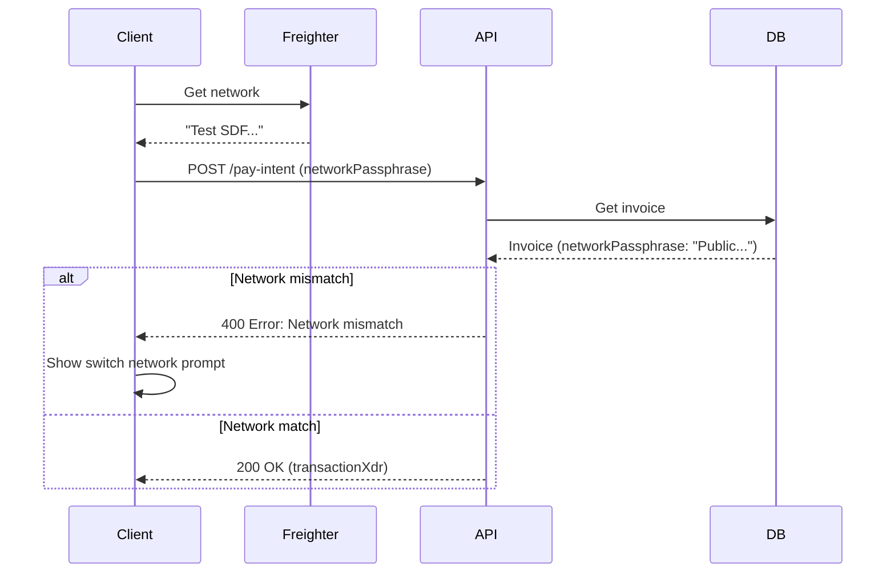

# Network Detection and Enforcement

Link2Pay automatically detects and enforces network consistency across the platform, preventing common errors like testnet/mainnet mismatches.

## Overview

The network detection system ensures:
- Invoices are paid on the correct Stellar network
- Wallet network matches invoice network
- Testnet and mainnet are never mixed
- Clear error messages when network mismatch occurs
- Automatic network switching with user guidance

**Prevents:**
- Paying testnet invoices with mainnet wallets
- Paying mainnet invoices with testnet wallets
- Lost transactions due to wrong network
- Confusion between test and production environments

---

## Stellar Networks

### Testnet

**Network Passphrase:** `Test SDF Network ; September 2015`

**Purpose:**
- Development and testing
- Learning Stellar
- Integration testing
- Free test funds available

**Horizon URL:** `https://horizon-testnet.stellar.org`

**Characteristics:**
- Fake money (no real value)
- Free XLM from friendbot
- Can be reset/wiped
- No real financial risk

**Asset Issuers:**
- **USDC:** `GBBD47IF6LWK7P7MDEVSCWR7DPUWV3NY3DTQEVFL4NAT4AQH3ZLLFLA5`
- **EURC:** `GDHU6WRG4IEQXM5NZ4BMPKOXHW76MZM4Y2IEMFDVXBSDP6SJY4ITNPP2`

---

### Mainnet (Public Network)

**Network Passphrase:** `Public Global Stellar Network ; September 2015`

**Purpose:**
- Production transactions
- Real money
- Live business operations

**Horizon URL:** `https://horizon.stellar.org`

**Characteristics:**
- Real cryptocurrency
- Real financial value
- Permanent records
- Must purchase XLM

**Asset Issuers:**
- **USDC:** `GA5ZSEJYB37JRC5AVCIA5MOP4RHTM335X2KGX3IHOJAPP5RE34K4KZVN`
- **EURC:** `GDHU6WRG4IEQXM5NZ4BMPKOXHW76MZM4Y2IEMFDVXBSDP6SJY4ITNPP2`

---

## How Network Detection Works

### 1. Invoice Creation

Network is specified when creating an invoice:

```typescript
const invoice = await createInvoice({
  // ... other fields
  networkPassphrase: "Test SDF Network ; September 2015"  // Testnet
});

// Or

const invoice = await createInvoice({
  // ... other fields
  networkPassphrase: "Public Global Stellar Network ; September 2015"  // Mainnet
});
```

**Invoice Stores Network:**
```json
{
  "id": "cm123...",
  "networkPassphrase": "Test SDF Network ; September 2015",
  // ... other fields
}
```

---

### 2. Wallet Connection

When user connects wallet, Link2Pay detects Freighter's network:

```typescript
import { getNetwork } from '@stellar/freighter-api';

// Get Freighter's current network
const { networkPassphrase } = await getNetwork();

// networkPassphrase will be one of:
// - "Test SDF Network ; September 2015"
// - "Public Global Stellar Network ; September 2015"
```

---

### 3. Network Validation

Before generating payment transaction, backend validates network match:

```typescript
POST /api/payments/:invoiceId/pay-intent

{
  "senderPublicKey": "GDPYEQVX...",
  "networkPassphrase": "Test SDF Network ; September 2015"
}

// Backend checks:
if (requestNetworkPassphrase !== invoice.networkPassphrase) {
  return res.status(400).json({
    error: 'Selected wallet network does not match the invoice network'
  });
}
```

**Validation Flow:**



---

### 4. Transaction Submission

Transaction is validated against network before submission:

```typescript
// stellarService.ts
async function submitTransaction(
  signedXdr: string,
  expectedNetworkPassphrase: string
) {
  const transaction = TransactionBuilder.fromXDR(signedXdr, expectedNetworkPassphrase);

  // Verify transaction network matches expected network
  if (transaction.networkPassphrase !== expectedNetworkPassphrase) {
    throw new Error(`Network mismatch: Transaction signed for '${transaction.networkPassphrase}' but invoice requires '${expectedNetworkPassphrase}'`);
  }

  // Submit to correct Horizon server
  const horizonUrl = getHorizonUrl(expectedNetworkPassphrase);
  const server = new Horizon.Server(horizonUrl);

  return await server.submitTransaction(transaction);
}
```

**Error if Mismatch:**
```json
{
  "error": "Network mismatch: Transaction signed for 'Test SDF Network ; September 2015' but invoice requires 'Public Global Stellar Network ; September 2015'"
}
```

---

## Network Toggle

### Dashboard Network Switcher

Link2Pay dashboard includes a network toggle:

**Visual Indicators:**

| Network | Color | Icon | Label |
|---------|-------|------|-------|
| Testnet | 🟢 Green | Test Tube | STELLAR TESTNET |
| Mainnet | 🟠 Amber | Network | STELLAR MAINNET |

**Behavior:**

```typescript
function NetworkToggle() {
  const { network, setNetwork } = useNetworkStore();

  const toggleNetwork = async () => {
    const nextNetwork = network === 'testnet' ? 'mainnet' : 'testnet';

    // Disconnect wallet if connected
    if (walletConnected) {
      disconnect();
      toast.success('Switched network. Please reconnect your wallet.');
    }

    // Change network
    setNetwork(nextNetwork);

    // Check if Freighter matches
    const freighterNetwork = await getFreighterNetwork();
    if (freighterNetwork !== nextNetworkPassphrase) {
      toast.error('Network mismatch: Switch Freighter to ' + nextNetwork.toUpperCase());
    }
  };

  return <button onClick={toggleNetwork}>{network}</button>;
}
```

---

### Automatic Detection on Load

Dashboard auto-detects Freighter network on page load:

```typescript
useEffect(() => {
  async function detectNetwork() {
    try {
      const { networkPassphrase } = await getNetwork();
      const isTestnet = networkPassphrase.includes('Test');

      setNetwork(isTestnet ? 'testnet' : 'mainnet');
    } catch (error) {
      // Freighter not installed or not connected
      // Default to testnet for safety
      setNetwork('testnet');
    }
  }

  detectNetwork();
}, []);
```

---

## User Experience

### Network Mismatch Detection

When user tries to pay with wrong network:

**1. Error Message:**
```
❌ Network mismatch: Your wallet is on MAINNET but this invoice requires TESTNET
```

**2. Help Instructions:**
```
To fix this:
1. Open Freighter wallet
2. Click network dropdown (top right)
3. Select "TESTNET"
4. Refresh this page
```

**3. Visual Indicator:**

```typescript
function NetworkMismatchBanner({ invoiceNetwork, walletNetwork }) {
  if (invoiceNetwork === walletNetwork) return null;

  const requiredNetwork = invoiceNetwork.includes('Test') ? 'TESTNET' : 'MAINNET';
  const currentNetwork = walletNetwork.includes('Test') ? 'TESTNET' : 'MAINNET';

  return (
    <div className="bg-red-50 border-l-4 border-red-500 p-4">
      <div className="flex">
        <div className="flex-shrink-0">
          ⚠️
        </div>
        <div className="ml-3">
          <h3 className="text-sm font-medium text-red-800">
            Network Mismatch Detected
          </h3>
          <div className="mt-2 text-sm text-red-700">
            <p>Your wallet is on <strong>{currentNetwork}</strong> but this invoice requires <strong>{requiredNetwork}</strong>.</p>
            <p className="mt-2">Please switch your Freighter wallet to {requiredNetwork} and try again.</p>
          </div>
        </div>
      </div>
    </div>
  );
}
```

---

## Implementation Guide

### Creating Network-Specific Invoices

```typescript
// Development/Testing
const testInvoice = await createInvoice({
  amount: 100,
  currency: 'USDC',
  networkPassphrase: 'Test SDF Network ; September 2015',  // Testnet
  // ... other fields
});

// Production
const prodInvoice = await createInvoice({
  amount: 100,
  currency: 'USDC',
  networkPassphrase: 'Public Global Stellar Network ; September 2015',  // Mainnet
  // ... other fields
});
```

---

### Validating Network Before Payment

```typescript
async function validateNetworkBeforePayment(invoiceId: string) {
  // 1. Get invoice
  const invoice = await fetch(`/api/invoices/${invoiceId}`).then(r => r.json());

  // 2. Get wallet network
  const { networkPassphrase: walletNetwork } = await getNetwork();

  // 3. Compare
  if (invoice.networkPassphrase !== walletNetwork) {
    const invoiceNet = invoice.networkPassphrase.includes('Test') ? 'Testnet' : 'Mainnet';
    const walletNet = walletNetwork.includes('Test') ? 'Testnet' : 'Mainnet';

    throw new Error(
      `Network mismatch: Invoice requires ${invoiceNet} but wallet is on ${walletNet}`
    );
  }

  // 4. Safe to proceed
  return true;
}

// Usage
try {
  await validateNetworkBeforePayment(invoiceId);
  // Proceed with payment
} catch (error) {
  alert(error.message);
  // Show network switch instructions
}
```

---

### Dynamic Network Selection

```typescript
function InvoiceForm() {
  const [network, setNetwork] = useState<'testnet' | 'mainnet'>('testnet');

  const networkPassphrase = network === 'testnet'
    ? 'Test SDF Network ; September 2015'
    : 'Public Global Stellar Network ; September 2015';

  async function handleSubmit(formData: any) {
    const invoice = await createInvoice({
      ...formData,
      networkPassphrase
    });

    return invoice;
  }

  return (
    <form onSubmit={handleSubmit}>
      {/* Network selector */}
      <select value={network} onChange={(e) => setNetwork(e.target.value)}>
        <option value="testnet">Testnet (for testing)</option>
        <option value="mainnet">Mainnet (real money)</option>
      </select>

      {/* Warning for mainnet */}
      {network === 'mainnet' && (
        <div className="warning">
          ⚠️ This will create a real invoice on mainnet using real cryptocurrency
        </div>
      )}

      {/* Rest of form */}
    </form>
  );
}
```

---

## Error Handling

### Network Mismatch Errors

**During Pay Intent:**

```typescript
POST /api/payments/:invoiceId/pay-intent

// Error Response (400)
{
  "error": "Selected wallet network does not match the invoice network"
}

// Handle in frontend
catch (error) {
  if (error.message.includes('network does not match')) {
    // Show network switch modal
    showNetworkSwitchModal(invoice.networkPassphrase);
  }
}
```

---

**During Transaction Submission:**

```typescript
POST /api/payments/submit

// Error Response (400)
{
  "error": "Network mismatch: Transaction signed for 'Test SDF Network ; September 2015' but invoice requires 'Public Global Stellar Network ; September 2015'"
}

// Handle in frontend
catch (error) {
  if (error.message.includes('Network mismatch')) {
    alert('Please ensure your wallet is on the correct network and try again');
  }
}
```

---

### Freighter Network Change Detection

Detect when user changes network in Freighter:

```typescript
// Poll for network changes
useEffect(() => {
  let lastNetwork: string | null = null;

  const checkNetwork = async () => {
    try {
      const { networkPassphrase } = await getNetwork();

      if (lastNetwork && lastNetwork !== networkPassphrase) {
        // Network changed!
        const newNet = networkPassphrase.includes('Test') ? 'Testnet' : 'Mainnet';
        toast.info(`Freighter switched to ${newNet}`);

        // Disconnect and prompt reconnection
        disconnect();
      }

      lastNetwork = networkPassphrase;
    } catch {
      // Freighter disconnected
    }
  };

  const interval = setInterval(checkNetwork, 3000); // Check every 3s
  return () => clearInterval(interval);
}, []);
```

---

## Best Practices

### 1. Always Validate Network

```typescript
// ✅ Always check before payment
async function initiatePayment(invoiceId: string) {
  const invoice = await getInvoice(invoiceId);
  const { networkPassphrase: walletNetwork } = await getNetwork();

  if (invoice.networkPassphrase !== walletNetwork) {
    throw new Error('Network mismatch');
  }

  // Proceed...
}

// ❌ Don't assume network matches
async function initiatePayment(invoiceId: string) {
  // Directly create transaction without checking
  const xdr = await buildTransaction(invoiceId);
  // May fail or submit to wrong network!
}
```

---

### 2. Clear Visual Indicators

```typescript
// ✅ Show network prominently
<div className="invoice-header">
  <h1>Invoice #{invoiceNumber}</h1>
  <div className={`network-badge ${isTestnet ? 'testnet' : 'mainnet'}`}>
    {isTestnet ? '🧪 Testnet' : '🌐 Mainnet'}
  </div>
</div>

// ❌ Hidden or unclear network
<div className="invoice-header">
  <h1>Invoice #{invoiceNumber}</h1>
  {/* Network not shown */}
</div>
```

---

### 3. Default to Testnet for Safety

```typescript
// ✅ Safe default for development
const DEFAULT_NETWORK = 'testnet';

function useNetwork() {
  const [network, setNetwork] = useState<'testnet' | 'mainnet'>(DEFAULT_NETWORK);
  return { network, setNetwork };
}

// ❌ Defaulting to mainnet risks accidental real transactions
const DEFAULT_NETWORK = 'mainnet';  // Dangerous!
```

---

### 4. Warn Before Mainnet Operations

```typescript
// ✅ Confirmation for mainnet
async function createMainnetInvoice(data: any) {
  if (network === 'mainnet') {
    const confirmed = confirm(
      '⚠️ You are about to create a REAL invoice on mainnet using real cryptocurrency. Continue?'
    );

    if (!confirmed) return;
  }

  return await createInvoice({
    ...data,
    networkPassphrase: networkPassphrase
  });
}
```

---

## Network-Specific Features

### Testnet-Only Features

**Friendbot (Free XLM):**

```typescript
// Only works on testnet
async function fundTestnetAccount(publicKey: string) {
  await fetch(`https://friendbot.stellar.org?addr=${publicKey}`);
  // Account funded with 10,000 XLM (testnet only)
}
```

**Reset/Wipe:**
- Testnet can be reset by SDF
- Don't rely on testnet data long-term

---

### Mainnet-Only Considerations

**Real Money:**
- All transactions cost real cryptocurrency
- Mistakes are permanent (no undo)
- Lost funds cannot be recovered

**Higher Stakes:**
- Test thoroughly on testnet first
- Use smaller amounts initially
- Implement extra validation

---

## Troubleshooting

### Issue: Payment failing with "Network mismatch"

**Cause:** Wallet on different network than invoice

**Solution:**
1. Check invoice network: Look for testnet/mainnet badge
2. Open Freighter wallet
3. Click network dropdown (top right)
4. Select matching network
5. Refresh page
6. Retry payment

---

### Issue: Can't find testnet assets in wallet

**Cause:** Wallet on mainnet, searching for testnet asset issuers

**Solution:**
1. Switch Freighter to Testnet
2. Add trustline with testnet issuer addresses:
   - Testnet USDC: `GBBD47IF6LWK...`
   - Testnet EURC: `GDHU6WRG...`

---

### Issue: Invoice shows wrong network

**Cause:** Invoice created with wrong networkPassphrase

**Solution:**
- Cannot change invoice network after creation
- Delete invoice (if DRAFT) and recreate
- Or create new invoice on correct network

---

## Next Steps

- Learn about [Real-Time Settlement](/guide/features/settlement)
- Explore [Multi-Asset Support](/guide/features/multi-asset)
- Read [Payment Flow](/api/endpoints/payments)
- Understand [Error Handling](/api/errors)
- Check [Integration Guide](/guide/integration/frontend)
