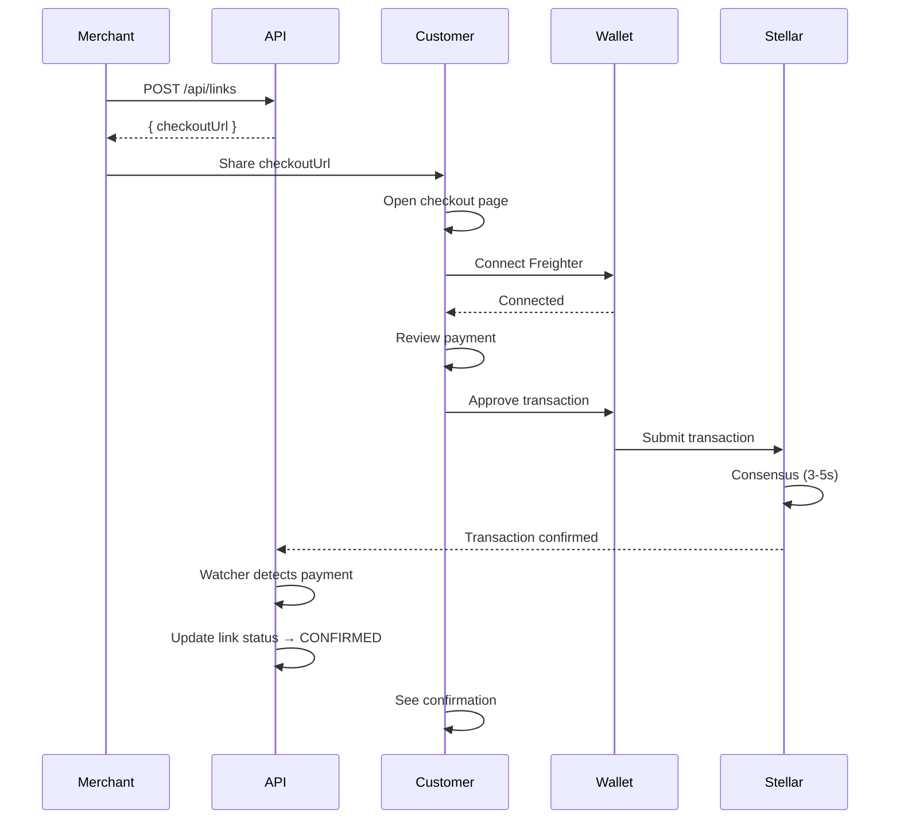

# Payment Links

Payment Links provide a fast, simple way to request cryptocurrency payments without creating full invoices.

## Overview

Payment Links are lightweight payment requests that:
- Generate instantly with a single API call
- Create shareable checkout URLs
- Support custom metadata and branding
- Auto-expire after a defined period
- Can activate new Stellar accounts (XLM only)

**Perfect for:**
- One-time payment requests
- Instant checkout flows
- Donations and crowdfunding
- Event tickets
- Subscription payments
- E-commerce checkout

---

## Key Features

### 1. Instant Generation

Create a payment link in one API call:

```typescript
const link = await createPaymentLink({
  amount: 50,
  asset: 'USDC',
  networkPassphrase: 'Test SDF Network ; September 2015',
  metadata: {
    title: 'Premium Subscription',
    description: 'Monthly premium plan access'
  }
});

console.log(link.checkoutUrl);
// https://app.link2pay.dev/pay/cm123abc456def
```

**Response time:** < 200ms

---

### 2. Hosted Checkout Page

Every payment link gets a secure, mobile-optimized checkout page:

**Features:**
- Responsive design (mobile, tablet, desktop)
- Freighter wallet integration
- Real-time payment status
- QR code for mobile wallets
- Transaction confirmation

**URL Format:**
```
https://app.link2pay.dev/pay/{linkId}
```

**Example:**
```
https://app.link2pay.dev/pay/cm3g4h5i6j7k8l9m0n
```

---

### 3. Custom Metadata

Add context to your payment requests:

```typescript
const link = await createPaymentLink({
  amount: 100,
  asset: 'XLM',
  metadata: {
    title: 'Concert Ticket - The Crypto Band',
    description: 'General admission ticket for March 15, 2024',
    reference: 'TICKET-2024-001',
    payerName: 'John Doe',
    payerEmail: 'john@example.com'
  }
});
```

**Metadata Fields:**

| Field | Description | Displayed on Checkout? |
|-------|-------------|----------------------|
| `title` | Payment title | Yes |
| `description` | Detailed description | Yes |
| `reference` | Your internal reference ID | No (backend only) |
| `payerName` | Payer's name | Pre-fills form |
| `payerEmail` | Payer's email | Pre-fills form (hidden) |

---

### 4. Auto-Expiration

Set custom expiration times:

```typescript
// Expires in 30 minutes
const link = await createPaymentLink({
  amount: 25,
  asset: 'USDC',
  expiresAt: new Date(Date.now() + 30 * 60 * 1000).toISOString()
});

// Expires in 7 days
const link = await createPaymentLink({
  amount: 500,
  asset: 'USDC',
  expiresAt: new Date(Date.now() + 7 * 24 * 60 * 60 * 1000).toISOString()
});
```

**Default:** 15 minutes if not specified

**Behavior:**
- Link status changes to `EXPIRED` after expiration
- Checkout page displays "Expired" message
- Cannot be paid after expiration

---

### 5. Account Activation (XLM Only)

Automatically activate new Stellar accounts during payment:

```typescript
const link = await createPaymentLink({
  amount: 5,
  asset: 'XLM',
  activateNewAccounts: true,  // ← Enable activation
  metadata: {
    title: 'Welcome Gift - 5 XLM',
    description: 'Activate your wallet and receive XLM!'
  }
});
```

**How it works:**

1. Payer opens checkout page
2. Connects Freighter wallet
3. If wallet is new (unactivated):
   - First 1 XLM creates the account
   - Remaining 4 XLM sent as payment
4. If wallet exists:
   - Full 5 XLM sent as payment

**Requirements:**
- Asset must be `XLM`
- Amount must be ≥ 1 XLM
- Only works on Stellar native asset

**Use Cases:**
- Onboarding new users to Stellar
- Airdrops
- Referral rewards
- Welcome gifts

---

## Payment Flow



---

## Use Cases

### 1. E-Commerce Checkout

```typescript
async function checkoutCart(items: CartItem[], customerEmail: string) {
  const total = items.reduce((sum, item) => sum + item.price, 0);

  const link = await createPaymentLink({
    amount: total,
    asset: 'USDC',
    networkPassphrase: 'Public Global Stellar Network ; September 2015',
    metadata: {
      title: `Order #${orderId}`,
      description: items.map(i => `${i.quantity}x ${i.name}`).join(', '),
      reference: orderId,
      payerEmail: customerEmail
    },
    expiresAt: new Date(Date.now() + 30 * 60 * 1000) // 30 min checkout
  });

  // Redirect to checkout
  window.location.href = link.checkoutUrl;
}
```

### 2. Donation Button

```typescript
function DonationButton({ amount, cause }: { amount: number, cause: string }) {
  async function handleDonate() {
    const link = await createPaymentLink({
      amount,
      asset: 'XLM',
      activateNewAccounts: true, // Support new users
      metadata: {
        title: `Support ${cause}`,
        description: `Thank you for your ${amount} XLM donation!`
      }
    });

    window.location.href = link.checkoutUrl;
  }

  return (
    <button onClick={handleDonate}>
      Donate {amount} XLM to {cause}
    </button>
  );
}
```

### 3. Event Tickets

```typescript
async function sellTicket(event: Event, attendee: Attendee) {
  const link = await createPaymentLink({
    amount: event.ticketPrice,
    asset: 'USDC',
    metadata: {
      title: `${event.name} - Ticket`,
      description: `${event.date} at ${event.venue}`,
      reference: `TICKET-${event.id}-${Date.now()}`,
      payerName: attendee.name,
      payerEmail: attendee.email
    },
    expiresAt: new Date(Date.now() + 24 * 60 * 60 * 1000) // 24 hours
  });

  // Send link via email
  await sendEmail(attendee.email, 'Complete Your Purchase', link.checkoutUrl);

  return link;
}
```

### 4. Subscription Payments

```typescript
async function createSubscriptionLink(
  userId: string,
  plan: SubscriptionPlan
) {
  const link = await createPaymentLink({
    amount: plan.monthlyPrice,
    asset: 'USDC',
    metadata: {
      title: `${plan.name} Subscription`,
      description: `Monthly subscription - ${plan.features.join(', ')}`,
      reference: `SUB-${userId}-${new Date().toISOString().slice(0, 7)}`,
      payerEmail: user.email
    },
    expiresAt: new Date(Date.now() + 7 * 24 * 60 * 60 * 1000) // 7 days
  });

  return link;
}

// Monitor payment
async function monitorSubscriptionPayment(linkId: string) {
  const interval = setInterval(async () => {
    const status = await fetch(`/api/links/${linkId}/status`).then(r => r.json());

    if (status.status === 'CONFIRMED') {
      await activateSubscription(userId);
      clearInterval(interval);
    }

    if (status.status === 'EXPIRED') {
      await notifyPaymentExpired(userId);
      clearInterval(interval);
    }
  }, 5000); // Poll every 5 seconds
}
```

---

## Implementation Guide

### Creating Payment Links

```typescript
import { authenticate, createPaymentLink } from './lib/link2pay';

// 1. Authenticate
const { token } = await authenticate(walletAddress);

// 2. Create link
const link = await createPaymentLink({
  amount: 100,
  asset: 'USDC',
  networkPassphrase: 'Test SDF Network ; September 2015',
  metadata: {
    title: 'Payment for Services',
    description: 'Web development - March 2024'
  },
  expiresAt: new Date(Date.now() + 60 * 60 * 1000).toISOString() // 1 hour
});

console.log('Share this link:', link.checkoutUrl);
```

### Monitoring Payment Status

```typescript
async function waitForPayment(linkId: string): Promise<boolean> {
  return new Promise((resolve) => {
    const interval = setInterval(async () => {
      const status = await fetch(`/api/links/${linkId}/status`)
        .then(r => r.json());

      if (status.status === 'CONFIRMED') {
        console.log('Payment received!', status.transactionHash);
        clearInterval(interval);
        resolve(true);
      }

      if (status.status === 'EXPIRED' || status.status === 'FAILED') {
        console.log('Payment failed:', status.status);
        clearInterval(interval);
        resolve(false);
      }
    }, 5000); // Check every 5 seconds
  });
}

// Usage
const paid = await waitForPayment(link.id);
if (paid) {
  // Fulfill order, grant access, etc.
}
```

### Embedding Checkout

```typescript
// Option 1: Redirect
window.location.href = link.checkoutUrl;

// Option 2: Open in new tab
window.open(link.checkoutUrl, '_blank');

// Option 3: iframe (not recommended - wallet popup blockers)
<iframe src={link.checkoutUrl} width="600" height="800" />

// Option 4: QR Code
import QRCode from 'qrcode';

const qr = await QRCode.toDataURL(link.checkoutUrl);

```

---

## Security Considerations

### 1. Validate Amount

```typescript
// ❌ User-controlled amount (security risk)
const link = await createPaymentLink({
  amount: req.query.amount, // User can modify!
  asset: 'USDC'
});

// ✅ Server-controlled amount
const productPrice = getProductPrice(productId);
const link = await createPaymentLink({
  amount: productPrice, // Server determines price
  asset: 'USDC'
});
```

### 2. Verify Payment On-Chain

```typescript
// Don't trust link status alone
const linkStatus = await getLinkStatus(linkId);

if (linkStatus.status === 'CONFIRMED') {
  // ✅ Verify on Stellar blockchain
  const txDetails = await verifyTransaction(linkStatus.transactionHash);

  if (txDetails.successful && txDetails.amount >= expectedAmount) {
    // Safe to fulfill order
    await fulfillOrder(orderId);
  }
}
```

### 3. Set Reasonable Expiration

```typescript
// ❌ Too long (security/UX risk)
expiresAt: new Date(Date.now() + 365 * 24 * 60 * 60 * 1000) // 1 year

// ✅ Appropriate for use case
expiresAt: new Date(Date.now() + 30 * 60 * 1000) // 30 min for checkout
expiresAt: new Date(Date.now() + 7 * 24 * 60 * 60 * 1000) // 7 days for invoice
```

---

## Rate Limits

Payment link creation is rate-limited:

**Limit:** 60 links per hour per wallet

**Best Practices:**
- Don't create links on every page load
- Create links only when user initiates checkout
- Cache link IDs for reuse (if applicable)

```typescript
// ❌ Bad: Creates link on every render
useEffect(() => {
  createPaymentLink(...);
}, []);

// ✅ Good: Creates link on user action
async function handleCheckout() {
  const link = await createPaymentLink(...);
  window.location.href = link.checkoutUrl;
}
```

---

## Comparison: Payment Links vs Invoices

| Feature | Payment Links | Invoices |
|---------|--------------|----------|
| **Creation Speed** | Instant (1 API call) | Multi-step (items, tax, etc.) |
| **Use Case** | Quick payments | Detailed billing |
| **Line Items** | No | Yes |
| **Tax Calculation** | No | Yes |
| **PDF Generation** | No | Yes (planned) |
| **Customization** | Limited metadata | Full details |
| **Best For** | E-commerce, donations | B2B billing, freelancing |

**When to use Payment Links:**
- One-time payments
- E-commerce checkout
- Donations
- Event tickets

**When to use Invoices:**
- Detailed billing
- Multiple line items
- Tax/discount calculations
- Professional invoicing

---

## Next Steps

- Read [Payment Links API Reference](/api/endpoints/links)
- Learn about [Invoicing](/guide/features/invoicing)
- Explore [Multi-Asset Support](/guide/features/multi-asset)
- Understand [Network Detection](/guide/features/network-detection)
