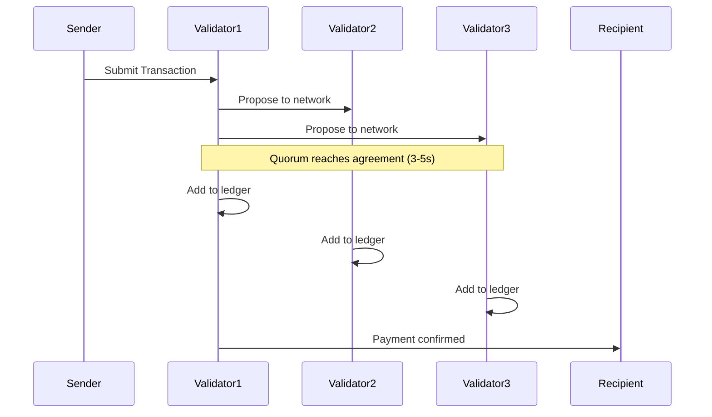
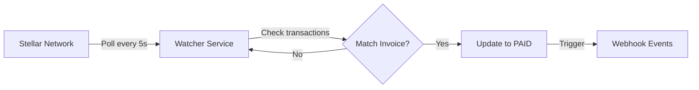

# Real-Time Settlement

Link2Pay leverages Stellar's fast blockchain to provide near-instant payment settlement, eliminating traditional banking delays.

## Overview

Real-time settlement means:
- Payments finalized in **3-5 seconds**
- No waiting days for bank transfers
- Instant account balance updates
- Immediate payment confirmation
- 24/7 availability (no banking hours)
- No chargebacks or reversals

**Traditional vs Stellar:**

| Method | Settlement Time | Reversible? | Availability |
|--------|----------------|-------------|--------------|
| **Wire Transfer** | 1-3 business days | Sometimes | Business hours |
| **ACH** | 1-2 business days | Yes (up to 60 days) | Business hours |
| **Credit Card** | 2-7 business days | Yes (chargebacks) | 24/7 |
| **PayPal** | Instant to 1 day | Yes (disputes) | 24/7 |
| **Stellar/Link2Pay** | **3-5 seconds** | **No** | **24/7** |

---

## How It Works

### Stellar Consensus

Stellar uses **Stellar Consensus Protocol (SCP)**, a federated Byzantine agreement system:



**Key Points:**
- **Finality:** Once confirmed, transaction cannot be reversed
- **Speed:** New ledger every 3-5 seconds
- **Decentralized:** Multiple validators must agree
- **Energy Efficient:** No mining required

---

## Settlement Timeline

### Complete Payment Flow

```
[Client Approves] → [Wallet Signs] → [Submit to Network] → [Consensus] → [Confirmed]
     Instant          Instant           < 1 second         3-5 seconds     Final
```

**Detailed Breakdown:**

| Step | Time | Description |
|------|------|-------------|
| 1. Build Transaction | < 100ms | Backend creates unsigned transaction |
| 2. Sign Transaction | Instant | Freighter signs with private key |
| 3. Submit to Horizon | < 500ms | Transaction submitted to Stellar network |
| 4. Broadcast to Validators | < 1s | Horizon broadcasts to validator nodes |
| 5. Consensus Round | 3-5s | Validators reach agreement |
| 6. Ledger Close | Instant | Transaction added to blockchain |
| 7. Confirmation | < 500ms | Result returned to application |

**Total:** ~5-8 seconds end-to-end

---

### Real-World Timing

**Typical Payment:**
```typescript
const startTime = Date.now();

// 1. Create pay intent
const intent = await createPayIntent(invoiceId);
// Time: ~200ms

// 2. Sign with Freighter
const signedXdr = await signTransaction(intent.transactionXdr);
// Time: ~100ms (user approval: varies)

// 3. Submit to Stellar
const result = await submitTransaction(signedXdr);
// Time: ~4-6 seconds (includes network consensus)

const totalTime = Date.now() - startTime;
console.log(`Payment completed in ${totalTime}ms`);
// Typical: 5000-8000ms (5-8 seconds)
```

---

## Finality Guarantees

### What is Finality?

**Finality** = Transaction is permanent and irreversible

Stellar provides **immediate finality**:
- Once in a closed ledger, transaction is permanent
- No "pending" state (like Bitcoin confirmations)
- No risk of reversal or chargeback
- Balance updated immediately

**Comparison:**

| Network | Finality | Confirmations Needed |
|---------|----------|---------------------|
| **Stellar** | **3-5 seconds** | **1 ledger** |
| Bitcoin | ~60 minutes | 6 blocks |
| Ethereum | ~15 minutes | 12-25 blocks |
| Bank Wire | 1-3 days | Manual clearing |

---

### Irreversibility

Once confirmed, Stellar transactions **cannot be reversed**:

```typescript
// Transaction submitted
const result = await horizon.submitTransaction(tx);

if (result.successful) {
  // ✅ Payment is FINAL
  // - Funds transferred
  // - Cannot be cancelled
  // - Cannot be refunded automatically
  // - Recipient has funds immediately
}
```

**Important:**
- No "cancel payment" option
- No chargebacks (unlike credit cards)
- Refunds must be manual (new transaction)
- Verify recipient address before sending

---

## Payment Confirmation

### Watcher Service

Link2Pay runs a **payment watcher** that detects confirmed payments:



**How it Works:**

1. **Polling:** Watcher queries Horizon every 5 seconds
2. **Filter:** Gets transactions for freelancer wallets with PENDING invoices
3. **Match:** Compares transaction memo with invoice numbers
4. **Validate:** Checks amount, asset, recipient
5. **Update:** Marks invoice as PAID
6. **Notify:** Triggers webhooks (future feature)

**Code Example:**

```typescript
// watcherService.ts
async function checkPendingPayments() {
  // 1. Get all pending invoices
  const pendingInvoices = await db.invoice.findMany({
    where: { status: { in: ['PENDING', 'PROCESSING'] } }
  });

  for (const invoice of pendingInvoices) {
    // 2. Query Stellar for transactions
    const transactions = await horizon
      .transactions()
      .forAccount(invoice.freelancerWallet)
      .limit(50)
      .call();

    // 3. Find matching transaction
    const match = transactions.records.find(tx =>
      tx.memo === invoice.invoiceNumber &&
      tx.successful
    );

    if (match) {
      // 4. Get payment details
      const payments = await getPaymentOperations(match.hash);
      const payment = payments.find(p =>
        p.to === invoice.freelancerWallet &&
        p.asset_code === invoice.currency &&
        parseFloat(p.amount) >= parseFloat(invoice.total)
      );

      if (payment) {
        // 5. Mark as paid
        await markInvoiceAsPaid(invoice.id, match.hash, payment);
      }
    }
  }
}

// Run every 5 seconds
setInterval(checkPendingPayments, 5000);
```

**Watcher Interval:** 5 seconds (configurable via `WATCHER_POLL_INTERVAL_MS`)

---

### Detection Latency

**Expected Latency:**

| Event | Time from Payment |
|-------|-------------------|
| Stellar Confirmation | 3-5 seconds |
| Watcher Detection | 0-5 seconds (next poll) |
| Database Update | < 100ms |
| **Total** | **3-10 seconds** |

**Example Timeline:**
```
00:00.000 - Client submits payment
00:04.500 - Stellar confirms (ledger closes)
00:07.000 - Watcher detects (next 5s poll)
00:07.100 - Database updated to PAID
00:07.200 - Frontend polls and sees PAID status
```

---

### Manual Confirmation

Clients can also manually confirm payments:

```typescript
POST /api/payments/confirm

{
  "invoiceId": "cm123...",
  "transactionHash": "7a8b9c0d..."
}

// Backend verifies on-chain immediately (no waiting for watcher)
```

**Use Cases:**
- Watcher temporarily down
- Faster confirmation (0 wait vs 0-5s)
- Mobile wallet flow (wallet submits directly)

---

## Balance Updates

### Instant Account Balance

Stellar account balances update **immediately** upon ledger close:

```typescript
// Before payment
const before = await horizon.accounts().accountId(walletAddress).call();
console.log(before.balances);
// [{ balance: "1000.0000000", asset_code: "USDC", ... }]

// Submit payment (100 USDC)
await submitPayment(100, 'USDC');

// After payment (3-5 seconds later)
const after = await horizon.accounts().accountId(walletAddress).call();
console.log(after.balances);
// [{ balance: "1100.0000000", asset_code: "USDC", ... }]
```

**No "Pending" State:**
- Balance reflects available funds
- Can spend immediately
- No waiting for "clearing"

---

### Transaction History

All transactions are permanently recorded on blockchain:

```typescript
const transactions = await horizon
  .transactions()
  .forAccount(walletAddress)
  .order('desc')
  .limit(10)
  .call();

transactions.records.forEach(tx => {
  console.log({
    hash: tx.hash,
    ledger: tx.ledger_attr,
    createdAt: tx.created_at,
    successful: tx.successful,
    memo: tx.memo
  });
});
```

**Blockchain Explorer:**

View any transaction publicly:
- Testnet: `https://stellar.expert/explorer/testnet/tx/{hash}`
- Mainnet: `https://stellar.expert/explorer/public/tx/{hash}`

---

## Benefits of Real-Time Settlement

### 1. Cash Flow Improvement

**Traditional Banking:**
```
Invoice sent: Monday 9am
Payment initiated: Monday 11am
Bank processing: Monday-Wednesday
Settlement: Wednesday 3pm
Available funds: Thursday

⏱️ Total: 3-4 business days
```

**Stellar/Link2Pay:**
```
Invoice sent: Monday 9am
Payment initiated: Monday 11am
Stellar consensus: Monday 11:00:05am
Available funds: Monday 11:00:05am

⏱️ Total: 5 seconds
```

**Impact:**
- Immediate access to funds
- Better cash flow management
- No waiting for "clearing"
- Pay bills/employees faster

---

### 2. Global Reach

**24/7/365 Settlement:**
- No banking hours
- No weekends/holidays
- Works across time zones
- Instant international transfers

**Example:**
```typescript
// Send payment from US to Europe on Sunday at 2am
const payment = await sendPayment({
  from: usWallet,
  to: europeWallet,
  amount: 1000,
  currency: 'EURC'
});

// Received in 5 seconds
// No waiting for Monday, no SWIFT delays, no intermediary banks
```

---

### 3. No Chargebacks

**Traditional Payments:**
- Credit cards: 60-120 day chargeback window
- PayPal: 180 day dispute window
- Risk of fraud/friendly fraud

**Stellar:**
- Irreversible after confirmation
- No chargeback risk
- Seller protected
- Lower fraud rates

**Trade-off:**
- Buyers must verify before sending
- No "payment protection" (like PayPal)
- Mistakes cannot be undone

---

### 4. Low Cost

**Stellar Transaction Fees:**
- Base fee: 0.00001 XLM (~$0.000001 USD)
- Total cost: ~$0.000001 per transaction
- Fixed regardless of amount

**Comparison:**

| Method | Fee | Example (send $1,000) |
|--------|-----|---------------------|
| **Stellar** | **0.00001 XLM** | **$0.000001** |
| Wire Transfer | $15-50 | $25 |
| ACH | $0-3 | $1 |
| Credit Card | 2.9% + $0.30 | $29.30 |
| PayPal | 2.9% + $0.30 | $29.30 |

---

## Monitoring Payments

### Real-Time Status Polling

```typescript
async function waitForPayment(invoiceId: string): Promise<boolean> {
  const maxWaitTime = 60_000; // 60 seconds
  const pollInterval = 3_000;  // 3 seconds
  const startTime = Date.now();

  while (Date.now() - startTime < maxWaitTime) {
    const status = await fetch(`/api/payments/${invoiceId}/status`)
      .then(r => r.json());

    if (status.status === 'PAID') {
      console.log('Payment confirmed!', status.transactionHash);
      return true;
    }

    if (status.status === 'FAILED' || status.status === 'EXPIRED') {
      console.log('Payment failed:', status.status);
      return false;
    }

    // Wait before next poll
    await new Promise(resolve => setTimeout(resolve, pollInterval));
  }

  console.log('Payment timeout');
  return false;
}

// Usage
const paid = await waitForPayment('cm123...');
if (paid) {
  // Fulfill order, grant access, etc.
}
```

---

### Server-Side Events (Future)

**Planned Feature:**

```typescript
// Subscribe to payment events
const eventSource = new EventSource(`/api/payments/${invoiceId}/events`);

eventSource.addEventListener('payment_confirmed', (event) => {
  const { transactionHash, ledger, paidAt } = JSON.parse(event.data);

  console.log('Payment confirmed!', transactionHash);
  // Update UI immediately
});

eventSource.addEventListener('payment_failed', (event) => {
  const { error } = JSON.parse(event.data);

  console.log('Payment failed:', error);
  // Show error to user
});
```

---

## Settlement Analytics

### Track Settlement Performance

```typescript
interface SettlementMetrics {
  averageConfirmationTime: number;  // Seconds
  averageDetectionTime: number;     // Seconds
  totalSettled24h: number;          // Amount
  fastestSettlement: number;        // Seconds
  slowestSettlement: number;        // Seconds
}

async function getSettlementMetrics(): Promise<SettlementMetrics> {
  const payments = await db.payment.findMany({
    where: {
      confirmedAt: { gte: new Date(Date.now() - 24 * 60 * 60 * 1000) }
    },
    include: { invoice: true }
  });

  const confirmationTimes = payments.map(p => {
    const submitTime = new Date(p.invoice.updatedAt).getTime();  // When PROCESSING
    const confirmTime = new Date(p.confirmedAt).getTime();

    return (confirmTime - submitTime) / 1000;  // Seconds
  });

  return {
    averageConfirmationTime: avg(confirmationTimes),
    averageDetectionTime: 5,  // Watcher poll interval
    totalSettled24h: sum(payments.map(p => p.amount)),
    fastestSettlement: min(confirmationTimes),
    slowestSettlement: max(confirmationTimes)
  };
}
```

---

## Best Practices

### 1. Set Reasonable Timeouts

```typescript
// ✅ Reasonable: 60 seconds (12x typical time)
const maxWaitTime = 60_000;

// ❌ Too short: May miss slow confirmations
const maxWaitTime = 3_000;

// ❌ Too long: Poor UX
const maxWaitTime = 300_000;
```

---

### 2. Provide Visual Feedback

```typescript
function PaymentStatus({ invoiceId }: { invoiceId: string }) {
  const [status, setStatus] = useState('pending');
  const [elapsed, setElapsed] = useState(0);

  useEffect(() => {
    const startTime = Date.now();
    const timer = setInterval(() => {
      setElapsed(Math.floor((Date.now() - startTime) / 1000));
    }, 1000);

    return () => clearInterval(timer);
  }, []);

  if (status === 'pending') {
    return (
      <div className="payment-pending">
        <div className="spinner" />
        <h3>Confirming Payment...</h3>
        <p>Waiting for Stellar network confirmation ({elapsed}s)</p>
        <small>Typical time: 5-8 seconds</small>
      </div>
    );
  }

  if (status === 'confirmed') {
    return (
      <div className="payment-success">
        <div className="checkmark">✓</div>
        <h3>Payment Confirmed!</h3>
        <p>Settled in {elapsed} seconds</p>
      </div>
    );
  }

  return null;
}
```

---

### 3. Handle Edge Cases

```typescript
async function robustPaymentMonitoring(invoiceId: string) {
  try {
    // 1. Poll for status
    const paid = await waitForPayment(invoiceId, 60_000);

    if (paid) {
      return { success: true };
    }

    // 2. Timeout - check one more time manually
    const finalStatus = await fetch(`/api/payments/${invoiceId}/status`)
      .then(r => r.json());

    if (finalStatus.status === 'PAID') {
      // Payment succeeded but watcher was slow
      return { success: true, slow: true };
    }

    // 3. Check blockchain directly
    const invoice = await getInvoice(invoiceId);
    const recentTxs = await horizon.transactions()
      .forAccount(invoice.freelancerWallet)
      .limit(50)
      .call();

    const matchingTx = recentTxs.records.find(tx =>
      tx.memo === invoice.invoiceNumber
    );

    if (matchingTx) {
      // Payment exists on-chain but not detected
      // Manually confirm
      await confirmPayment(invoiceId, matchingTx.hash);
      return { success: true, manualConfirmation: true };
    }

    // 4. Truly failed
    return { success: false };

  } catch (error) {
    // Network error or API down
    return { success: false, error };
  }
}
```

---

## Troubleshooting

### Issue: Payment taking longer than 10 seconds

**Possible Causes:**
1. Network congestion (rare on Stellar)
2. High transaction fee surge (rare)
3. Watcher service slow/down

**Solutions:**
- Wait up to 60 seconds
- Check Stellar status: https://status.stellar.org
- Verify transaction on blockchain explorer
- Use manual confirmation API

---

### Issue: Payment confirmed on blockchain but invoice still PENDING

**Cause:** Watcher hasn't detected yet or is down

**Solution:**
```typescript
POST /api/payments/confirm

{
  "invoiceId": "cm123...",
  "transactionHash": "<copy from Stellar Explorer>"
}
```

---

### Issue: Payment failed with "timeout"

**Cause:** Transaction took > 5 minutes (very rare)

**Solution:**
1. Check if transaction exists on blockchain
2. If yes, use manual confirmation
3. If no, retry payment

---

## Next Steps

- Learn about [Payment Watcher Service](/guide/advanced/watcher)
- Explore [Network Detection](/guide/features/network-detection)
- Read [Payment Endpoints](/api/endpoints/payments)
- Understand [Multi-Asset Support](/guide/features/multi-asset)
- Check [Integration Guide](/guide/integration/frontend)
