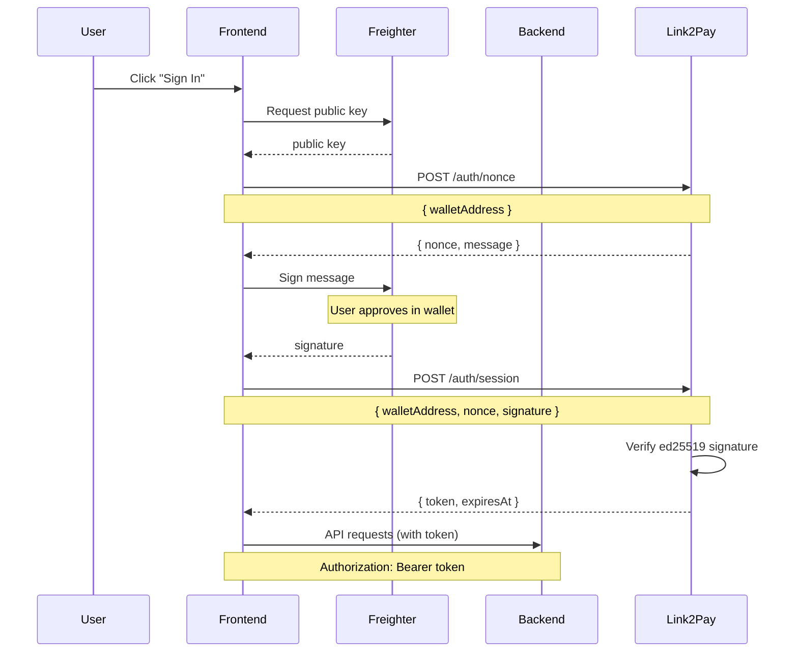

# Authentication Integration

Complete guide to implementing Link2Pay's passwordless wallet authentication in your application.

## Overview

Link2Pay uses **cryptographic signature-based authentication** instead of traditional passwords:

**Benefits:**
- No passwords to store or manage
- No risk of password leaks
- Built on Stellar's ed25519 cryptography
- Users authenticate with wallet they already own
- Non-custodial (keys never leave user's wallet)

**Flow:**
1. User connects Freighter wallet
2. Backend issues a nonce (challenge)
3. User signs nonce with private key
4. Backend verifies signature
5. Session token issued (JWT)

---

## Authentication Flow



---

## Frontend Implementation

### 1. Connect Wallet

```typescript
// hooks/useWallet.ts
import { getPublicKey, getNetwork } from '@stellar/freighter-api';
import { useState } from 'react';

export function useWallet() {
  const [wallet, setWallet] = useState<{
    publicKey: string;
    networkPassphrase: string;
  } | null>(null);

  async function connect() {
    try {
      // Request public key from Freighter
      const publicKey = await getPublicKey();

      // Get network
      const { networkPassphrase } = await getNetwork();

      setWallet({ publicKey, networkPassphrase });

      return { publicKey, networkPassphrase };
    } catch (error) {
      if (error.message === 'User declined access') {
        throw new Error('Please approve wallet connection');
      }
      throw error;
    }
  }

  function disconnect() {
    setWallet(null);
  }

  return {
    wallet,
    connected: !!wallet,
    connect,
    disconnect
  };
}

// Usage
function WalletButton() {
  const { connected, wallet, connect, disconnect } = useWallet();

  if (connected) {
    return (
      <div>
        <span>{wallet!.publicKey.slice(0, 8)}...</span>
        <button onClick={disconnect}>Disconnect</button>
      </div>
    );
  }

  return <button onClick={connect}>Connect Wallet</button>;
}
```

---

### 2. Request Nonce

```typescript
// services/auth.ts
const API_URL = 'https://api.link2pay.dev';

export async function requestNonce(walletAddress: string) {
  const response = await fetch(`${API_URL}/api/auth/nonce`, {
    method: 'POST',
    headers: { 'Content-Type': 'application/json' },
    body: JSON.stringify({ walletAddress })
  });

  if (!response.ok) {
    throw new Error('Failed to request nonce');
  }

  return response.json();
}

// Response:
// {
//   nonce: "a1b2c3d4e5f6g7h8i9j0k1l2m3n4o5p6",
//   message: "Link2Pay Authentication\nWallet: GABC...\nNonce: a1b2c3d4...\nTimestamp: 2024-03-07T12:00:00.000Z",
//   expiresIn: 300
// }
```

---

### 3. Sign Message

```typescript
import { signAuthEntry } from '@stellar/freighter-api';

export async function signMessage(
  message: string,
  walletAddress: string
): Promise<string> {
  try {
    const signature = await signAuthEntry(message, {
      accountToSign: walletAddress
    });

    return signature;
  } catch (error) {
    if (error.message === 'User declined access') {
      throw new Error('Please approve the signature request in your wallet');
    }
    throw error;
  }
}
```

---

### 4. Get Session Token

```typescript
export async function getSessionToken(
  walletAddress: string,
  nonce: string,
  signature: string
) {
  const response = await fetch(`${API_URL}/api/auth/session`, {
    method: 'POST',
    headers: { 'Content-Type': 'application/json' },
    body: JSON.stringify({
      walletAddress,
      nonce,
      signature
    })
  });

  if (!response.ok) {
    const error = await response.json();
    throw new Error(error.error || 'Authentication failed');
  }

  return response.json();
}

// Response:
// {
//   token: "eyJhbGciOiJIUzI1NiIsInR5cCI6IkpXVCJ9...",
//   expiresAt: "2024-03-07T13:00:00.000Z",
//   walletAddress: "GABC..."
// }
```

---

### 5. Complete Auth Hook

```typescript
// hooks/useAuth.ts
import { useState, useEffect } from 'react';
import { useWallet } from './useWallet';
import { requestNonce, signMessage, getSessionToken } from '../services/auth';

export function useAuth() {
  const { wallet } = useWallet();
  const [token, setToken] = useState<string | null>(null);
  const [loading, setLoading] = useState(false);

  // Load token from localStorage on mount
  useEffect(() => {
    const stored = localStorage.getItem('auth_token');
    const expires = localStorage.getItem('auth_expires');

    if (stored && expires) {
      const expiresAt = new Date(expires).getTime();

      if (Date.now() < expiresAt) {
        setToken(stored);
      } else {
        // Token expired
        localStorage.removeItem('auth_token');
        localStorage.removeItem('auth_expires');
      }
    }
  }, []);

  async function authenticate() {
    if (!wallet) {
      throw new Error('Wallet not connected');
    }

    setLoading(true);

    try {
      // 1. Request nonce
      const { nonce, message } = await requestNonce(wallet.publicKey);

      // 2. Sign message
      const signature = await signMessage(message, wallet.publicKey);

      // 3. Get session token
      const { token, expiresAt } = await getSessionToken(
        wallet.publicKey,
        nonce,
        signature
      );

      // 4. Store token
      setToken(token);
      localStorage.setItem('auth_token', token);
      localStorage.setItem('auth_expires', expiresAt);

      return token;
    } catch (error) {
      throw error;
    } finally {
      setLoading(false);
    }
  }

  function logout() {
    setToken(null);
    localStorage.removeItem('auth_token');
    localStorage.removeItem('auth_expires');
  }

  return {
    token,
    loading,
    isAuthenticated: !!token,
    authenticate,
    logout
  };
}

// Usage
function ProtectedPage() {
  const { isAuthenticated, authenticate, loading } = useAuth();

  if (!isAuthenticated) {
    return (
      <div>
        <h1>Sign In Required</h1>
        <button onClick={authenticate} disabled={loading}>
          {loading ? 'Authenticating...' : 'Sign In with Wallet'}
        </button>
      </div>
    );
  }

  return <Dashboard />;
}
```

---

## Backend Implementation

### 1. Nonce Generation

```typescript
// services/authService.ts
import crypto from 'crypto';

interface NonceRecord {
  nonce: string;
  walletAddress: string;
  expiresAt: number;
}

// In-memory nonce store (use Redis in production)
const nonceStore = new Map<string, NonceRecord>();

export class AuthService {
  // Issue nonce
  issueNonce(walletAddress: string): string {
    const nonce = crypto.randomBytes(16).toString('hex');
    const expiresAt = Date.now() + 5 * 60 * 1000; // 5 minutes

    nonceStore.set(nonce, {
      nonce,
      walletAddress,
      expiresAt
    });

    // Clean up expired nonces
    this.cleanupExpiredNonces();

    return nonce;
  }

  // Build message to sign
  buildMessage(walletAddress: string, nonce: string): string {
    return `Link2Pay Authentication
Wallet: ${walletAddress}
Nonce: ${nonce}
Timestamp: ${new Date().toISOString()}`;
  }

  // Verify nonce is valid
  verifyNonce(walletAddress: string, nonce: string): boolean {
    const record = nonceStore.get(nonce);

    if (!record) {
      return false; // Nonce not found
    }

    if (record.walletAddress !== walletAddress) {
      return false; // Wrong wallet
    }

    if (Date.now() > record.expiresAt) {
      nonceStore.delete(nonce);
      return false; // Expired
    }

    // Consume nonce (one-time use)
    nonceStore.delete(nonce);

    return true;
  }

  private cleanupExpiredNonces() {
    const now = Date.now();

    for (const [nonce, record] of nonceStore.entries()) {
      if (now > record.expiresAt) {
        nonceStore.delete(nonce);
      }
    }
  }
}

export const authService = new AuthService();
```

---

### 2. Signature Verification

```typescript
import { Keypair } from '@stellar/stellar-sdk';

export class AuthService {
  // ... previous methods

  verifySignature(
    walletAddress: string,
    nonce: string,
    signature: string
  ): boolean {
    try {
      // 1. Verify nonce
      if (!this.verifyNonce(walletAddress, nonce)) {
        return false;
      }

      // 2. Rebuild message
      const message = this.buildMessage(walletAddress, nonce);

      // 3. Verify ed25519 signature
      const keypair = Keypair.fromPublicKey(walletAddress);
      const messageBuffer = Buffer.from(message, 'utf-8');
      const signatureBuffer = Buffer.from(signature, 'hex');

      return keypair.verify(messageBuffer, signatureBuffer);
    } catch (error) {
      console.error('Signature verification error:', error);
      return false;
    }
  }
}
```

---

### 3. JWT Token Generation

```typescript
import jwt from 'jsonwebtoken';

const JWT_SECRET = process.env.JWT_SECRET || 'your-secret-key';
const TOKEN_EXPIRY = '1h'; // 1 hour

export class AuthService {
  // ... previous methods

  issueSessionToken(walletAddress: string) {
    const expiresAt = new Date(Date.now() + 60 * 60 * 1000); // 1 hour

    const token = jwt.sign(
      { walletAddress },
      JWT_SECRET,
      { expiresIn: TOKEN_EXPIRY }
    );

    return {
      token,
      expiresAt: expiresAt.toISOString(),
      walletAddress
    };
  }

  verifyToken(token: string): { walletAddress: string } | null {
    try {
      return jwt.verify(token, JWT_SECRET) as { walletAddress: string };
    } catch (error) {
      return null;
    }
  }
}
```

---

### 4. Auth Routes

```typescript
// routes/auth.ts
import { Router } from 'express';
import { z } from 'zod';
import { authService } from '../services/authService';

const router = Router();

const nonceSchema = z.object({
  walletAddress: z
    .string()
    .regex(/^G[A-Z2-7]{55}$/, 'Invalid Stellar address')
});

const sessionSchema = z.object({
  walletAddress: z
    .string()
    .regex(/^G[A-Z2-7]{55}$/),
  nonce: z.string().regex(/^[a-fA-F0-9]{32}$/),
  signature: z.string().regex(/^[a-fA-F0-9]+$/)
});

// POST /api/auth/nonce
router.post('/nonce', (req, res) => {
  try {
    const { walletAddress } = nonceSchema.parse(req.body);

    const nonce = authService.issueNonce(walletAddress);
    const message = authService.buildMessage(walletAddress, nonce);

    res.json({
      nonce,
      message,
      expiresIn: 300 // seconds
    });
  } catch (error) {
    res.status(400).json({ error: 'Invalid request' });
  }
});

// POST /api/auth/session
router.post('/session', (req, res) => {
  try {
    const { walletAddress, nonce, signature } = sessionSchema.parse(req.body);

    const valid = authService.verifySignature(walletAddress, nonce, signature);

    if (!valid) {
      return res.status(401).json({
        error: 'Invalid or expired signature. Request a new nonce.'
      });
    }

    const session = authService.issueSessionToken(walletAddress);

    res.json(session);
  } catch (error) {
    res.status(400).json({ error: 'Invalid request' });
  }
});

export default router;
```

---

### 5. Auth Middleware

```typescript
// middleware/auth.ts
import { Request, Response, NextFunction } from 'express';
import { authService } from '../services/authService';

export interface AuthRequest extends Request {
  walletAddress?: string;
}

export function requireAuth(
  req: AuthRequest,
  res: Response,
  next: NextFunction
) {
  try {
    const authHeader = req.headers.authorization;

    if (!authHeader || !authHeader.startsWith('Bearer ')) {
      return res.status(401).json({ error: 'Authentication required' });
    }

    const token = authHeader.substring(7);
    const payload = authService.verifyToken(token);

    if (!payload) {
      return res.status(401).json({ error: 'Invalid or expired token' });
    }

    req.walletAddress = payload.walletAddress;
    next();
  } catch (error) {
    res.status(401).json({ error: 'Authentication failed' });
  }
}

// Usage
app.get('/api/invoices', requireAuth, (req: AuthRequest, res) => {
  const walletAddress = req.walletAddress!;
  // ... fetch user's invoices
});
```

---

## Production Considerations

### 1. Use Redis for Nonce Storage

```typescript
// services/authService.ts
import Redis from 'ioredis';

const redis = new Redis(process.env.REDIS_URL);

export class AuthService {
  async issueNonce(walletAddress: string): Promise<string> {
    const nonce = crypto.randomBytes(16).toString('hex');

    // Store in Redis with 5-minute TTL
    await redis.setex(
      `nonce:${nonce}`,
      300,
      JSON.stringify({ walletAddress, createdAt: Date.now() })
    );

    return nonce;
  }

  async verifyNonce(walletAddress: string, nonce: string): Promise<boolean> {
    const data = await redis.get(`nonce:${nonce}`);

    if (!data) {
      return false;
    }

    const record = JSON.parse(data);

    if (record.walletAddress !== walletAddress) {
      return false;
    }

    // Consume nonce (delete from Redis)
    await redis.del(`nonce:${nonce}`);

    return true;
  }
}
```

---

### 2. Refresh Tokens

```typescript
// Generate refresh token (long-lived)
issueRefreshToken(walletAddress: string): string {
  return jwt.sign(
    { walletAddress, type: 'refresh' },
    JWT_SECRET,
    { expiresIn: '7d' } // 7 days
  );
}

// Refresh access token
async refreshAccessToken(refreshToken: string) {
  const payload = jwt.verify(refreshToken, JWT_SECRET);

  if (payload.type !== 'refresh') {
    throw new Error('Invalid refresh token');
  }

  return this.issueSessionToken(payload.walletAddress);
}

// Route
router.post('/refresh', (req, res) => {
  const { refreshToken } = req.body;

  try {
    const session = authService.refreshAccessToken(refreshToken);
    res.json(session);
  } catch (error) {
    res.status(401).json({ error: 'Invalid refresh token' });
  }
});
```

---

### 3. Rate Limiting

```typescript
import rateLimit from 'express-rate-limit';

const nonceRateLimiter = rateLimit({
  windowMs: 15 * 60 * 1000, // 15 minutes
  max: 10, // 10 requests per window
  message: { error: 'Too many authentication attempts' }
});

router.post('/nonce', nonceRateLimiter, (req, res) => {
  // ... handle nonce request
});
```

---

### 4. HTTPS Only

```typescript
// middleware/httpsOnly.ts
export function httpsOnly(req, res, next) {
  if (req.protocol !== 'https' && process.env.NODE_ENV === 'production') {
    return res.status(403).json({
      error: 'HTTPS required for authentication'
    });
  }
  next();
}

app.use('/api/auth', httpsOnly, authRouter);
```

---

## Security Best Practices

### 1. Validate Wallet Address

```typescript
function isValidStellarAddress(address: string): boolean {
  return /^G[A-Z2-7]{55}$/.test(address);
}

router.post('/nonce', (req, res) => {
  const { walletAddress } = req.body;

  if (!isValidStellarAddress(walletAddress)) {
    return res.status(400).json({ error: 'Invalid wallet address' });
  }

  // ... continue
});
```

---

### 2. Prevent Replay Attacks

Nonces are single-use and time-limited:

```typescript
// ✅ Good: Nonce consumed after verification
verifyNonce(walletAddress, nonce) {
  const record = nonceStore.get(nonce);
  // ... verify
  nonceStore.delete(nonce); // Delete immediately
  return true;
}

// ❌ Bad: Nonce can be reused
verifyNonce(walletAddress, nonce) {
  const record = nonceStore.get(nonce);
  // ... verify
  // Nonce not deleted! Can be used again
  return true;
}
```

---

### 3. Secure JWT Secret

```bash
# Generate strong secret
openssl rand -hex 32

# .env
JWT_SECRET=a1b2c3d4e5f6g7h8i9j0k1l2m3n4o5p6q7r8s9t0u1v2w3x4y5z6a7b8c9d0e1f2
```

---

### 4. Token Expiration

```typescript
// Short-lived access tokens
const ACCESS_TOKEN_EXPIRY = '1h';

// Long-lived refresh tokens
const REFRESH_TOKEN_EXPIRY = '7d';

// Verify expiration on every request
function requireAuth(req, res, next) {
  const payload = jwt.verify(token, JWT_SECRET);

  // JWT library automatically checks expiration
  // Will throw error if expired

  req.walletAddress = payload.walletAddress;
  next();
}
```

---

## Testing

### Unit Tests

```typescript
// auth.test.ts
import { authService } from '../services/authService';
import { Keypair } from '@stellar/stellar-sdk';

describe('AuthService', () => {
  it('should issue and verify nonce', () => {
    const wallet = 'GABC...';
    const nonce = authService.issueNonce(wallet);

    expect(nonce).toHaveLength(32);

    const valid = authService.verifyNonce(wallet, nonce);
    expect(valid).toBe(true);

    // Nonce should be consumed
    const invalid = authService.verifyNonce(wallet, nonce);
    expect(invalid).toBe(false);
  });

  it('should verify ed25519 signature', () => {
    const keypair = Keypair.random();
    const wallet = keypair.publicKey();

    const nonce = authService.issueNonce(wallet);
    const message = authService.buildMessage(wallet, nonce);

    // Sign message
    const signature = keypair.sign(Buffer.from(message)).toString('hex');

    const valid = authService.verifySignature(wallet, nonce, signature);
    expect(valid).toBe(true);
  });

  it('should reject expired nonce', async () => {
    const wallet = 'GABC...';
    const nonce = authService.issueNonce(wallet);

    // Wait for expiration
    jest.useFakeTimers();
    jest.advanceTimersByTime(6 * 60 * 1000); // 6 minutes

    const valid = authService.verifyNonce(wallet, nonce);
    expect(valid).toBe(false);
  });
});
```

---

## Troubleshooting

### Issue: Signature verification always fails

**Causes:**
1. Message format doesn't match
2. Wrong network (testnet vs mainnet keys)
3. Signature encoding mismatch

**Solution:**
```typescript
// Debug signature verification
console.log('Wallet:', walletAddress);
console.log('Nonce:', nonce);
console.log('Message:', message);
console.log('Signature:', signature);

// Try verifying manually
const keypair = Keypair.fromPublicKey(walletAddress);
const messageBuffer = Buffer.from(message, 'utf-8');
const signatureBuffer = Buffer.from(signature, 'hex');

const valid = keypair.verify(messageBuffer, signatureBuffer);
console.log('Valid:', valid);
```

---

### Issue: Nonce expired

**Causes:**
1. User takes > 5 minutes to sign
2. Clock skew between client/server
3. Nonce already consumed

**Solution:**
- Increase nonce TTL to 10 minutes
- Request new nonce on expiration
- Show countdown timer to user

---

## Next Steps

- Read [Frontend Integration](/guide/integration/frontend)
- Learn about [Backend Integration](/guide/integration/backend)
- Explore [Webhook Events](/guide/integration/webhooks)
- Check [Security Guide](/guide/advanced/security)
