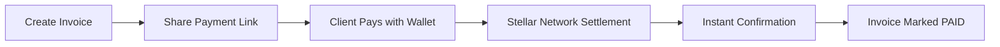

# Introduction

Welcome to Link2Pay - a modern payment infrastructure platform built on the Stellar blockchain network.

## What is Link2Pay?

Link2Pay enables businesses, freelancers, and developers to create shareable payment links, generate professional invoices, and receive instant on-chain payment confirmations with cryptographic proof.

Unlike traditional payment processors, Link2Pay:

- ⚡ **Settles in 3-5 seconds** instead of 2-3 business days
- 💰 **Charges near-zero fees** (< $0.01) instead of 2-3% processing fees
- 🔐 **Maintains non-custodial security** - your keys, your funds
- 🌍 **Works globally** without geographical restrictions
- 📊 **Provides immutable audit trails** on the Stellar blockchain

## How It Works



### The Flow

1. **Freelancer** creates an invoice with line items, taxes, and due date
2. **System** generates a unique payment link (`/pay/invoice-123`)
3. **Client** opens link and connects their Stellar wallet (Freighter)
4. **Client** signs transaction with their private key (non-custodial)
5. **Stellar Network** settles payment in 3-5 seconds
6. **Watcher Service** detects payment and updates invoice status
7. **Both parties** receive confirmation with transaction hash proof

## Key Features

### Payment Links
Generate unique, shareable URLs for each invoice. No client registration required - they simply open the link and pay.

### Multi-Asset Support
Accept payments in:
- **XLM** (Stellar Lumens - native token)
- **USDC** (USD Coin stablecoin)
- **EURC** (Euro Coin stablecoin)

### Cryptographic Authentication
No passwords. No centralized accounts. Just cryptographic signatures proving wallet ownership through ed25519 signatures.

### Network Detection
Automatic detection of testnet vs mainnet with Freighter wallet validation to prevent network mismatch errors.

### Real-Time Settlement
Background watcher service polls Stellar Horizon API every 5 seconds to detect payments and automatically update invoice status.

### Immutable Audit Trail
Every invoice state change is logged with:
- Actor wallet address
- Timestamp
- Action type
- Transaction hash (for payments)

## Who Is Link2Pay For?

### Freelancers & Consultants
- Generate professional invoices instantly
- Get paid faster with global reach
- Keep 99.9%+ of payment (no processor fees)
- Accept international clients without restrictions

### Businesses
- Integrate blockchain payments into existing workflows
- Reduce payment processing costs significantly
- Maintain complete transaction transparency
- Access immutable financial records

### Developers
- Build payment flows into your applications
- Use RESTful API with TypeScript SDK
- Receive webhook events for payment notifications
- Self-host or use hosted infrastructure

## Technology Stack

Link2Pay is built with modern, production-ready technologies:

**Frontend:**
- React 18 + TypeScript
- Vite (lightning-fast builds)
- TailwindCSS (utility-first styling)
- Zustand (state management)
- React Query (data fetching)

**Backend:**
- Node.js + Express
- Prisma ORM + PostgreSQL
- Zod validation
- Winston logging
- Helmet.js security

**Blockchain:**
- Stellar SDK
- Freighter wallet integration
- Horizon API
- SEP-7 deep linking

## Architecture Overview

```
┌─────────────────┐
│  React Frontend │
│   (Vercel)      │
└────────┬────────┘
         │
    REST API
         │
┌────────▼────────┐      ┌──────────────┐
│  Express API    │◄────►│  PostgreSQL  │
│   (Render)      │      │   Database   │
└────────┬────────┘      └──────────────┘
         │
    Stellar SDK
         │
┌────────▼────────┐
│ Stellar Network │
│ (Horizon API)   │
└─────────────────┘
```

## Security Model

Link2Pay implements defense-in-depth security:

- **Non-Custodial**: Private keys never leave user's device
- **Nonce-Based Auth**: Single-use nonces with 5-minute TTL
- **ed25519 Signatures**: Cryptographic proof of wallet ownership
- **Rate Limiting**: Per-IP and per-wallet rate limits
- **SERIALIZABLE Transactions**: Prevents double-payment race conditions
- **Helmet.js**: CSP, HSTS, and security headers
- **Zod Validation**: All request bodies validated
- **STRIDE Threat Model**: Comprehensive security documentation

## Next Steps

Ready to get started?

- [Quick Start Guide](/guide/quick-start) - Get up and running in 5 minutes
- [Core Concepts](/guide/concepts) - Understand the fundamentals
- [API Reference](/api/overview) - Explore the REST API
- [SDK Documentation](/sdk/overview) - Integrate with your app

## Support

Need help? We're here for you:

- 📚 [GitHub Discussions](https://github.com/Link2Pay/link2pay-app/discussions)
- 🐛 [Report Issues](https://github.com/Link2Pay/link2pay-app/issues)
- 💬 [Discord Community](#)
- 📧 [Email Support](mailto:support@link2pay.dev)
